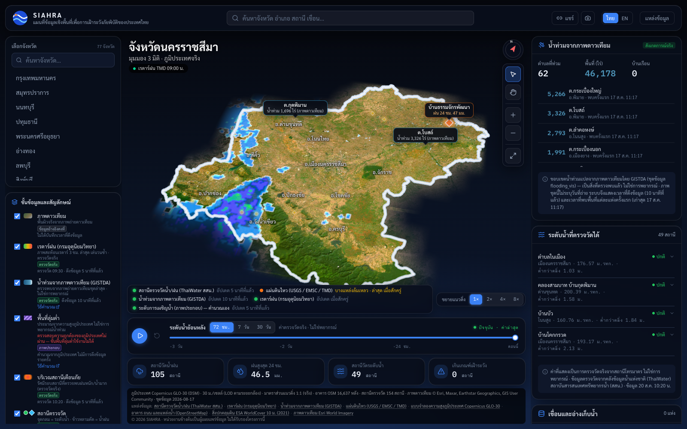

<div align="center">

# 🛰️ SIAHRA

**S**patial **I**ntelligence **A**tlas for **H**azard & **R**esilience **A**nalytics

แผนที่ข้อมูลเชิงพื้นที่เพื่อการเฝ้าระวังภัยพิบัติของประเทศไทย
*A 3D geospatial hazard-intelligence platform for Thailand — real-time flood, rainfall, dam and earthquake monitoring rendered as an interactive provincial digital environment.*

[](https://react.dev)
[](https://www.typescriptlang.org)
[](https://threejs.org)
[](https://vite.dev)
[](https://workers.cloudflare.com)
[](https://tailwindcss.com)
[](#project-status)
[](LICENSE)

`thailand` `disaster-response` `geospatial` `webgl` `three-js` `react` `typescript` `cloudflare-workers` `durable-objects` `flood-monitoring` `earthquake-monitoring` `digital-twin` `3d-visualization` `open-data`

</div>

<br/>

<p align="center">
  
</p>

<p align="center"><sub>Nakhon Ratchasima in the live 3D viewport — GISTDA satellite flood extent over real terrain, a TMD radar sweep, 49 gauge stations reporting measured levels, and every panel stamped with when its data was fetched.</sub></p>

<table align="center">
  <tr>
    <td align="center" width="50%">
      
    </td>
    <td align="center" width="50%">
      
    </td>
  </tr>
</table>

<p align="center"><sub>The same province on a phone-sized viewport (390 × 844) — below 768 px the map is full-bleed and a single swipe-up bottom sheet is the only bottom chrome, with three snap points (peek, half, full); its peek section keeps the province name, the source-health dots, the timeline and the attribution line on screen at every snap, while the stat pills, the TMD forecast strip, the exaggeration switch and the panels themselves sit in the body under one thumb. From 768 px up the same panels sit behind a 48 px icon rail on the left that opens at most one drawer at a time (open by default only from 1280 px), with a full-width bottom dock carrying the source-health dots, timeline, forecast strip, vertical-scale switch and the attribution line.</sub></p>

<br/>

## Table of contents

- [About](#about)
- [Features](#features)
- [Tech stack](#tech-stack)
- [Architecture](#architecture)
- [Monorepo layout](#monorepo-layout)
- [Getting started](#getting-started)
- [API](#api)
- [CI & contributing](#ci--contributing)
- [Data sources & attribution](#data-sources--attribution)
- [Project status](#project-status)
- [Disclaimer](#disclaimer)
- [License](#license)

## About

SIAHRA renders Thailand's 77 provinces as navigable 3D terrain — real elevation, buildings, roads, rivers and land cover — and overlays it with live hazard intelligence: flood extents, river/rainfall telemetry, dam levels, weather radar and earthquake activity. It exists to make the question **"is my area at risk right now, and how did we get here?"** answerable in a single interactive view instead of scattered across a dozen agency dashboards.

The project follows a clean separation between three data classes: **base geospatial data** (terrain, buildings, land cover — slow-changing, pre-processed offline), **observation data** (rainfall, river levels, radar, seismic events — polled continuously from official sources), and **derived data** (flood extents, alerts, aggregates — computed by SIAHRA's own edge services). Every panel in the UI shows its data's age and source so nothing is presented as more current or more certain than it actually is.

## Features

- 🗺️ **Interactive 3D provincial terrain** — Three.js quadtree-tiled terrain with satellite imagery, building extrusions, vegetation and road networks, streamed progressively as you pan and zoom.
- 🌊 **Real-time flood intelligence** — GISTDA satellite-derived flood extent overlaid on the terrain, plus live water-level readings from ThaiWater (สสน.) gauge stations with 72-hour history.
- 🛰️ **Sentinel-1 flood scenes with illustrative depth** — Copernicus GFM flood extent per satellite pass (observed, stamped with its acquisition time and picked by the timeline within a 14-day window), draped as depth-graded water with a transparent water surface; the depth is FwDET on the same DEM, labelled *illustrative* with its own [methodology page](docs/methodology/flood-depth.md), and cells whose depth is not estimated are stippled rather than shown as 0 m. The flood panel lists every pass (dry ones included) and groups the flooded ones into events; pass ticks sit on the timeline, a click on either jumps the whole map to that acquisition, the panel labels the gap between the chosen time and the image, and a click on the terrain names the cell's GFM class and estimated depth — the same browser will reach back to 2015 once the archive is backfilled.
- 🌧️ **Rainfall & weather radar** — TMD radar composites and rainfall telemetry with a scrubbable timeline.
- 🏔️ **Dam & reservoir monitoring** — storage levels and capacity for reservoirs reporting in the selected province.
- 🌏 **Earthquake feed** — near real-time seismic events cross-checked across USGS, EMSC and TMD.
- 🏛️ **Local-authority (อปท.) decision support** — per-authority flood impact from real polygon intersection against the current GISTDA scene (flooded area/fraction and facilities-in-flood are measured; population/buildings exposed are an illustrative area-weighted share of the baseline), a flooded-fraction-ranked affected-authority list, and an alert banner that renders healthy, never-evaluated, degraded-fetch and unreachable states distinctly — covers the 431 local authorities with a real OSM boundary.
- 📡 **Live source-health footer** — every panel discloses upstream freshness ("updated N minutes ago") and falls back to "unknown" instead of failing silently when a source is down.
- 🔗 **Shareable permalinks** — camera position, province and layer state are encoded into the URL.
- 📱 **Responsive layout** — one shell for every width: an icon rail with a single drawer and a full-width bottom dock from 768 px up, and on phones no dock at all — a full-bleed map under one three-snap swipe-up bottom sheet, with Google-Maps touch gestures (one finger pans, two fingers zoom, tilt and twist) instead of a tool toggle; which panel is open is remembered per browser, never in the permalink.

## Tech stack

| Layer | Technology |
|---|---|
| 3D rendering / client | [Three.js](https://threejs.org), [React 19](https://react.dev), TypeScript, [Vite](https://vite.dev), [Tailwind CSS 4](https://tailwindcss.com) |
| Edge API | [Cloudflare Workers](https://workers.cloudflare.com), [Durable Objects](https://developers.cloudflare.com/durable-objects/) (live state / fan-out, SQLite-backed), [R2](https://developers.cloudflare.com/r2/) (immutable geodata artifacts) |
| ETL / geodata pipeline | [GDAL](https://gdal.org)-driven Node/TypeScript scripts ([`tsx`](https://github.com/privatenumber/tsx)), [Turf.js](https://turfjs.org), [Copernicus GLO-30 DEM](https://registry.opendata.aws/copernicus-dem/), [OpenStreetMap](https://www.openstreetmap.org); a Python 3.13 / [uv](https://docs.astral.sh/uv/) package (`apps/etl/gfm`: [rasterio](https://rasterio.readthedocs.io), NumPy, SciPy, [pystac-client](https://pystac-client.readthedocs.io)) turns [Copernicus GFM](https://extwiki.eodc.eu/GFM/PUM) flood scenes into FwDET depth fields |
| Tooling | npm workspaces monorepo, [Wrangler](https://developers.cloudflare.com/workers/wrangler/), [oxlint](https://oxc.rs) |

## Architecture

<p align="center">
  
</p>

<p align="center"><sub>Rendered from <a href="docs/diagrams/architecture.svg"><code>docs/diagrams/architecture.svg</code></a> with <code>node docs/diagrams/render.mjs</code> — edit the SVG and re-render.</sub></p>

The Worker's `scheduled` handler polls upstream sources on a cron and keeps each Durable Object's cache warm, so the first browser request after a quiet period never pays a multi-megabyte upstream fetch inline.

## Monorepo layout

```
SIAHRA/
├── apps/
│   ├── web/     # React + Three.js client (Vite)
│   ├── api/     # Cloudflare Worker — routes, Durable Objects, ingestion
│   └── etl/     # Offline geodata pipeline (terrain/building/feature/land-cover tiles; gfm/ = Python flood scenes)
├── packages/
│   └── shared-types/   # Types shared between web and api
└── docs/       # Plan, audit & deploy guide
```

## Getting started

**Prerequisites:** Node.js 20+, npm 10+. The flood-scene pipeline (`apps/etl/gfm`) additionally needs [uv](https://docs.astral.sh/uv/) (it pins Python 3.13 in `.python-version` and runs with `uv run --frozen`); `scripts/upload-gfm-inputs.sh` also needs GDAL (`gdal_translate`) and rclone.

```bash
# Install workspace dependencies
npm install

# Run the API (Wrangler, port 8787) and the web client (Vite, port 5173) together
npm run dev

# ...or independently
npm run dev:api
npm run dev:web
```

Terrain/building tile pyramids are generated by the ETL pipeline and served locally by a Vite middleware:

```bash
npm run build:all -w apps/etl        # build tiles for all provinces
npm run gfm:test -w apps/etl         # offline pytest suite of the Copernicus GFM flood pipeline (uv)
npm run gfm:run -w apps/etl -- --province 57 --since 2024-09-11   # flood scenes → apps/etl/data/flood
```

The SPA and the API are **two separately deployed Cloudflare Workers** sharing one origin
(`siahra-radar.co`): `siahra-web` holds the hostname as a Custom Domain, and `siahra-api` layers a
`/api/*` route in front of it — Workers on routes run before the origin Worker. So the browser still
sees a single origin (no CORS), while a UI change and an API change never have to ship together:

```bash
npm run deploy:web                    # build apps/web → dist, deploy siahra-web (static assets only)
npm run deploy:api                    # deploy siahra-api (Durable Objects, cron, R2) — dist not needed
```

See [docs/deploy.md](docs/deploy.md) for the full deploy guide.

## API

The Worker exposes a versioned JSON API under `/api/v1`:

| Endpoint | Description |
|---|---|
| `GET /api/v1/health` | Freshness/status of every upstream source |
| `GET /api/v1/observations` | Live rainfall/water-level observations |
| `GET /api/v1/earthquakes/recent` · `/live` | Recent and live-polled seismic events |
| `GET /api/v1/flood-extent/summary` | Nationwide flood-extent summary |
| `GET /api/v1/provinces/:code/flood-extent` | Flood extent for one province; `?at=<ISO>` returns the scene that covered that instant (`reason: "no-archived-scene"` when none was recorded) |
| `GET /api/v1/provinces/:code/hazards/latest` | Latest hazard snapshot for one province |
| `GET /api/v1/dams` | Reservoir storage levels |
| `GET /api/v1/radar/frames` · `/radar/frame/:ts.png` | Weather radar composite frames |
| `GET /api/v1/stations/:id/history` | Historical readings for one gauge station |
| `GET /api/v1/local-authorities` · `/:id` | National local-authority (อปท.) registry, sourced from DLA — static-reference, baked into the build, not live-polled |
| `GET /api/v1/local-authorities/:id/exposure` | Baseline exposure (WorldPop 2020 population, OSM buildings/roads/facilities) for the 431 local authorities with a real E11.2 boundary — static-reference, baked into the build |
| `GET /api/v1/local-authorities/:id/impact` | Real `turf.intersect()` between the current GISTDA flood scene and the authority's real E11.2 boundary — flooded area/fraction and facilities-in-flood are observed, population/buildings exposed are an illustrative area-weighted share of the E11.3 baseline |
| `GET /api/v1/alerts/active` | Currently active threshold alerts (real ThaiWater stations bound to local authorities, hysteresis-evaluated) — read-only, GET-only |
| `GET /api/v1/alerts/rules` | The baked threshold-rule table (rainfall/water-level, real stations and boundaries) an alert can fire from |

## CI & contributing

**`ci.yml`** runs on every push to `main` and every pull request:

```
Lint ─────────────┐
TypeScript ───────┼─ independent, always run → required status checks on main
Build ────────────┘
Detect affected ──┬─ Test (api, apps/api)  ┐
                  ├─ Test (web, apps/web)  ├─ only the affected workspaces
                  └─ Test (etl, apps/etl)  ┘
                       └─ Test ─────────────── always reports, gates the legs
```

- **Lint** — `oxlint` over `apps/web/src` and `apps/web/worker`
- **TypeScript** — `tsc -b` (apps/web), `tsc --noEmit` (apps/api + its `test/` project, apps/etl); the same commands as the pre-push checklist in [`AGENTS.md`](AGENTS.md)
- **Build** — production web build, then `wrangler deploy --dry-run` to bundle both Workers against it, plus a guard on the Workers static-asset limits (≤ 20,000 files, ≤ 25 MiB each)
- **Detect affected** — diffs the branch against its merge base and emits the matrix of workspaces whose tests need to run. A change to the lockfile, root `package.json`, `packages/shared-types` or `ci.yml` itself marks all three; an unusable diff base does the same, so the failure mode is "run everything", never "run nothing"
- **Test (name, path)** — one vitest run per affected workspace: `apps/api` in `workerd`, `apps/web` and `apps/etl` as pure modules in node. These names are generated and a leg can be absent, so none of them may ever be a required check
- **Test** — the aggregate gate, `if: always()`. It reports pass/fail for whatever the matrix did, including "nothing was affected", which makes it the only test check that is safe to require. It is **not** required yet — promoting it is an owner action

Two conventions a branch ruleset can't express — a PR that touches UI files must embed a screenshot (or carry the `no-screenshot` label), and PR titles/descriptions are English-only — used to live in a `pr-rules.yml` workflow. They are still the rules, but they are now checked locally by the `/implement` loop instead of burning Actions minutes on every edit to a PR description. `pr-image-cleanup.yml` / `pr-cache-cleanup.yml` tidy up screenshot releases and npm caches when a PR closes; `dependabot.yml` batches minor/patch bumps weekly and opens majors one-by-one. `gfm-ingest.yml` is the one workflow that is not about the repo itself: every six hours it runs the Copernicus GFM flood pipeline (`apps/etl/gfm`) on a runner and `rclone`s the resulting scenes into R2 (it deploys nothing — see [`docs/deploy.md`](docs/deploy.md) §1 for the secrets, bootstrap and backfill commands).

**Rules on `main`** ([`.github/rulesets/main.json`](.github/rulesets/main.json), applied with `scripts/apply-branch-rules.sh`): no direct pushes, no force-push or deletion, every change via a pull request with `Lint`, `TypeScript` and `Build` green.

> [!WARNING]
> Only jobs that *always* run may be required checks. A path-filtered job that never triggers leaves the PR waiting forever.

**Agent loop:** `.claude/` holds the working loop this repo is built with — `/implement` first sends anything that touches Durable Objects, D1, R2, cron or Workers Logs through a read-only DevOps agent that prices the change against the account's $5–10/month ceiling (`stop` halts before any code is written), then runs a senior-engineer agent, gates it on a QA agent that runs the same commands as CI plus a headless screenshot pass, loops until the verdict is green, syncs the docs, and then *asks* before opening a PR (a `PreToolUse` hook makes sure it never opens one on its own). `/review-fix` addresses a Codex review in a single batch — P1/P2 only — and closes every thread with a reaction, a reply and a resolve. See [`AGENTS.md`](AGENTS.md).

<p align="center">
  
</p>

<p align="center"><sub>The diagram is rendered from <a href="docs/diagrams/loop-engineering.svg"><code>docs/diagrams/loop-engineering.svg</code></a> with <code>node docs/diagrams/render.mjs</code> — edit the SVG and re-render.</sub></p>

**Social preview / Open Graph image:** [`docs/images/og-image.png`](docs/images/og-image.png) (1280 × 640) is rendered from [`docs/og/og-image.html`](docs/og/og-image.html) with `node docs/og/render.mjs` — edit the HTML, re-render, and upload the PNG in *Settings → General → Social preview*.

**Contributing:** branch, open a PR, and — for anything that touches the UI — put a screenshot in the description (drag-and-drop, or `scripts/pr-media.sh "$(git branch --show-current)" shot.png` from the CLI and paste the Markdown it prints). Delete the branch once merged. [`AGENTS.md`](AGENTS.md) has the full working agreement, including the data-honesty rules every layer must follow.

## Data sources & attribution

ข้อมูลจาก สสน. (ThaiWater), กรมอุตุนิยมวิทยา (TMD), USGS, EMSC, Copernicus DEM และ OpenStreetMap

| Layer | Source | License |
|---|---|---|
| Terrain (DEM) | Copernicus GLO-30 | Open, attribution required |
| Land cover | ESA WorldCover | CC BY 4.0 |
| Buildings / roads | OpenStreetMap / Geofabrik Thailand extract | ODbL |
| Rainfall / radar / seismic | Thai Meteorological Department (TMD) | Official API terms |
| River / rainfall telemetry, dams | Hydro-Informatics Institute / ThaiWater (สสน.) | Official API terms |
| Satellite flood extent | GISTDA | Open Data Commons |
| Satellite flood extent (Sentinel-1) + illustrative depth input | [Copernicus Emergency Management Service — Global Flood Monitoring](https://extwiki.eodc.eu/GFM/PUM) (EODC STAC) | CEMS terms (GloFAS/EFAS Terms and Conditions per PUM 7.1.4); attribution "© European Union, Copernicus Emergency Management Service (GFM), EODC" |
| Earthquake cross-check | USGS, EMSC | Public data policy |
| Local-authority (อปท.) registry | Department of Local Administration (DLA) | Open Data Common |
| Local-authority (อปท.) boundaries | OpenStreetMap (`admin_level=7` relations) | ODbL |
| Local-authority baseline exposure (population) | WorldPop 2020, UN-adjusted, 100 m (University of Southampton) | CC BY 4.0 |

This is an attribution list, **not** a claim of authorship or endorsement — these agencies supply the data; they did not build or endorse this application. Several upstream layers referenced in [`docs/SIAHRA-implement-plan.md`](docs/SIAHRA-implement-plan.md) (e.g. some LDD soil datasets) carry non-commercial or share-alike terms and are deliberately **not** wired into the live product; verify licensing before adding any new source.

## Project status

SIAHRA is deployed on `siahra-radar.co` as two independently released Cloudflare Workers — `siahra-web` (the static SPA and tile proxy) and `siahra-api` (bound to `/api/*`). The hazard layers listed in [Features](#features) above are live: 3D terrain for all 77 provinces, GISTDA flood extent, Copernicus GFM flood scenes and illustrative depth (for provinces the `gfm-ingest.yml` cron has covered), ThaiWater levels and dams, TMD radar, the earthquake feed, the local-authority decision-support panel (impact card, affected-authority list, alert banner) and the source-health footer. The Durable-Object-backed API endpoints require a Workers Paid plan — see [`docs/deploy.md`](docs/deploy.md) for the deployment prerequisites.

What comes next — the ordered task list, milestones and the work deliberately deferred — is in [`docs/roadmap.md`](docs/roadmap.md). [`docs/SIAHRA-implement-plan.md`](docs/SIAHRA-implement-plan.md) remains the original research blueprint and data-source inventory; it is not a schedule.

## Disclaimer

SIAHRA aggregates and visualizes official hazard data; it is **not** an early-warning system and does not predict earthquakes. Earthquake science can detect and rapidly characterize events after rupture begins — it cannot forecast the time, place or magnitude of a future quake. Flood extents and levels reflect the freshness and resolution of upstream sources (shown next to every panel) and should not be the sole basis for evacuation or safety decisions — always follow official guidance from TMD, DDPM and local authorities.

## License

The **code** in this repository is released under the MIT License — see [`LICENSE`](LICENSE). That covers the source of the web app, the API Worker and the ETL pipelines, and nothing else.

The **data** is not ours to license. Every observation, tile and imagery layer SIAHRA fetches or derives stays under the terms of the agency that published it — ThaiWater/HII, TMD, GISTDA, USGS, EMSC, Copernicus DEM, OpenStreetMap, ESA WorldCover and DLA — listed one by one [above](#data-sources--attribution). MIT applies to the code only; it grants you no right to redistribute those sources, and reusing this code does not transfer their terms to you. If you fork SIAHRA, check each upstream licence for your own use, and keep the attributions.
