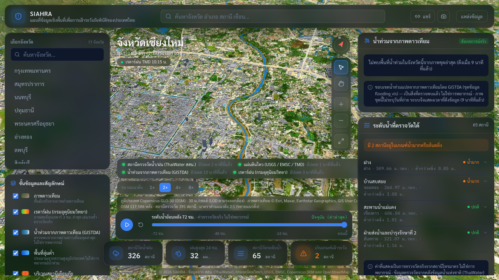
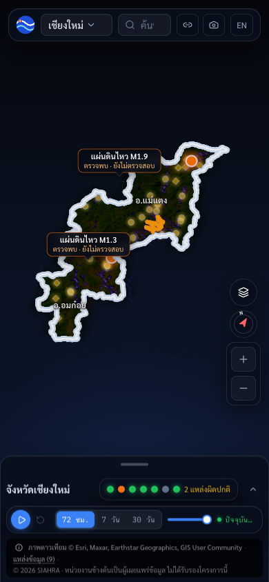
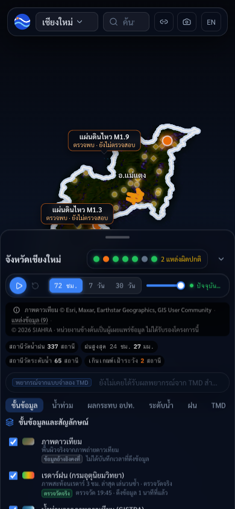
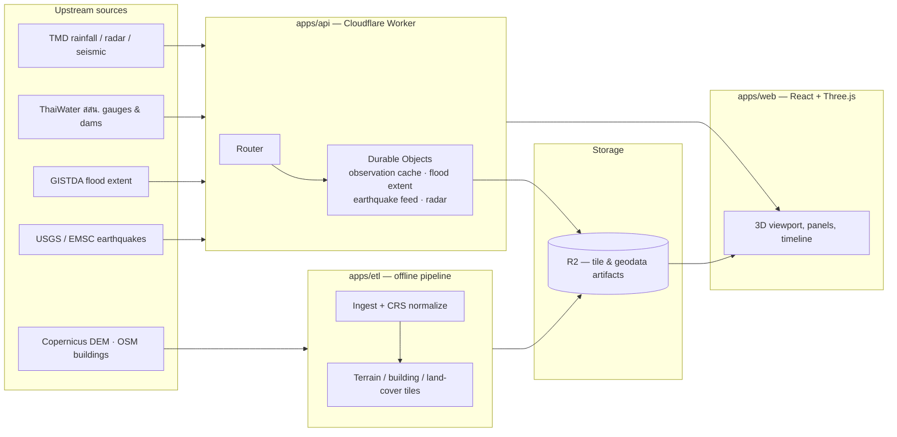

<div align="center">

# 🛰️ SIAHRA

**S**patial **I**ntelligence **A**tlas for **H**azard & **R**esilience **A**nalytics

แผนที่ข้อมูลเชิงพื้นที่เพื่อการเฝ้าระวังภัยพิบัติของประเทศไทย
*A 3D geospatial hazard-intelligence platform for Thailand — real-time flood, rainfall, dam and earthquake monitoring rendered as an interactive provincial digital environment.*

[](https://react.dev)
[](https://www.typescriptlang.org)
[](https://threejs.org)
[](https://vite.dev)
[](https://workers.cloudflare.com)
[](https://tailwindcss.com)
[](#project-status)
[](#license)

`thailand` `disaster-response` `geospatial` `webgl` `three-js` `react` `typescript` `cloudflare-workers` `durable-objects` `flood-monitoring` `earthquake-monitoring` `digital-twin` `3d-visualization` `open-data`

</div>

<br/>

<p align="center">
  
</p>

<p align="center"><sub>Chiang Mai province in the live 3D viewport — real terrain relief, road networks, a live earthquake marker and the full data-layer legend.</sub></p>

<table align="center">
  <tr>
    <td align="center" width="50%">
      
    </td>
    <td align="center" width="50%">
      
    </td>
  </tr>
</table>

<p align="center"><sub>The same province on a phone-sized viewport (390 × 844) — the desktop panels collapse into a bottom tab bar and a swipe-up sheet, so the map keeps the whole screen; the timeline, exaggeration switch and source-health dots stay reachable with one thumb.</sub></p>

<br/>

## Table of contents

- [About](#about)
- [Features](#features)
- [Tech stack](#tech-stack)
- [Architecture](#architecture)
- [Monorepo layout](#monorepo-layout)
- [Getting started](#getting-started)
- [API](#api)
- [CI & contributing](#ci--contributing)
- [Data sources & attribution](#data-sources--attribution)
- [Project status](#project-status)
- [Disclaimer](#disclaimer)
- [License](#license)

## About

SIAHRA renders Thailand's 77 provinces as navigable 3D terrain — real elevation, buildings, roads, rivers and land cover — and overlays it with live hazard intelligence: flood extents, river/rainfall telemetry, dam levels, weather radar and earthquake activity. It exists to make the question **"is my area at risk right now, and how did we get here?"** answerable in a single interactive view instead of scattered across a dozen agency dashboards.

The project follows a clean separation between three data classes: **base geospatial data** (terrain, buildings, land cover — slow-changing, pre-processed offline), **observation data** (rainfall, river levels, radar, seismic events — polled continuously from official sources), and **derived data** (flood extents, alerts, aggregates — computed by SIAHRA's own edge services). Every panel in the UI shows its data's age and source so nothing is presented as more current or more certain than it actually is.

## Features

- 🗺️ **Interactive 3D provincial terrain** — Three.js quadtree-tiled terrain with satellite imagery, building extrusions, vegetation and road networks, streamed progressively as you pan and zoom.
- 🌊 **Real-time flood intelligence** — GISTDA satellite-derived flood extent overlaid on the terrain, plus live water-level readings from ThaiWater (สสน.) gauge stations with 72-hour history.
- 🌧️ **Rainfall & weather radar** — TMD radar composites and rainfall telemetry with a scrubbable timeline.
- 🏔️ **Dam & reservoir monitoring** — storage levels and capacity for reservoirs reporting in the selected province.
- 🌏 **Earthquake feed** — near real-time seismic events cross-checked across USGS, EMSC and TMD.
- 📡 **Live source-health footer** — every panel discloses upstream freshness ("updated N minutes ago") and falls back to "unknown" instead of failing silently when a source is down.
- 🔗 **Shareable permalinks** — camera position, province and layer state are encoded into the URL.
- 📱 **Responsive layout** — a full desktop control-room view and a condensed mobile sheet for field use.

## Tech stack

| Layer | Technology |
|---|---|
| 3D rendering / client | [Three.js](https://threejs.org), [React 19](https://react.dev), TypeScript, [Vite](https://vite.dev), [Tailwind CSS 4](https://tailwindcss.com) |
| Edge API | [Cloudflare Workers](https://workers.cloudflare.com), [Durable Objects](https://developers.cloudflare.com/durable-objects/) (live state / fan-out, SQLite-backed), [R2](https://developers.cloudflare.com/r2/) (immutable geodata artifacts) |
| ETL / geodata pipeline | [GDAL](https://gdal.org)-driven Node/TypeScript scripts ([`tsx`](https://github.com/privatenumber/tsx)), [Turf.js](https://turfjs.org), [Copernicus GLO-30 DEM](https://registry.opendata.aws/copernicus-dem/), [OpenStreetMap](https://www.openstreetmap.org) |
| Tooling | npm workspaces monorepo, [Wrangler](https://developers.cloudflare.com/workers/wrangler/), [oxlint](https://oxc.rs) |

## Architecture



The Worker's `scheduled` handler polls upstream sources on a cron and keeps each Durable Object's cache warm, so the first browser request after a quiet period never pays a multi-megabyte upstream fetch inline.

## Monorepo layout

```
SIAHRA/
├── apps/
│   ├── web/     # React + Three.js client (Vite)
│   ├── api/     # Cloudflare Worker — routes, Durable Objects, ingestion
│   └── etl/     # Offline geodata pipeline (terrain/building/feature/land-cover tiles)
├── packages/
│   └── shared-types/   # Types shared between web and api
└── docs/       # Plan, audit & deploy guide
```

## Getting started

**Prerequisites:** Node.js 20+, npm 10+.

```bash
# Install workspace dependencies
npm install

# Run the API (Wrangler, port 8787) and the web client (Vite, port 5173) together
npm run dev

# ...or independently
npm run dev:api
npm run dev:web
```

Terrain/building tile pyramids are generated by the ETL pipeline and served locally by a Vite middleware:

```bash
npm run build:aoi -w apps/etl        # build tiles for all provinces
```

The SPA and the API are **two separately deployed Cloudflare Workers** sharing one origin
(`siahra-radar.co`): `siahra-web` holds the hostname as a Custom Domain, and `siahra-api` layers a
`/api/*` route in front of it — Workers on routes run before the origin Worker. So the browser still
sees a single origin (no CORS), while a UI change and an API change never have to ship together:

```bash
npm run deploy:web                    # build apps/web → dist, deploy siahra-web (static assets only)
npm run deploy:api                    # deploy siahra-api (Durable Objects, cron, R2) — dist not needed
```

See [docs/deploy.md](docs/deploy.md) for the full deploy guide.

## API

The Worker exposes a versioned JSON API under `/api/v1`:

| Endpoint | Description |
|---|---|
| `GET /api/v1/health` | Freshness/status of every upstream source |
| `GET /api/v1/observations` | Live rainfall/water-level observations |
| `GET /api/v1/earthquakes/recent` · `/live` | Recent and live-polled seismic events |
| `GET /api/v1/flood-extent/summary` | Nationwide flood-extent summary |
| `GET /api/v1/provinces/:code/flood-extent` | Flood extent for one province |
| `GET /api/v1/provinces/:code/hazards/latest` | Latest hazard snapshot for one province |
| `GET /api/v1/dams` | Reservoir storage levels |
| `GET /api/v1/radar/frames` · `/radar/frame/:ts.png` | Weather radar composite frames |
| `GET /api/v1/stations/:id/history` | Historical readings for one gauge station |

## CI & contributing

**`ci.yml`** runs on every push to `main` and every pull request:

```
Lint ────────┐
TypeScript ──┼─ independent, always run → required status checks on main
Build ───────┘
```

- **Lint** — `oxlint` over `apps/web/src`
- **TypeScript** — `tsc -b` (apps/web), `tsc --noEmit` (apps/api, apps/etl); the same commands as the pre-push checklist in [`AGENTS.md`](AGENTS.md)
- **Build** — production web build, then `wrangler deploy --dry-run` to bundle the Worker against it, plus a guard on the Workers static-asset limits (≤ 20,000 files, ≤ 25 MiB each)

Two conventions a branch ruleset can't express — a PR that touches UI files must embed a screenshot (or carry the `no-screenshot` label), and PR titles/descriptions are English-only — used to live in a `pr-rules.yml` workflow. They are still the rules, but they are now checked locally by the `/implement` loop instead of burning Actions minutes on every edit to a PR description. `pr-image-cleanup.yml` / `pr-cache-cleanup.yml` tidy up screenshot releases and npm caches when a PR closes; `dependabot.yml` batches minor/patch bumps weekly and opens majors one-by-one.

**Rules on `main`** ([`.github/rulesets/main.json`](.github/rulesets/main.json), applied with `scripts/apply-branch-rules.sh`): no direct pushes, no force-push or deletion, every change via a pull request with `Lint`, `TypeScript` and `Build` green.

> [!WARNING]
> Only jobs that *always* run may be required checks. A path-filtered job that never triggers leaves the PR waiting forever.

**Agent loop:** `.claude/` holds the working loop this repo is built with — `/implement` runs a senior-engineer agent, gates it on a QA agent that runs the same commands as CI plus a headless screenshot pass, loops until the verdict is green, syncs the docs, and then *asks* before opening a PR (a `PreToolUse` hook makes sure it never opens one on its own). `/review-fix` addresses a Codex review in a single batch — P1/P2 only — and closes every thread with a reaction, a reply and a resolve. See [`AGENTS.md`](AGENTS.md).

**Social preview / Open Graph image:** [`docs/images/og-image.png`](docs/images/og-image.png) (1280 × 640) is rendered from [`docs/og/og-image.html`](docs/og/og-image.html) with `node docs/og/render.mjs` — edit the HTML, re-render, and upload the PNG in *Settings → General → Social preview*.

**Contributing:** branch, open a PR, and — for anything that touches the UI — put a screenshot in the description (drag-and-drop, or `scripts/pr-media.sh "$(git branch --show-current)" shot.png` from the CLI and paste the Markdown it prints). Delete the branch once merged. [`AGENTS.md`](AGENTS.md) has the full working agreement, including the data-honesty rules every layer must follow.

## Data sources & attribution

ข้อมูลจาก สสน. (ThaiWater), กรมอุตุนิยมวิทยา (TMD), USGS, EMSC, Copernicus DEM และ OpenStreetMap

| Layer | Source | License |
|---|---|---|
| Terrain (DEM) | Copernicus GLO-30 | Open, attribution required |
| Land cover | ESA WorldCover | CC BY 4.0 |
| Buildings / roads | OpenStreetMap / Geofabrik Thailand extract | ODbL |
| Rainfall / radar / seismic | Thai Meteorological Department (TMD) | Official API terms |
| River / rainfall telemetry, dams | Hydro-Informatics Institute / ThaiWater (สสน.) | Official API terms |
| Satellite flood extent | GISTDA | Open Data Commons |
| Earthquake cross-check | USGS, EMSC | Public data policy |

This is an attribution list, **not** a claim of authorship or endorsement — these agencies supply the data; they did not build or endorse this application. Several upstream layers referenced in [`docs/SIAHRA-implement-plan.md`](docs/SIAHRA-implement-plan.md) (e.g. some LDD soil datasets) carry non-commercial or share-alike terms and are deliberately **not** wired into the live product; verify licensing before adding any new source.

## Project status

SIAHRA is deployed on `siahra-radar.co` as two independently released Cloudflare Workers — `siahra-web` (the static SPA and tile proxy) and `siahra-api` (bound to `/api/*`). The hazard layers listed in [Features](#features) above are live: 3D terrain for all 77 provinces, GISTDA flood extent, ThaiWater levels and dams, TMD radar, the earthquake feed and the source-health footer. The Durable-Object-backed API endpoints require a Workers Paid plan — see [`docs/deploy.md`](docs/deploy.md) for the deployment prerequisites.

What comes next — the ordered task list, milestones and the work deliberately deferred — is in [`docs/roadmap.md`](docs/roadmap.md). [`docs/SIAHRA-implement-plan.md`](docs/SIAHRA-implement-plan.md) remains the original research blueprint and data-source inventory; it is not a schedule.

## Disclaimer

SIAHRA aggregates and visualizes official hazard data; it is **not** an early-warning system and does not predict earthquakes. Earthquake science can detect and rapidly characterize events after rupture begins — it cannot forecast the time, place or magnitude of a future quake. Flood extents and levels reflect the freshness and resolution of upstream sources (shown next to every panel) and should not be the sole basis for evacuation or safety decisions — always follow official guidance from TMD, DDPM and local authorities.

## License

No license has been declared for this repository yet — all rights reserved by default until a `LICENSE` file is added. Upstream data retains the licenses listed [above](#data-sources--attribution) regardless of this repository's own license.
