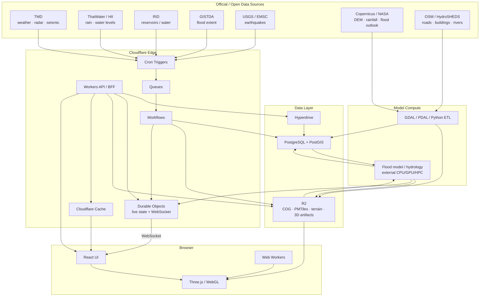
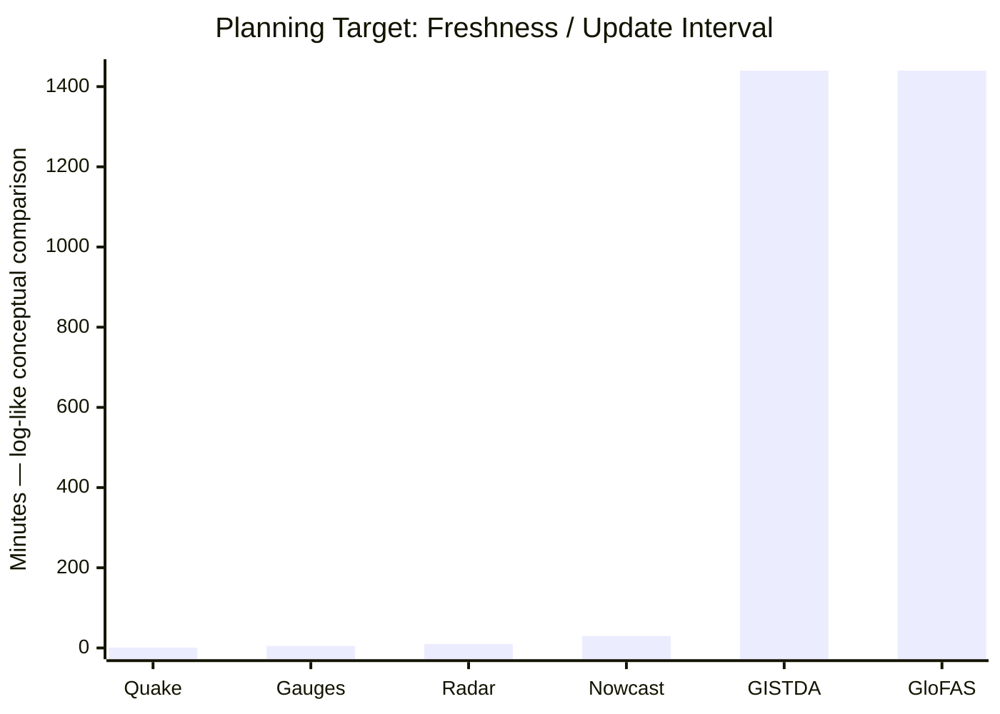
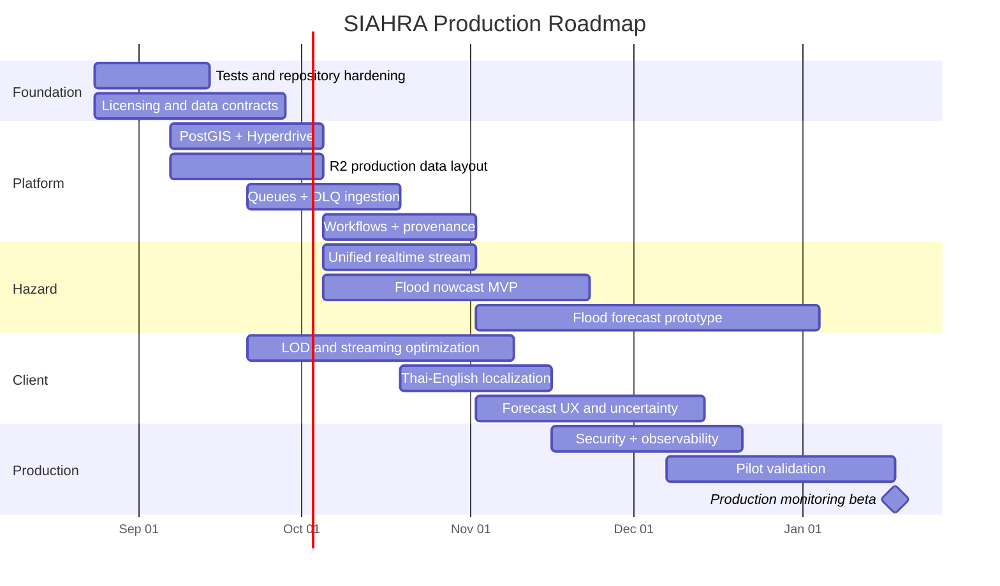

# SIAHRA Repository Audit, Gap Analysis, and Implementation Roadmap

**Research date:** 17 August 2026, Asia/Bangkok  
**Repository audited:** `flukelaster/SIAHRA`, `main` branch  
**Target product:** Thailand-focused desktop-first 3D hazard-intelligence web application for flood monitoring/forecasting and earthquake situational awareness, deployed primarily on Cloudflare.

## Executive summary / บทสรุปผู้บริหาร

### English

SIAHRA is substantially further along than a concept prototype. The public repository already contains a functioning monorepo with a React/TypeScript/Three.js client, an offline geospatial ETL pipeline, a Cloudflare Worker API, Durable Objects, an R2 binding, a one-minute scheduled ingestion loop, live earthquake WebSockets, province selection, terrain/building/road/vegetation rendering, flood extents, radar, rainfall/water stations, dams, source-health indicators, timelines, permalinks, and responsive layouts. The README describes all 77 Thai provinces as the intended navigable 3D coverage and says implementation phases through the present 3D client/API pipeline are complete locally, while production Cloudflare deployment is still in progress.

The largest remaining gap is therefore **not the 3D front end**. It is the transition from a sophisticated monitoring/demo system into a **production-grade hazard-data platform with defensible forecasting**.

The current Cloudflare configuration already contains static assets, R2, five Durable Object bindings and a one-minute Cron Trigger (no KV namespace is bound in either Worker), but it does **not currently configure Cloudflare Queues, Workflows, or Hyperdrive/PostgreSQL**. Those are the highest-priority platform additions because they separate ingestion from processing, give long-running ETL jobs retryable orchestration, and introduce a proper spatial database for historical and analytical queries. Cloudflare documents Queues as a guaranteed-delivery messaging mechanism with batching/retries, Workflows as durable multi-step execution with persisted state/retries, and Hyperdrive as its connection/caching layer for PostgreSQL-compatible databases.

The existing earthquake implementation is comparatively mature architecturally. `EarthquakeFeedDO` stores events in Durable Object SQLite, tracks source status, upgrades `/earthquakes/live` to a WebSocket and broadcasts messages to connected clients through the Durable Object WebSocket API. That matches Cloudflare's recommended Durable Object WebSocket/Hibernation architecture for long-lived WebSocket connections. This mechanism should be generalized into a multi-hazard event channel rather than replaced.

The existing renderer is also more mature than the earlier architectural assumption that SIAHRA would use React Three Fiber. The audited renderer imports Three.js directly and owns `THREE.Scene`, `PerspectiveCamera`, `WebGLRenderer`, `OrbitControls`, a georeferenced world group and vertical exaggeration itself. **I would not rewrite this renderer in React Three Fiber simply for framework consistency.** R3F can be introduced selectively for future self-contained visualization components, but the existing imperative renderer should remain the core unless maintainability measurements show a concrete reason to migrate.

The major scientific distinction needs to remain explicit:

**Floods can be forecast probabilistically; earthquakes cannot be treated as deterministic short-range forecasts.** SIAHRA's own README already correctly states that it is not an earthquake prediction system. The appropriate earthquake product is near-real-time event detection, cross-source reconciliation, shaking/exposure estimates, after-event impact analytics and probabilistic long-term/aftershock risk—not a UI claiming that an earthquake will occur at a given Thai location on a given day.

For flooding, the recommended product should expose several distinct horizons rather than a single "forecast":

| Product mode | Recommended horizon | What it means |
|---|---:|---|
| Observed | now → past 72 h | Gauges, rainfall, radar, GISTDA flood extent |
| Rain/flood nowcast | 0–6 h | Radar extrapolation + current rainfall + gauge response |
| Short-range flood forecast | 6–72 h | Meteorological forcing + calibrated catchment/hydraulic model |
| Medium-range basin risk | 3–7 days | Probabilistic rainfall/discharge risk |
| National outlook | multi-day (confirm the current GloFAS horizon) | GloFAS/basin-scale context, lower local confidence |
| Seasonal context | weeks–months | Hydrologic anomaly/outlook, **not** street-level inundation |

GloFAS publishes daily flood forecasts and longer-range hydrological outlooks ([system description](https://confluence.ecmwf.int/display/CEMS/Global+Flood+Awareness+System)); the exact medium-range horizon it publishes today must be read off the CEMS product pages at the time of use rather than quoted from this audit — the number was not re-verified against a fetchable source when these citations were rewritten. NASA IMERG provides global precipitation estimates every half hour ([IMERG](https://gpm.nasa.gov/data/imerg)). These are useful forcing/context sources, but neither turns a 30 m surface DEM into an operational urban flood model.

My planning estimate from the **current repo state**, not from a greenfield project, is:

**12–16 weeks:** production-quality monitoring beta for selected provinces.  
**20–28 weeks:** national monitoring platform with PostGIS, resilient ingestion, bilingual UI and production operations.  
**6–12 months:** a flood-forecasting product that has been calibrated and validated sufficiently to make quantified claims about forecast skill.

Those estimates assume approximately **5–7 FTE**, access to the source APIs, and at least one hydrology/hydraulics specialist. The model-validation calendar, not React or Cloudflare development, is likely to become the critical path.

### ภาษาไทย

จากการ audit repository ปัจจุบัน SIAHRA ไม่ได้อยู่ในระดับ mockup แล้ว แต่มีแกนหลักของระบบค่อนข้างครบ ทั้ง React/Three.js, terrain 3D, จังหวัด, อาคาร ถนน พืชพรรณ, ข้อมูลน้ำท่วม, radar, สถานีวัดน้ำ/ฝน, เขื่อน, earthquake feed, timeline, source freshness, Worker API, Durable Objects, R2 และ WebSocket (ไม่มี KV namespace ผูกอยู่ใน Worker ใดเลย) โดย README ระบุว่าระบบออกแบบเพื่อรองรับ 77 จังหวัด และส่วนหลักของ pipeline ใช้งานใน local development แล้ว แต่ production deployment ยังอยู่ระหว่างดำเนินการ

ดังนั้นงานสำคัญต่อจากนี้ไม่ใช่ "ทำแผนที่ 3D ให้ได้" แต่เป็นการทำให้ระบบกลายเป็น **production hazard platform** ได้แก่ PostGIS, Hyperdrive, Queues, Workflows, ingestion reliability, model provenance, test coverage, authentication, bilingual localization และโดยเฉพาะการสร้าง flood forecast ที่ตรวจสอบความแม่นยำได้จริง

สำหรับ earthquake ควรใช้คำว่า **monitoring / rapid assessment / seismic risk** มากกว่า prediction เพราะ repository เองก็ระบุไว้อย่างถูกต้องแล้วว่า SIAHRA ไม่สามารถทำนายวัน เวลา สถานที่ และขนาดของแผ่นดินไหวในอนาคตได้

สำหรับ flood สามารถทำ forecast หลายระดับตั้งแต่ 0–6 ชั่วโมง, 6–72 ชั่วโมง, 3–7 วัน ไปจนถึงระดับ basin/national outlook โดย GloFAS มี medium-range forecast รายวัน — **ตัวเลข lead time ที่แน่นอนต้องไปอ่านจาก CEMS เอง เอกสารนี้ยืนยันไม่ได้** (ดูหัวข้อ Sources ท้ายเอกสาร) — และ NASA IMERG มีข้อมูลฝนระดับครึ่งชั่วโมงสำหรับใช้เป็นข้อมูลเสริม

**คำแนะนำหลัก:** รักษา Three.js renderer ปัจจุบันไว้, เพิ่ม PostGIS + Hyperdrive, แยก ingestion ด้วย Queues, ใช้ Workflows สำหรับ pipeline ที่มีหลายขั้นตอน, ใช้ R2 เป็น geospatial object store, ทำ Durable Objects ต่อสำหรับ real-time fan-out และย้ายงาน simulation/modeling หนักไป compute ภายนอก Cloudflare Workers.

## Repository audit

The audit is based on the public `main` branch visible on 17 August 2026. The repository contained 24 commits at crawl time and is structured as an npm-workspaces monorepo.

### What is already implemented

| Capability | Audit finding | Status |
|---|---|---|
| React web application | React/TypeScript/Vite client exists | **Implemented** |
| Three.js 3D scene | Imperative Three.js scene with camera, renderer, controls, lighting/sky and georeferenced world group | **Implemented** |
| Provincial navigation | Province dataset, selector and AOI loading | **Implemented** |
| Terrain | Quadtree/tiled terrain architecture | **Implemented** |
| Buildings | Building layer/tile infrastructure | **Implemented** |
| Roads/water/vegetation | Dedicated feature layers | **Implemented** |
| Satellite imagery | Imagery layer exists | **Implemented** |
| Flood extent | GISTDA ingestion + province flood API/UI | **Implemented monitoring** |
| Water/rain observations | ThaiWater ingestion and observation UI | **Implemented monitoring** |
| Radar | TMD radar ingestion, frame APIs and timeline | **Implemented** |
| Reservoirs | Dam endpoint and UI | **Implemented** |
| Earthquakes | USGS/EMSC/TMD ingestion, reconciliation, storage, WebSocket | **Strong implementation** |
| Data freshness | `/health` and source-status UX | **Implemented** |
| Permalinks | camera/province/layers encoded in URL | **Implemented** |
| Responsive UI | desktop + mobile UI | **Implemented** |
| Cloudflare Worker | Worker router/API | **Implemented** |
| Durable Objects | five DO classes/bindings | **Implemented** |
| R2 binding | `HAZARD_BUCKET` | **Configured** |
| KV | no `kv_namespaces` in either `wrangler.jsonc` | **Missing** |
| Cron | every minute | **Configured** |
| Queues | no binding/consumer found | **Missing** |
| Workflows | no Workflow binding found | **Missing** |
| PostGIS | no PostgreSQL/PostGIS integration found | **Missing** |
| Hyperdrive | no Hyperdrive binding found | **Missing** |
| User authentication | no production auth architecture evident | **Missing** |
| Thai/English localization framework | UI contains Thai-specific labels, but no bilingual i18n framework was evident | **Missing** |
| Automated test suite | no test runner/test script was evident in the audited manifests/workflow description | **Major gap** |
| Repository license | README explicitly says no license declared | **Missing** |
| Actual predictive flood model | monitoring/extent infrastructure exists; a validated predictive model does not appear to be deployed | **Major gap** |

The repository's own feature summary confirms terrain, satellite imagery, buildings, vegetation, roads, GISTDA flood extent, ThaiWater history, TMD radar, dam monitoring, earthquake cross-checking, source health, permalinks and responsive UI.

### Code structure

The separation is sensible:

```text
SIAHRA/
├─ apps/
│  ├─ web/             React + Three.js client
│  ├─ api/             Cloudflare Worker + DOs + ingestion
│  └─ etl/             offline geospatial preprocessing
├─ packages/
│  └─ shared-types/    contracts shared by browser/API/ETL
├─ docs/
├─ scripts/
└─ .github/
```

This architecture is explicitly described by the repository and is a good foundation to preserve.

Inside `apps/api`, responsibilities are already separated into durable objects, ingestion adapters, routes, upstream clients, archiving, routing, types and rate limiting. That is approximately the shape I would want before introducing queues and PostGIS rather than after.

The client is similarly decomposed into UI components, hooks, scene layers and Web Workers. Existing scene modules include terrain, buildings, feature tiles, radar, flood masks, hazard overlays, stations, earthquake markers, dams, imagery, vegetation and material systems. Separate Web Workers already exist for building and feature-tile processing, so the codebase is already moving compute away from the rendering thread.

### Current client technology

The audited package configuration uses React 19, Three.js, TypeScript, Vite and Tailwind. The package did **not** contain `@react-three/fiber`; the renderer is direct Three.js. The actual scene implementation imports `three`, `OrbitControls`, `Sky` and `CSS2DRenderer`, creates a `THREE.WebGLRenderer`, and exposes its scene/camera/world state explicitly.

That matters because an R3F migration would be a rewrite, not a cleanup.

My recommendation:

> **Keep direct Three.js as SIAHRA's rendering kernel. Add R3F only for isolated future modules when React lifecycle integration provides measurable benefit.**

Do not turn framework migration into a prerequisite for shipping.

### Current Cloudflare implementation

There is **no single combined `wrangler.jsonc`**. SIAHRA deploys as two independent Workers with one
config each, and every recommendation below has to name which deploy unit it lands in:

```text
apps/web/wrangler.jsonc — "siahra-web"        apps/api/wrangler.jsonc — "siahra-api"
├─ main → worker/index.ts (R2 tile reads)     ├─ main → src/index.ts
├─ Static Assets → ./dist (SPA fallback)      ├─ R2 → HAZARD_BUCKET
├─ R2 → HAZARD_BUCKET                         ├─ Durable Objects
└─ Custom Domain → siahra-radar.co (all       │  ├─ EARTHQUAKE_FEED
   paths; this Worker is the origin)          │  ├─ FORECAST_POINTER
                                              │  ├─ OBSERVATION_CACHE
                                              │  ├─ FLOOD_EXTENT
                                              │  └─ RADAR
                                              ├─ Cron → * * * * *
                                              └─ Route → siahra-radar.co/api/*
                                                 (runs before the origin)
```

Both use compatibility date `2026-08-16`; `siahra-api` additionally sets `nodejs_compat`. Neither config
binds a KV namespace — there is no `CONFIG` binding in the repository today, so anything proposed here
that wants one is proposing a new binding, not reusing an existing one.

What is absent from **both** configurations is:

```text
Hyperdrive
Queues
Workflows
```

Where each belongs, by deploy unit:

| Addition | Deploy unit | Why |
|---|---|---|
| Hyperdrive | `siahra-api` | only the API queries the database |
| Queues (producer + consumer) | `siahra-api` | ingestion already lives beside the cron trigger and the DOs |
| Workflows | `siahra-api` | orchestrates ingestion/ETL, not asset serving |
| (unchanged) | `siahra-web` | keep it assets + tile reads; adding data bindings here re-couples the two deploys |

That makes these additions low-risk architecturally: they complement rather than replace the existing
Worker/DO approach — **provided they go into `siahra-api` only**. Putting a data binding in
`siahra-web` would undo the split that lets a UI release ship without restarting the Durable Objects.

### WebSocket audit

The earthquake WebSocket design is one of the better parts of the current backend.

The Durable Object:

```text
poll sources
     │
     ▼
normalize/reconcile
     │
     ▼
DO SQLite
     │
     ├── GET recent
     │
     └── WebSocket broadcast
```

The code retrieves existing sockets with `ctx.getWebSockets()`, accepts upgraded sockets through `ctx.acceptWebSocket()`, sends event payloads and tracks connected client counts in source health.

Cloudflare specifically recommends Durable Objects for coordinated WebSocket applications and provides WebSocket hibernation so an object can be evicted from memory while sockets remain connected.

The gap is therefore not "implement WebSocket." It is:

**turn the existing earthquake-only channel into a versioned multi-hazard event protocol.**

For example:

```ts
type HazardMessage =
  | { type: "earthquake.created"; event: EarthquakeEvent }
  | { type: "earthquake.updated"; event: EarthquakeEvent }
  | { type: "flood.extent.updated"; province: string; version: string }
  | { type: "station.updated"; stationId: string; observation: Observation }
  | { type: "radar.frame"; timestamp: string }
  | { type: "forecast.published"; runId: string; hazard: "flood" }
  | { type: "source.health"; source: SourceStatus };
```

### CI/CD and test audit

The existing GitHub Actions setup runs lint, TypeScript checks, production build, `wrangler deploy --dry-run`, and checks Workers static-asset constraints. UI-changing pull requests are required to carry screenshots unless explicitly exempted, and branch rules require PR-based changes.

This is a good **build-integrity** pipeline, but not yet a sufficient **correctness** pipeline.

The significant missing layers are:

```text
unit tests
API integration tests
Durable Object tests
ETL golden-data tests
visual regression tests
Playwright end-to-end tests
load tests
WebSocket reconnect tests
data-contract/schema tests
forecast verification tests
```

The lack of an automated test suite should be treated as a release blocker before expanding ingestion complexity.

### Asset and licensing audit

The repository identifies Copernicus GLO-30 for terrain, ESA WorldCover for land cover, OSM for buildings/roads, TMD, ThaiWater, GISTDA, USGS and EMSC. It also explicitly warns that source-specific licensing still needs verification, and the repository itself currently has **no declared software license**.

This is important because "publicly accessible" is not the same as "open source/open data with unrestricted commercial redistribution."

For example, TMD offers open API access through its service pages, but its data-service terms also contain restrictions on reproduction/commercial exploitation without permission.

Therefore licensing must become metadata in the data pipeline, not a README footnote.

Every source should have:

```json
{
  "source": "gistda",
  "dataset": "flood-extent-1day",
  "license": "Open Data Common",
  "attribution": "...",
  "redistributionAllowed": "unknown",
  "commercialUseReviewed": "unknown",
  "retrievedAt": "...",
  "sourceUpdatedAt": "...",
  "termsReviewedAt": null
}
```

`redistributionAllowed` and `commercialUseReviewed` are tri-state (`"unknown" | "yes" | "no"`), and
they start at `"unknown"` with `termsReviewedAt: null`. A dataset is only promoted to `"yes"` once a
human has actually read that dataset's terms and stamped `termsReviewedAt`. This matters because the
Sources appendix of this very audit lists the Thai agency licence terms — GISTDA's included — as
**not verified in this pass**: a template that ships `true` by default would let unreviewed material
be promoted into browser-facing storage on the strength of a placeholder. The publish step should
refuse anything still `"unknown"` rather than treat it as permitted.

## Gap analysis and target architecture

### Priority gap matrix

| Area | Current state | Required end state | Priority |
|---|---|---|---|
| 3D client | Already strong | optimize rather than rewrite | Medium |
| Observational ingestion | Direct cron → DO | queue-backed resilient ingestion | **Critical** |
| Flood prediction | observed extent/telemetry | calibrated nowcast + forecast pipeline | **Critical** |
| Earthquake | live monitoring | exposure/shaking analytics; no fake prediction | High |
| Historical GIS | DO/local artifacts | PostGIS spatial/time-series store | **Critical** |
| Hyperdrive | absent | Worker → Hyperdrive → PostGIS | **Critical** |
| R2 | binding exists | versioned data lake + immutable artifacts | High |
| Queues | absent | source-specific ingestion queues + DLQ | High |
| Workflows | absent | forecast/ETL orchestration | High |
| WebSocket | earthquake only | unified multi-hazard stream | Medium |
| Caching | DO/R2 (no KV bound today) | explicit CDN/API cache policy | High |
| Auth | absent | public read + protected operator/admin | High |
| Localization | mostly Thai-specific UI | th-TH + en-US resource catalog | Medium |
| Tests | minimal/not evident | unit/integration/E2E/data-quality | **Critical** |
| Ops | source health exists | tracing, alerts, SLOs, runbooks | High |
| Licensing | partially documented | machine-readable provenance catalog | **Critical** |

### Recommended production architecture



Cloudflare Queues provide asynchronous guaranteed-delivery semantics with batching/retries, making them a better ingestion boundary than asking the cron invocation to perform every fetch/normalize/store operation synchronously. Workflows are appropriate when an operation needs durable steps, retries, waits or execution spanning a more complex lifecycle, and can be triggered from Workers and other Cloudflare primitives.

### Recommended event path

Today:

```text
Cron
 ↓
fetch source
 ↓
DO
 ↓
client
```

Target:

```text
Cron
 ↓
small fetch / discovery job
 ↓
Queue
 ↓
normalize + validate
 ↓
┌─────────────┬──────────────┐
│             │              │
PostGIS       R2             DO
history       artifact       hot state
                              │
                              ▼
                          WebSocket
```

The important benefit is not theoretical scalability. It is **failure isolation**.

If GISTDA is temporarily unavailable, it should not interfere with USGS.

If the PostGIS writer fails, a source event should be retried.

If a malformed radar frame appears, it should reach a dead-letter path rather than poison an entire scheduled ingestion cycle.

### PostGIS and Hyperdrive

PostGIS should become the analytical source of truth for spatially queryable history.

Hyperdrive supports PostgreSQL-compatible databases from Workers, so the recommended path is:

```text
Cloudflare Worker
        │
        ▼
   Hyperdrive
        │
        ▼
Managed PostgreSQL
     + PostGIS
```

Cloudflare documents Hyperdrive specifically as a way to connect Workers to PostgreSQL/MySQL-compatible databases while improving connection behavior; managed PostgreSQL providers are supported.

Do **not** put large terrain meshes, radar rasters or PMTiles into PostGIS just because PostGIS can hold them.

Use:

**PostGIS:** things you query.

**R2:** things you stream.

### Example PostGIS schema

```sql
CREATE EXTENSION IF NOT EXISTS postgis;

CREATE TABLE provinces (
  code text PRIMARY KEY,
  name_th text NOT NULL,
  name_en text NOT NULL,
  -- MultiPolygon, so the seed MUST normalise. Every one of the 77
  -- apps/web/public/aoi/*/boundary.geojson files is a bare `Polygon`, so a
  -- direct ST_GeomFromGeoJSON insert rejects all of them — and then every
  -- spatial join in this document has no province rows to join against.
  geom geometry(MultiPolygon, 4326) NOT NULL
);

CREATE INDEX provinces_geom_gix
ON provinces USING GIST (geom);

-- seeding from the repository's own boundaries
INSERT INTO provinces (code, name_th, name_en, geom)
VALUES ($1, $2, $3, ST_Multi(ST_GeomFromGeoJSON($4)))
ON CONFLICT (code) DO UPDATE SET
  geom = EXCLUDED.geom;


CREATE TABLE stations (
  id text PRIMARY KEY,
  source text NOT NULL,
  station_type text NOT NULL,
  name_th text,
  name_en text,
  geom geometry(Point, 4326) NOT NULL,
  metadata jsonb NOT NULL DEFAULT '{}'
);

CREATE INDEX stations_geom_gix
ON stations USING GIST (geom);


CREATE TABLE observations (
  id bigserial PRIMARY KEY,
  station_id text NOT NULL REFERENCES stations(id),
  -- Nullable: shared-types declares `observedAt: string | null` for both
  -- RainfallObservation and WaterLevelObservation because ThaiWater does omit
  -- or corrupt the measurement time. NOT NULL here would force the consumer to
  -- drop a real sensor reading or write the fetch time in and thereby invent
  -- when the instrument measured — the forbidden move.
  observed_at timestamptz,
  -- when the upstream source published it (null when the source does not say)
  source_published_at timestamptz,
  -- when SIAHRA successfully received it. NOT NULL: a row cannot exist
  -- without a successful fetch, and this is what `fetchedAt` is rendered from.
  fetched_at timestamptz NOT NULL,
  variable text NOT NULL,
  value double precision,
  unit text NOT NULL,
  quality_code text,
  source_payload jsonb,
  -- Identity of the READING, never of the fetch. The upstream reading id when
  -- ThaiWater supplies one; otherwise a digest over the reading's own content
  -- (station, variable, observed_at, value, unit, quality_code).
  --
  -- fetched_at must NOT appear here: consecutive polls return the same reading
  -- with a new receipt time, so a key containing it never conflicts and every
  -- refresh appends a duplicate — repeating points in the timeline and
  -- inflating historical aggregates. The digest makes an undated reading
  -- dedupe on what it actually says, which is the only stable thing about it.
  reading_key text NOT NULL,
  CONSTRAINT observations_identity_uniq
    UNIQUE (station_id, variable, reading_key)
);

-- NULLS LAST so undated readings never sort as the most recent
CREATE INDEX observations_time_idx
ON observations (observed_at DESC NULLS LAST);

CREATE INDEX observations_fetched_idx
ON observations (fetched_at DESC);
```

Re-ingesting the same reading updates its receipt metadata and nothing else —
the measured value is immutable, and `fetched_at` only moves forward:

```sql
INSERT INTO observations (
  station_id, variable, reading_key, observed_at,
  source_published_at, fetched_at, value, unit, quality_code, source_payload
) VALUES (...)
ON CONFLICT (station_id, variable, reading_key) DO UPDATE SET
  fetched_at = GREATEST(observations.fetched_at, EXCLUDED.fetched_at);
```

```sql
CREATE TABLE earthquakes (
  id text PRIMARY KEY,
  origin_at timestamptz NOT NULL,
  magnitude double precision,
  -- nullable, because it genuinely is: shared-types declares
  -- `depthKm: number | null` and the TMD adapter legitimately produces null
  depth_km double precision,
  source_ids jsonb NOT NULL,
  -- 2D deliberately. A PointZ needs a third ordinate, so an event with no
  -- reported depth would either produce a null geometry (violating NOT NULL,
  -- dropping a real earthquake) or force the writer to invent a depth of 0 —
  -- publishing a hazard value nobody measured. Depth stays in its own nullable
  -- column where "unknown" can be represented honestly.
  geom geometry(Point, 4326) NOT NULL,
  -- upstream revision time (USGS/EMSC revise magnitude and depth after the fact)
  updated_at timestamptz NOT NULL,
  -- when SIAHRA first received this event, and when it last re-fetched it.
  -- EarthquakeFeedDO already keeps `ingested_at_ms`; migrating without these
  -- columns would throw that away and leave the history unable to say whether
  -- an old event came from a live feed or a stale one.
  first_seen_at timestamptz NOT NULL,
  fetched_at timestamptz NOT NULL,

  -- The rest of the EarthquakeEvent contract. These are not optional extras:
  --   status  — 'deleted' is how an upstream retraction is honoured. Without
  --             it the table cannot suppress a withdrawn event and would keep
  --             showing an earthquake the agency has taken back.
  --   tsunami — a user-visible hazard flag; losing it silently downgrades a
  --             tsunami-flagged event to an ordinary one.
  -- magType/place/url are what the UI labels and links the event with.
  cluster_id text NOT NULL,
  mag_type text,
  place text,
  status text NOT NULL
    CHECK (status IN ('automatic', 'reviewed', 'deleted')),
  tsunami boolean NOT NULL,
  url text,
  -- lossless copy of the reconciled event, so a future field added to
  -- EarthquakeEvent is not lost by rows written before the column exists
  canonical jsonb NOT NULL
);

CREATE INDEX earthquakes_geom_gix
ON earthquakes USING GIST (geom);

CREATE INDEX earthquakes_fetched_idx
ON earthquakes (fetched_at DESC);

-- read paths filter deleted events out rather than deleting the row: the
-- retraction itself is part of the history
CREATE INDEX earthquakes_status_idx
ON earthquakes (status);


CREATE TABLE flood_extents (
  id bigserial PRIMARY KEY,
  source text NOT NULL,
  -- stable identifier of the upstream artifact this row came from
  -- (GISTDA scene/product id, or a digest of the fetched artifact).
  -- Queue delivery is at-least-once, so this is what makes a redelivery
  -- an update instead of a duplicate polygon.
  source_artifact_id text NOT NULL,
  -- ...and the feature within it. One GISTDA scene carries many tambon
  -- polygons in the same province, and fetchGistdaFloodExtent emits each as a
  -- distinct FloodExtentFeature with its own `id`. Keying on the artifact
  -- alone would make every tambon after the first overwrite its predecessor,
  -- leaving one polygon per province and understating the flood. The
  -- alternative is to dissolve the features into a single province geometry
  -- before insert — but then do that deliberately, not as a side effect of a
  -- too-narrow key.
  source_feature_id text NOT NULL,
  -- Nullable on purpose. GISTDA features carry no observation timestamp —
  -- FloodExtentDO and packages/shared-types/src/flood.ts keep only retrieval
  -- and first/last-seen times. Requiring it would force the consumer to copy a
  -- receipt time in here and thereby state when the satellite observed the
  -- flood, which nobody knows. Null means unknown, and the UI must say so
  -- rather than showing a retrieval time as an observation time.
  observed_at timestamptz,
  fetched_at timestamptz NOT NULL,
  first_seen_at timestamptz NOT NULL,
  last_seen_at timestamptz NOT NULL,
  -- Nullable and mutable: an extent may arrive with no province and be
  -- assigned one later. Because it is no longer part of the uniqueness key,
  -- a null here neither blocks the insert nor splits the row's identity.
  province_code text REFERENCES provinces(code),
  -- MultiPolygon only, so every insert must normalise: FloodExtentFeature
  -- permits `Polygon | MultiPolygon` and GISTDA does return bare Polygons.
  -- Without ST_Multi those features fail on insert and vanish from the
  -- observed flood layer — a silent hole in the data, not a loud error.
  geom geometry(MultiPolygon, 4326) NOT NULL,
  confidence double precision,
  artifact_key text,
  provenance jsonb NOT NULL,
  -- The rest of FloodExtentFeatureProps. The popup, the flood card and the
  -- province summary all read these, and none of them can be recomputed from
  -- geometry: dropping them would leave the migrated API unable to serve its
  -- own contract or total the displayed area and affected houses.
  tambon_th text,
  amphoe_th text,
  province_th text,
  flood_area_rai double precision,
  houses integer,
  -- lossless copy of the upstream properties, so a field added to
  -- FloodExtentFeatureProps later is not lost by rows written before it
  canonical_props jsonb NOT NULL,
  -- Identity is the upstream artifact + feature, and nothing else.
  -- province_code is DERIVED metadata: an extent may arrive unassigned and be
  -- assigned later, or have a wrong code corrected. If it were part of the key
  -- that correction would not conflict with the original row — the old polygon
  -- would survive next to the new one and be rendered and counted twice.
  CONSTRAINT flood_extents_source_artifact_uniq
    UNIQUE (source, source_artifact_id, source_feature_id)
);

CREATE INDEX flood_extents_geom_gix
ON flood_extents USING GIST (geom);

-- NULLS LAST: extents with no observation time sort to the end rather than
-- masquerading as the newest rows
CREATE INDEX flood_extents_time_idx
ON flood_extents (observed_at DESC NULLS LAST);

CREATE INDEX flood_extents_seen_idx
ON flood_extents (last_seen_at DESC);
```

The queue consumer must therefore upsert rather than insert, so that a retry or redelivery of the same
GISTDA extent overwrites the existing row instead of adding a second polygon that would be drawn and
counted twice in every spatial summary:

```sql
INSERT INTO flood_extents (
  source, source_artifact_id, source_feature_id, observed_at, fetched_at,
  first_seen_at, last_seen_at,
  province_code, geom, confidence, artifact_key, provenance
) VALUES (
  ..., ST_Multi(ST_GeomFromGeoJSON($geometry)), ...
)
ON CONFLICT (source, source_artifact_id, source_feature_id)
DO UPDATE SET
  -- Queue redelivery is not ordered, so the payload is replaced only by a
  -- genuinely newer delivery: a retried older message must not overwrite newer
  -- geometry or drag the displayed freshness backwards. This is a CASE rather
  -- than a statement-level WHERE because an out-of-order delivery still
  -- carries valid evidence about when the feature was seen, and that must be
  -- merged even when its payload is discarded.
  geom          = CASE WHEN EXCLUDED.fetched_at > flood_extents.fetched_at
                       THEN EXCLUDED.geom ELSE flood_extents.geom END,
  confidence    = CASE WHEN EXCLUDED.fetched_at > flood_extents.fetched_at
                       THEN EXCLUDED.confidence ELSE flood_extents.confidence END,
  province_code = CASE WHEN EXCLUDED.fetched_at > flood_extents.fetched_at
                       THEN EXCLUDED.province_code ELSE flood_extents.province_code END,
  provenance    = CASE WHEN EXCLUDED.fetched_at > flood_extents.fetched_at
                       THEN EXCLUDED.provenance ELSE flood_extents.provenance END,
  observed_at   = CASE WHEN EXCLUDED.fetched_at > flood_extents.fetched_at
                       THEN EXCLUDED.observed_at ELSE flood_extents.observed_at END,
  -- monotonic bounds, merged from every delivery regardless of order:
  -- first_seen_at only ever moves backwards, last_seen_at only forwards
  fetched_at    = GREATEST(flood_extents.fetched_at, EXCLUDED.fetched_at),
  first_seen_at = LEAST(flood_extents.first_seen_at, EXCLUDED.first_seen_at),
  last_seen_at  = GREATEST(flood_extents.last_seen_at, EXCLUDED.last_seen_at);
```

### Why every table carries both `observed_at` and `fetched_at`

`AGENTS.md` requires the UI to show when a value is from, and requires `fetchedAt: null` never to be
rendered as "now". Once PostgreSQL becomes the historical source of truth, a schema that records only
the upstream observation time cannot answer "when did we actually receive this?" — it is not
reconstructible from `source_payload`, because not every source publishes it. Historical responses
would then have no honest `fetchedAt` to return, and stale rows would render as current after
migration. Storing the ingestion time explicitly is also what makes the latency targets later in this
document measurable at all — and the two intervals must not be confused:

| Metric | Formula | What it measures |
|---|---|---|
| **Pipeline latency** | `fetched_at - source_published_at` | the part SIAHRA is responsible for; the SLO |
| **End-to-end age** | `fetched_at - observed_at` | how old the value is to a user; includes upstream delay |

A source that measures at 09:00 and publishes at 09:12 has already spent 12 minutes before SIAHRA can
see the value. Charging that to the ingestion pipeline would corrupt the processing SLO, so pipeline
latency is measured from publication time where the source provides one, and only end-to-end age is
measured from `observed_at`. Where `source_published_at` is null, report end-to-end age and say so —
do not silently substitute one metric for the other.

```sql
CREATE TABLE forecast_runs (
  id uuid PRIMARY KEY,
  model text NOT NULL,
  model_version text NOT NULL,
  -- the forecast's model time — the cycle it was initialised from
  initialized_at timestamptz NOT NULL,
  -- when the provider actually published the run (null if it does not say)
  published_at timestamptz,
  -- when SIAHRA received it. This — never initialized_at — is what the layer
  -- descriptor's `fetchedAt` is rendered from: a run can be published hours
  -- after its cycle, and reusing initialized_at would report a receipt time
  -- that never happened.
  fetched_at timestamptz NOT NULL,
  horizon_hours integer NOT NULL,
  status text NOT NULL,
  forcing jsonb NOT NULL,
  metrics jsonb,
  r2_prefix text NOT NULL
);
```

PostGIS spatial indexes use GiST, and index-aware functions such as `ST_Intersects` and `ST_DWithin` can make spatial filtering efficient.

Example:

```sql
-- one view, so no read path can forget the retraction filter
CREATE VIEW active_earthquakes AS
  SELECT * FROM earthquakes WHERE status <> 'deleted';

SELECT e.*
FROM active_earthquakes e
JOIN provinces p ON p.code = $1
WHERE ST_Intersects(e.geom, p.geom)
  AND e.origin_at >= now() - interval '7 days'
ORDER BY e.origin_at DESC;
```

The row itself is kept — the retraction is part of the history — but a
withdrawn event must never be served as an active one. Every read path goes
through `active_earthquakes` rather than repeating `status <> 'deleted'` and
eventually omitting it somewhere.

Or:

```sql
SELECT s.*
FROM stations s
WHERE ST_DWithin(
  s.geom::geography,
  ST_SetSRID(ST_Point($1, $2), 4326)::geography,
  $3
);
```

### R2 storage design

I recommend separating raw/private artifacts from browser-facing assets. Note this is **two buckets,
and today only one is bound**: both `wrangler.jsonc` files bind `HAZARD_BUCKET` → `siahra-geodata`,
and nothing binds a raw bucket at all, so the ingestion and Workflow code below cannot write these
objects until the binding is added:

```jsonc
// apps/api/wrangler.jsonc — siahra-api only
"r2_buckets": [
  { "binding": "HAZARD_BUCKET", "bucket_name": "siahra-geodata" },
  { "binding": "RAW_BUCKET",    "bucket_name": "siahra-raw" }
]
```

Deliberately **not** added to `apps/web/wrangler.jsonc`: the web Worker serves public tiles, and
binding raw upstream material into the asset deploy unit would put unreviewed, possibly
non-redistributable source data one code path away from the browser.

```text
siahra-raw/
  tmd/
    radar/YYYY/MM/DD/...
    rainfall/YYYY/MM/DD/...
  thaiwater/
    observations/YYYY/MM/DD/...
  gistda/
    flood/YYYY/MM/DD/...
  usgs/
    earthquakes/YYYY/MM/DD/...

siahra-geodata/
  manifests/
    thailand.json
    provinces/{province}/manifest.json

  terrain/
    {province}/{version}/{z}/{x}/{y}.bin

  imagery/
    {province}/{version}/{z}/{x}/{y}.webp

  pmtiles/
    thailand-roads-{version}.pmtiles
    thailand-water-{version}.pmtiles
    thailand-buildings-{version}.pmtiles

  buildings/
    {province}/{version}/...

  dem/
    source/
      copernicus-glo30/*.tif
    cogs/
      {province}.tif

  flood/
    observed/{source}/{timestamp}/...
    forecast/{model}/{run_id}/{lead_hour}/depth.tif
    forecast/{model}/{run_id}/{lead_hour}/extent.geojson

  radar/
    tmd/{timestamp}.webp

  provenance/
    datasets/{dataset_version}.json
```

R2 is appropriate for these immutable artifacts, and Cloudflare documents serving R2 through custom
domains with Cloudflare caching available in front of the objects.

**None of these prefixes is reachable from a browser today, and that is a prerequisite, not a
detail.** `apps/web/worker/index.ts` maps exactly one pattern to R2 —
`/aoi/{province}/{layer}/{z}/{x}_{y}.bin` — the API has no generic artifact route, and no R2 custom
domain is provisioned anywhere in the repository. A request for one of the PMTiles or forecast paths
above therefore falls through to the static-asset handler and returns the SPA shell rather than the
object. Pick one before uploading anything under these prefixes:

- **A Worker route** (`/artifacts/*` on `siahra-web`, beside the existing tile route) that forwards
  to R2 and **must honour `Range`** — PMTiles is byte-range retrieval, so a handler that ignores
  `Range` returns whole archives and breaks the format's whole point. Keeps one origin and one cache
  policy.
- **An R2 custom domain**, which serves the bucket directly with Cloudflare caching in front. Cheaper
  in Worker invocations, but it is a second hostname: document it, and remember the same-origin
  assumption in `apps/api/src/router.ts` covers only the main host.

PMTiles is particularly attractive for static/slow-changing vector layers because it retrieves selected tile ranges from a single archive using HTTP Range Requests and is designed for S3-compatible object storage.

## Open data and geospatial pipeline

### Thailand and global source inventory

A key conclusion of this research is that **not every useful Thai government dataset should be described as unrestricted open-source data**. Access and redistribution terms vary.

| Source | Useful data | Access | Source/update characteristics | License / terms | SIAHRA role |
|---|---|---|---|---|---|
| **TMD / กรมอุตุนิยมวิทยา** | current weather, forecasts, rain, radar, earthquake information | official APIs/pages | weather/radar operational feeds; TMD publishes 7-day regional forecasts | official terms; commercial redistribution must be reviewed | primary Thai weather/radar |
| **ThaiWater / HII / สสน.** | rainfall, runoff/water level, reservoirs, station metadata | standardized REST resources such as `/Rainfall`, `/Runoff`; exchange formats also documented | observation/time-series oriented | verify operational API authorization/redistribution | primary gauge abstraction |
| **RID / กรมชลประทาน** | reservoirs, inflow/outflow, storage | official reservoir/open-data portals | reservoir reporting commonly daily | dataset-specific government terms | dam/reservoir validation |
| **GISTDA** | current/recent flood extents, recurrent flood layers | API Gateway; key registration required for flood API | current flood API includes one-day-back extent resource | Open Data Common for cited flood datasets | primary flood observation |
| **USGS** | earthquakes | FDSN REST + GeoJSON feeds | near-real-time event feeds | public US government data; review product-specific terms | primary global seismic source |
| **EMSC** | rapid earthquake parameters | EMSC query/service interfaces | rapid event dissemination | verify service/API terms and request limits | seismic corroboration |
| **Copernicus DEM GLO-30** | 30 m global surface elevation | Copernicus Browser/API/S3/OData | static/versioned DEM | free-license product with attribution obligations | national terrain baseline |
| **NASA SRTM** | ~30 m DEM | NASA Earthdata | static | NASA data terms | fallback/reference DEM |
| **ESA WorldCover** | 10 m land cover | download/WMS/WMTS | 2020/2021 global products | CC BY 4.0 | vegetation/land-cover classification |
| **OpenStreetMap** | buildings, roads, waterways, POIs | extracts/OSM services | continuously evolving dataset | ODbL | built environment |
| **HydroRIVERS / HydroSHEDS** | river networks/catchments | downloadable GIS | static/versioned hydrography | free commercial/noncommercial use, attribution/terms apply | consistent drainage network |
| **NASA GPM IMERG** | satellite precipitation | NASA services | half-hourly precipitation product | NASA terms | radar/gauge gap filling |
| **GloFAS / Copernicus EMS** | modeled river discharge/flood probability | Copernicus data services | daily medium-range forecast; horizon unverified here — read it off CEMS | CEMS terms | national/basin outlook |
| **geoBoundaries** | administrative boundaries | downloadable geodata | versioned | CC BY 4.0 | fallback admin boundaries |
| **Thailand Open Government Data** | numerous government spatial/tabular datasets | Data.go.th | dataset dependent | dataset-specific | discovery/catalog layer |

TMD's official service catalog exposes open API services and radar products. Its separate data-service page also states restrictions on unauthorized reproduction or commercial exploitation, so production/legal review is required before redistributing TMD-derived products commercially.

ThaiWater's published standards define GET resources including `/Rainfall` and `/Runoff`, with additional resources for large, medium and small water bodies, water quality and station information; its documentation also defines CSV/FTP exchange structures. Treat that documentation as the interchange contract, but confirm production endpoint access and redistribution rights with HII rather than assuming the example base URLs constitute a universally open endpoint.

RID operates an official reservoir database covering medium and large reservoirs.

GISTDA is especially valuable because its Open Data portal currently exposes flood datasets as API resources under Open Data Common; the recent-flood dataset documents API-key registration through GISTDA's gateway.

USGS explicitly recommends its real-time GeoJSON feeds for automated applications displaying earthquake information, while the FDSN service remains available for parameterized catalog queries.

Copernicus GLO-30 provides worldwide elevation at 30 m and is downloadable through Copernicus services including programmatic interfaces; its license requires source notices when redistributing or modifying the product.

ESA WorldCover provides approximately 10 m land-cover COGs under CC BY 4.0.

HydroRIVERS is available for scientific, educational and commercial use under HydroSHEDS licensing terms, making it an appropriate neutral river-network baseline when Thai agency geometry cannot be redistributed.

NASA IMERG provides near-real-time precipitation estimates updated every half hour ([IMERG](https://gpm.nasa.gov/data/imerg)).

GloFAS publishes daily medium-range forecasts; treat the lead time as a figure to confirm against CEMS rather than a constant fixed by this audit.

OpenStreetMap data is distributed under ODbL, so attribution and database-license obligations must remain visible in SIAHRA's production data catalog.

### A specific gap: tide data

For coastal provinces, tidal boundary conditions matter.

I did **not** verify a stable, documented public realtime tide API from Thailand's Hydrographic Department in the indexed official material during this audit. Therefore I would not architect SIAHRA around an assumed undocumented endpoint.

Phase the requirement as:

```text
Preferred:
official Thai tide station feed/API under explicit agreement

Fallback:
coastal water-level stations available through ThaiWater/partner datasets

Model fallback:
astronomical tide model / international source
+
locally observed bias correction
```

This is one of the areas where an agency data-sharing agreement may provide more value than additional front-end engineering.

### Recommended format strategy

| Data | Canonical/source format | Browser/distribution format |
|---|---|---|
| Provincial boundaries | GeoPackage/GeoJSON | simplified GeoJSON or PMTiles |
| Roads/rivers | GeoPackage/OSM PBF | vector PMTiles |
| Buildings | OSM PBF/GeoPackage | tiled binary/glTF/3D Tiles |
| DEM | GeoTIFF | COG + terrain tile pyramid |
| Flood depth | GeoTIFF/NetCDF | COG + derived raster tiles |
| Flood extent | GeoPackage/PostGIS | GeoJSON/PMTiles |
| Radar | GeoTIFF/PNG/native radar | georeferenced WebP/PNG tiles |
| Land cover | COG GeoTIFF | classified tiles / derived instances |
| Point cloud/LiDAR | LAS/LAZ | COPC/derived DTM/mesh |
| 3D city assets | glTF | 3D Tiles/glTF |
| Events/stations | PostGIS | JSON/GeoJSON |
| Large static tile pyramids | intermediate MVT | PMTiles |

GDAL supports raster/vector conversion and has a dedicated Cloud Optimized GeoTIFF driver. PDAL is designed for translating, filtering and manipulating point-cloud datasets and supports declarative processing pipelines.

### Recommended preprocessing pipeline

```text
Source acquisition
      │
      ▼
Checksum + provenance manifest
      │
      ▼
Validate geometry/raster metadata
      │
      ▼
Normalize CRS
      │
      ├── vector ──► topology fix ─► clip ─► simplify ─► tile
      │
      ├── DEM ─────► void fix ─────► clip ─► overviews ─► COG
      │
      └── LiDAR ───► classify ─────► ground points ─► DTM/mesh
      │
      ▼
Generate LOD levels
      │
      ▼
Validate output
      │
      ▼
version + hash
      │
      ├──► R2 artifacts
      └──► PostGIS catalog/provenance
```

Recommended tooling:

```text
GDAL / ogr2ogr      raster/vector normalization
pyproj              CRS transformations
rasterio            Python raster pipeline
Shapely / GEOS      geometry validation
PDAL                 LiDAR / point clouds
Tippecanoe/PMTiles   vector tile generation
Turf.js              lightweight JS spatial preprocessing
meshoptimizer        mesh/geometry optimization
glTF tooling         buildings and 3D assets
```

One improvement over the present ETL is to make every output **content-addressed or version-addressed**.

Instead of:

```text
terrain/bangkok/12/3291/2011.bin
```

prefer:

```text
terrain/bangkok/2026-08-glo30-v3/12/3291/2011.bin
```

The province manifest then atomically moves users between versions.

That makes rollback trivial.

## Forecasting, real-time behavior, and 3D UX

### What “real-time” should mean

Real-time should not be one global label.

SIAHRA should display three timestamps:

```text
Observed at
Source published at
SIAHRA received at
```

And derive:

```text
source latency
pipeline latency
display latency
```

For example:

```text
Observed     10:00:00
Published    10:03:20
Received     10:04:02
Displayed    10:04:04

source latency   = 3m20s
pipeline latency = 42s
client latency   = 2s
total age        = 4m04s
```

That is considerably more honest than showing only "Live."

### Recommended service objectives

These values are **engineering targets, not upstream-provider SLAs**.

| Layer | Poll/refresh target | Target SIAHRA processing latency |
|---|---:|---:|
| Earthquake feeds | 1 min | <30 s after ingestion |
| Water/rain gauges | 5 min where source permits | <60 s |
| TMD radar | 5–10 min where source cadence permits | <2 min |
| Flood model nowcast | 15–30 min | <5 min publication |
| GISTDA extent | source-driven | <5 min after source availability |
| Reservoir | daily/source-driven | <10 min |
| GloFAS | daily | <30 min |
| Static geodata | weekly/monthly/versioned | offline |

The existing Worker already schedules source refresh every minute. The architecture should keep that one-minute scheduler lightweight rather than forcing every upstream source to refresh every minute.

### Sample latency/update chart



The final two values are intentionally conservative planning placeholders rather than claims that GISTDA and GloFAS have identical source publication behavior. GloFAS itself is a daily medium-range product.

### Flood forecasting architecture

A credible flood forecast should be layered rather than pretending there is one universal model.

```text
                 ┌──── TMD radar
                 ├──── station rainfall
Meteorology ─────┼──── IMERG
                 ├──── TMD forecast/NWP
                 └──── global NWP
                         │
                         ▼
                 Rainfall forcing
                         │
                         ▼
                Hydrological model
                rainfall → discharge
                         │
            ┌────────────┴────────────┐
            ▼                         ▼
       river routing          hydraulic/inundation
                                      │
                          DEM + rivers + structures
                                      │
                                      ▼
                         depth / velocity / extent
                                      │
                        ┌─────────────┴──────────┐
                        ▼                        ▼
                    PostGIS                     R2
                  metadata/stats          raster/vector output
```

For an MVP I would separate:

**Tier A — heuristic nowcast**

```text
radar trend
+ station rain
+ water-level derivative
+ historical threshold
+ known lowland DEM
```

Produces:

```text
low / elevated / high / severe flood exposure — illustrative
```

This can be operational sooner, but it is an **uncalibrated heuristic composite**, and the repository's
data-honesty rules decide how it may be published:

- It must ship a `HazardLayerDescriptor` with `epistemicClass: "illustrative"` — a topographic/threshold
  approximation the project computed itself. It is **not** `probabilistic`: that class is reserved for a
  named, cited, third-party model, and no such model produces this output.
- It must **not** be presented as a likelihood, a probability, or a "% chance of flooding". Ranking
  observed exposure is honest; attaching an implied probability to an uncalibrated composite is exactly
  the invented forecast number `AGENTS.md` forbids.
- The legend must state the inputs and that the layer is a derived approximation, and `methodologyUrl`
  must point at the derivation.
- It cannot become `probabilistic` by being validated. That class is defined in
  `packages/shared-types/src/hazard-layer.ts` as *"a named, cited, third-party probabilistic model"*,
  and validating an in-house heuristic does not make it third-party. An internally developed forecast
  that earns a real probability therefore has **no valid descriptor today** — a gap in the contract,
  not a labelling choice.

  Closing it is a `packages/shared-types` change and must be made there first, with every api/web/etl
  consumer updated in the same change: either widen `probabilistic` to mean "a named model with
  published skill metrics, whoever built it" and carry the operator in the descriptor, or add a
  distinct class for in-house validated models. Until that contract change lands, the wording stays
  "illustrative" — not "risk" and not "nowcast", both of which read to users as a forecast.

**Tier B — basin forecast**

Use rainfall-runoff modelling to predict discharge.

**Tier C — inundation model**

Use discharge + terrain + river geometry + drainage/structures to calculate extent/depth.

A 30 m global surface DEM such as Copernicus GLO-30 is appropriate for impressive provincial terrain and broad catchment analysis, but it should not be marketed as street-level flood-depth truth. Copernicus describes GLO-30 as a global 30 m *Digital Surface Model* — it represents surface elevation including buildings and vegetation, not a bare-earth urban DTM ([Copernicus DEM](https://registry.opendata.aws/copernicus-dem/)).

For Bangkok or another dense urban pilot, high-resolution LiDAR/bare-earth DTM, drainage assets, road/embankment elevations, culverts, canals and river cross sections become the highest-value data acquisitions.

### Forecast horizon presented to users

The UI should physically distinguish confidence with lead time:

```text
NOW                           FUTURE
│
├─ Observed
│   very high temporal confidence
│
├─ 0–6 h Nowcast
│   radar + gauges
│
├─ 6–24 h Forecast
│   modelled
│
├─ 24–72 h Forecast
│   wider uncertainty
│
├─ 3–7 d Outlook
│   basin context; probability only from a cited model
│
└─ Multi-day Outlook
    strategic signal only; horizon set by the
    GloFAS product actually in use
```

Do not simply extend the same bright flood polygon to the end of the outlook window. The graphic treatment itself should indicate declining certainty.

### Earthquake product definition

Current implementation:

```text
USGS
EMSC
TMD
 │
 ▼
reconcile
 │
 ▼
EarthquakeFeedDO
 │
 ├─ recent API
 └─ live WebSocket
```

That is directionally correct. USGS recommends real-time GeoJSON feeds for automated real-time display.

Extend it with:

```text
Event
 ↓
magnitude / depth / location reconciliation
 ↓
distance to province / city
 ↓
exposure overlay
 ↓
estimated population/assets affected
 ↓
official-source link + uncertainty
```

What the UI should **not** contain:

```text
"Earthquake forecast: Bangkok, 62%, next Tuesday"
```

The current repository correctly rejects that product framing.

Use terminology such as:

```text
Recent earthquakes
Seismic activity
Shaking assessment
Exposure
Historical seismicity
Long-term seismic hazard
After-event outlook
```

### 3D visual language

The mockup aesthetic is achievable without simulating everything physically.

For terrain:

```text
real DEM
+ modest vertical exaggeration
+ ambient/environment lighting
+ directional sunlight
+ atmospheric perspective/fog
+ satellite/albedo texture
+ screen-space LOD
```

The existing renderer already supports a common world group and vertical exaggeration, providing a strong basis for this treatment.

For flood visualization, use actual flood depth as the geometry signal:

```text
depth 0–0.2 m     very light visual weight
0.2–0.5 m
0.5–1.0 m
1–2 m
>2 m             strongest weight
```

Do not infer "water height" from blue polygon saturation if the source only says flooded/not flooded.

For observed GISTDA extent:

```text
flat/translucent extent
label: SATELLITE OBSERVED EXTENT
```

For modeled inundation:

```text
elevation-aware water surface/depth shader
label: MODEL FORECAST
lead time + run time + model version
```

For uncertainty:

```text
opacity
dither
edge softness
hatching
confidence band
```

should be preferable to inventing arbitrary additional "risk colors."

### Recommended scene LOD

```text
Altitude high
  terrain low LOD
  province boundary
  major river
  flood overview
  no individual buildings

Altitude medium
  terrain medium LOD
  primary/secondary roads
  generalized buildings
  gauges
  flood polygons

Altitude low
  terrain high LOD
  detailed buildings
  road hierarchy
  local waterway
  detailed flood depth
  labels / selected assets
```

Use hysteresis when switching LODs so geometry does not flicker around a threshold.

### Streaming strategy

For browser startup:

```text
HTML / JS shell
       │
       ▼
province manifest       <100 KB goal
       │
       ├── terrain coarse
       ├── imagery coarse
       ├── hazards current
       │
       ▼
first useful frame
       │
       ├── terrain refinement
       ├── buildings
       ├── roads
       ├── vegetation
       └── history/forecast
```

Never block first render waiting for vegetation or high-detail buildings.

PMTiles can reduce object proliferation for static vector-tile pyramids by using byte-range retrieval from one archive.

### Web Worker opportunities

The repository already has worker infrastructure for building/feature processing. Extend that approach to:

```text
GeoJSON decoding
mesh generation
polygon triangulation
terrain decompression
raster colorization
contour generation
flood-mask generation
large timeseries aggregation
```

The main thread should primarily do:

```text
input
React
Three.js scene changes
GPU submission
```

### R3F integration sample

For **new isolated layers**, an R3F component could look like:

```tsx
import { Canvas } from "@react-three/fiber";
import { useEffect, useMemo } from "react";
import * as THREE from "three";

interface FloodSurfaceProps {
  positions: Float32Array;
  indices: Uint32Array;
}

function FloodSurface({ positions, indices }: FloodSurfaceProps) {
  const geometry = useMemo(() => {
    const g = new THREE.BufferGeometry();

    g.setAttribute(
      "position",
      new THREE.BufferAttribute(positions, 3),
    );

    g.setIndex(new THREE.BufferAttribute(indices, 1));
    g.computeVertexNormals();

    return g;
  }, [positions, indices]);

  // The geometry is constructed by hand and passed in as a prop, so R3F does
  // not own it and will not dispose it. Timeline/forecast playback changes
  // `positions`/`indices` on every frame step, which builds a new geometry each
  // time — without this cleanup every superseded instance keeps its GPU buffers
  // alive, which is exactly the render-loop leak this roadmap exists to avoid.
  useEffect(() => () => geometry.dispose(), [geometry]);

  return (
    <mesh geometry={geometry}>
      <meshPhysicalMaterial
        transparent
        opacity={0.65}
        roughness={0.2}
        metalness={0}
      />
    </mesh>
  );
}

```

**Do not mount this behind its own `<Canvas>`.** A second `<Canvas>` creates a second WebGLRenderer,
scene and camera: it would burn another WebGL context, and — worse — its camera and world transform
would be nothing to do with `Map3DCanvas`, so the flood surface would drift out of alignment with the
terrain the moment the user pans, zooms or switches province. There is one scene graph, and this
geometry belongs in it:

```ts
// the flood layer is a node in the existing scene, not a parallel renderer
import * as THREE from "three";

export function attachFloodSurface(world: THREE.Group): {
  update(positions: Float32Array, indices: Uint32Array): void;
  dispose(): void;
} {
  const material = new THREE.MeshPhysicalMaterial({
    transparent: true, opacity: 0.65, roughness: 0.2, metalness: 0,
  });
  const mesh = new THREE.Mesh(new THREE.BufferGeometry(), material);
  // added to the georeferenced world group, so it inherits the same AOI origin
  // and vertical exaggeration as the terrain and stays aligned for free
  world.add(mesh);

  return {
    update(positions, indices) {
      const next = new THREE.BufferGeometry();
      next.setAttribute("position", new THREE.BufferAttribute(positions, 3));
      next.setIndex(new THREE.BufferAttribute(indices, 1));
      next.computeVertexNormals();
      // same leak rule as the R3F version: the superseded geometry owns GPU
      // buffers that nothing else will free
      mesh.geometry.dispose();
      mesh.geometry = next;
    },
    dispose() {
      world.remove(mesh);
      mesh.geometry.dispose();
      material.dispose();
    },
  };
}
```

If R3F is ever used here, it has to render **into the existing renderer and camera** rather than
mounting its own `<Canvas>`. That is the whole reason this document recommends against an R3F
migration: I would **not replace `setupScene.ts` with this architecture immediately**. Treat the
component style above as a pattern for genuinely self-contained future modules — ones that do not
have to stay registered to the terrain.

### Resilient WebSocket client

```ts
export type HazardStreamStatus =
  | { state: "live" }
  | { state: "reconnecting"; retryInMs: number }
  | { state: "degraded"; reason: "invalid-message"; error: string }
  | { state: "degraded"; reason: "heartbeat-timeout" };

export function connectHazardStream(
  onMessage: (message: unknown) => void,
  // Required, not optional: every path below reports through it, and a caller
  // that cannot see "degraded" would keep rendering stale hazard values as
  // though they were live.
  onStatus: (status: HazardStreamStatus) => void,
): () => void {
  let socket: WebSocket | undefined;
  let stopped = false;
  let retryMs = 1_000;
  let timer: number | undefined;
  let heartbeatTimer: number | undefined;

  // EarthquakeFeedDO.pollOnce() broadcasts on every poll (once a minute), so
  // silence well past that means the socket is half-open — mobile sleep and
  // network transitions both produce a connection that never fires `close` or
  // `error`. Without this deadline the client sits in `live` forever and the UI
  // keeps presenting stale hazard values as healthy, which is the one thing
  // AGENTS.md forbids.
  const HEARTBEAT_TIMEOUT_MS = 150_000; // ~2.5 missed one-minute polls

  const armHeartbeatDeadline = () => {
    if (heartbeatTimer !== undefined) window.clearTimeout(heartbeatTimer);
    heartbeatTimer = window.setTimeout(() => {
      onStatus({ state: "degraded", reason: "heartbeat-timeout" });
      // close() drives the reconnect/backoff path below; a half-open socket
      // will not do it for us
      socket?.close();
    }, HEARTBEAT_TIMEOUT_MS);
  };

  const connect = () => {
    if (stopped) return;

    const protocol = location.protocol === "https:" ? "wss:" : "ws:";
    socket = new WebSocket(
      `${protocol}//${location.host}/api/v1/hazards/live`,
    );

    socket.addEventListener("open", () => {
      // NOT the place to reset the backoff. A backend fault can accept the
      // socket and drop it immediately; resetting here would turn the
      // exponential backoff into a 1-second reconnect loop that hammers the
      // API for as long as the outage lasts. The delay is reset only once the
      // connection has proved itself — see the message handler.
      onStatus({ state: "live" });
      armHeartbeatDeadline();
    });

    socket.addEventListener("message", (event) => {
      // any frame, heartbeat included, proves the connection is still alive
      armHeartbeatDeadline();

      try {
        onMessage(JSON.parse(event.data));
        // Only here. A frame that arrives but fails to parse — or whose
        // handler throws — is a protocol failure, and the catch below closes
        // the socket. Resetting before this point would schedule every one of
        // those reconnects at one second and hammer the API for as long as the
        // server keeps sending bad frames. The backoff resets once a frame has
        // been received AND successfully handled, not merely received.
        retryMs = 1_000;
      } catch (err) {
        // Never swallow this. A malformed payload, a protocol change, or a
        // throw inside onMessage all mean live updates have stopped being
        // applied — and the UI would otherwise keep showing the last hazard
        // values as if they were healthy. Report the degraded state, then
        // close so the reconnect/backoff path below takes over.
        onStatus({
          state: "degraded",
          reason: "invalid-message",
          error: String(err),
        });
        socket?.close();
      }
    });

    socket.addEventListener("close", () => {
      if (stopped) return;

      // Reconnecting is not "healthy" — the caller has to be able to dim the
      // layer and keep the last-good timestamp visible while we back off.
      onStatus({ state: "reconnecting", retryInMs: retryMs });
      timer = window.setTimeout(connect, retryMs);
      retryMs = Math.min(retryMs * 2, 30_000);
    });

    socket.addEventListener("error", () => {
      socket?.close();
    });
  };

  connect();

  return () => {
    stopped = true;

    if (timer !== undefined) {
      window.clearTimeout(timer);
    }

    if (heartbeatTimer !== undefined) {
      window.clearTimeout(heartbeatTimer);
    }

    socket?.close();
  };
}
```

### Cloudflare Worker + Hyperdrive endpoint

This must be registered as a **route in the existing table**, not as a second `fetch` entry handler.
`createRouter` in `apps/api/src/router.ts` is where `originAllowed` and `checkLimit` are applied; a
standalone `export default { fetch }` would answer the request before either runs and expose an
unauthenticated, unthrottled spatial query straight to the database:

```ts
import postgres from "postgres";
import { json, type Route } from "./router.js";

// registered in the route table in src/index.ts, so the same-origin guard and
// the rate limiter in createRouter() run before this handler is ever reached
export const earthquakesRoute: Route = {
  method: "GET",
  pattern: /^\/api\/v1\/earthquakes$/,
  // spatial queries are dearer than a cache read — give them their own budget
  limit: { perMinute: 60 },
  limitScope: "spatial",
  handler: async (request, env) => {
    const url = new URL(request.url);
    const province = url.searchParams.get("province");

    if (!province) {
      return json({ error: "province is required" }, { status: 400 });
    }

    const sql = postgres(env.HYPERDRIVE.connectionString, {
      max: 5,
      prepare: false,
    });

    try {
      const rows = await sql`
        SELECT
          e.id,
          e.origin_at,
          e.magnitude,
          e.depth_km,
          e.tsunami,
          e.status,
          -- without this the response cannot populate the layer descriptor's
          -- `fetchedAt`, and the UI cannot tell a stale feed from an old event
          -- that was fetched a moment ago
          e.fetched_at,
          ST_X(e.geom::geometry) AS lon,
          ST_Y(e.geom::geometry) AS lat
        FROM active_earthquakes e
        JOIN provinces p
          ON p.code = ${province}
        WHERE ST_Intersects(e.geom, p.geom)
          AND e.origin_at >= now() - interval '7 days'
        ORDER BY e.origin_at DESC
        LIMIT 250
      `;

      return json(
        {
          data: rows,
          // the freshness contract travels with the data, never inferred
          // client-side: null here would mean "never fetched", so an empty
          // result set reports the layer's own last successful fetch
          layer: {
            id: "earthquakes",
            epistemicClass: "observed",
            liveOrStatic: "live",
            fetchedAt: rows[0]?.fetched_at ?? null,
            sourceIds: ["usgs", "emsc", "tmd"],
          },
        },
        { cacheControl: "public, max-age=30, s-maxage=60" },
      );
    } finally {
      await sql.end();
    }
  },
};
```

`AppEnv` gains the `HYPERDRIVE: Hyperdrive` binding, and `src/index.ts` adds `earthquakesRoute` to the
array it passes to `createRouter`. The 404 fall-through, the same-origin 403 and the 429 all stay in
`createRouter` where they already are — a new endpoint should never re-implement them.

Hyperdrive is the Cloudflare-native bridge recommended here rather than exposing the database directly
to browsers. It is a binding on **`siahra-api` only** (see the deploy-unit table above).

## Implementation roadmap, operations, and naming

### Recommended milestone plan

Assumptions:

```text
5–7 FTE core team
existing repository retained
one pilot flood basin/province
Cloudflare remains primary edge platform
managed PostgreSQL/PostGIS externally
model compute may run outside Cloudflare
official API access can be obtained
```



The dates are planning estimates, not commitments.

### Milestone schedule

| Milestone | Duration | Deliverable | Exit criterion |
|---|---:|---|---|
| Repository hardening | 2–3 weeks | unit/integration/E2E framework | CI blocks regressions |
| Data/legal inventory | 3–5 weeks parallel | machine-readable source registry | every production source has reviewed terms |
| R2 + PostGIS foundation | 3–4 weeks | stable schemas/storage/versioning | staging data reproducible |
| Hyperdrive API migration | 2–3 weeks | spatial/history endpoints | production-like query tests pass |
| Queue ingestion | 3–4 weeks | retriable source pipelines | replay + DLQ tested |
| Workflow orchestration | 3–4 weeks | versioned ETL/forecast jobs | idempotent reruns |
| Unified real-time | 2–4 weeks | `/hazards/live` | reconnect/load tests pass |
| 3D performance pass | 4–7 weeks | LOD/streaming/memory fixes | target devices maintain performance budget |
| Flood nowcast | 6–8 weeks | 0–6 h layer, `illustrative` until a cited model exists | hindcast metrics published before any `probabilistic` reclassification |
| Short forecast | 8–16+ weeks | 6–72 h calibrated model | domain expert validation |
| Localization | 2–4 weeks | Thai + English | UI coverage test |
| Production beta | ~4 months from start | selected provinces | ops/security/SLO sign-off |
| Validated national forecast | 6–12 months | basin/province expansion | documented forecast skill |

### Staffing estimate

A practical team:

| Role | Suggested allocation |
|---|---:|
| Technical lead / Cloudflare backend | 1 |
| Geospatial/ETL engineer | 1 |
| 3D frontend engineer | 1 |
| Product frontend/UX engineer | 1 |
| Data/backend engineer | 1 |
| Hydrologist/hydraulic modeler | 0.5–1 |
| QA/SRE/security | 0.5–1 |
| Thai hazard-domain/agency advisor | fractional |

A smaller 3-person team can ship a monitoring product, but making defensible flood predictions becomes considerably harder because model calibration and data engineering compete directly with application work.

### CI/CD target

The existing CI already handles lint/type/build/dry-run deploy. Expand it to:

```text
Pull request
 │
 ├─ npm audit / dependency policy
 ├─ lint
 ├─ TypeScript
 ├─ unit tests
 ├─ API tests
 ├─ DO tests
 ├─ ETL fixture tests
 ├─ production web build
 ├─ asset-budget check
 ├─ wrangler deploy --dry-run
 ├─ Playwright
 ├─ visual regression
 └─ UI screenshot rule
        │
        ▼
     merge main
        │
        ├─ deploy staging
        ├─ smoke tests
        ├─ migration check
        └─ promote production
```

Cloudflare's GitHub Actions deployment guidance recommends storing the Cloudflare account identifier and API token in GitHub secrets rather than committing credentials, then invoking Wrangler from the workflow.

Example:

```yaml
name: Deploy

on:
  push:
    branches: [main]

jobs:
  deploy:
    runs-on: ubuntu-latest
    permissions:
      contents: read

    steps:
      - uses: actions/checkout@v4

      - uses: actions/setup-node@v4
        with:
          node-version: 22
          cache: npm

      - run: npm ci
      - run: npm run lint -w apps/web
      - run: npm run typecheck -w apps/api
      - run: npm run build:web
      - run: npm test

      - name: Deploy API Worker
        run: npm run deploy:api
        env:
          CLOUDFLARE_API_TOKEN: ${{ secrets.CLOUDFLARE_API_TOKEN }}
          CLOUDFLARE_ACCOUNT_ID: ${{ secrets.CLOUDFLARE_ACCOUNT_ID }}

      - name: Deploy web Worker
        run: npm run deploy:web
        env:
          CLOUDFLARE_API_TOKEN: ${{ secrets.CLOUDFLARE_API_TOKEN }}
          CLOUDFLARE_ACCOUNT_ID: ${{ secrets.CLOUDFLARE_ACCOUNT_ID }}
```

`siahra-web` and `siahra-api` are **two separate Workers sharing one host**, so a release must deploy
both. Building the client (`npm run build:web`) only produces the asset bundle; it publishes nothing.
Omitting the second step leaves the production web Worker serving the previous UI while the API moves
on — see `docs/deploy.md` §0.1 for why the two deploys are independent.

### Geodata CI should be separate

Do not run nationwide DEM/building regeneration on every application commit.

Use:

```text
application CI
```

and

```text
dataset release pipeline
```

as separate systems.

Dataset release:

```text
source/version change
      │
      ▼
fetch
      │
checksum
      │
ETL
      │
validation
      │
sample visual diff
      │
upload versioned R2 prefix
      │
update manifest
      │
atomic publish
```

This avoids accidentally redeploying gigabytes of terrain because a button changed.

### Security checklist

Before production release:

**Secrets and access.** All non-public API credentials must move to Wrangler secrets/secret stores rather than regular variables. The TMD pair currently present in `wrangler.jsonc` is documented by the repo as TMD's published public pair, but any registered/privileged replacement should never be committed.

**Public vs private API.** Keep public hazard reads anonymous; require authentication for administrative actions, source overrides, model publishing and reprocessing.

**CORS.** Default to same-origin and explicitly enumerate allowed external origins.

**R2.** Separate public derived visualization artifacts from restricted/raw upstream material. Do not assume because a browser can display an upstream dataset that SIAHRA may redistribute the raw dataset.

**Input validation.** Validate every upstream response before inserting it into the canonical schema.

**Rate limiting.** Preserve the repository's existing rate-limit layer and add per-endpoint limits for expensive historical/spatial searches.

**Provenance.** Every derived artifact should retain source versions, initialization time, model version and checksum.

**Forecast integrity.** Never overwrite a forecast run. Publish a new run ID.

**Audit log.** Record operator actions that publish, suppress or manually override hazard products.

**Headers.** Add CSP, HSTS, `X-Content-Type-Options`, appropriate `Referrer-Policy`, and restrictive frame policy.

**Dependency security.** Dependabot already exists according to the repository; add automated vulnerability gating for production-severity findings.

**Availability.** Define degraded behavior for every source. The existing source-health UX is a good starting point.

### Operations/SLOs

Suggested initial SLOs:

```text
Public API availability         99.9%
3D shell availability           99.9%
Earthquake ingestion success    99.5%
Freshness SLO                    source-specific
WebSocket successful reconnect  >99%
Forecast artifact publication   >99% per scheduled run
```

More important than an aggregate uptime number is a per-source freshness state:

```text
OK
DELAYED
STALE
DEGRADED
DOWN
UNKNOWN
```

SIAHRA already follows this philosophy for source health.

### Localization architecture

Do not duplicate React components for Thai and English.

Use message keys:

```json
{
  "hazard.flood.observed": {
    "th": "พื้นที่น้ำท่วมที่ตรวจพบ",
    "en": "Observed flood extent"
  },
  "hazard.flood.forecast": {
    "th": "พื้นที่น้ำท่วมที่คาดการณ์",
    "en": "Forecast flood extent"
  }
}
```

Internally:

```text
timestamps → UTC / ISO 8601
coordinates → WGS84
units → canonical SI
province IDs → stable codes
```

Presentation:

```text
locale       th-TH / en-US
timezone     Asia/Bangkok by default
numbers      localized
province     Thai/English name
time         timezone explicitly shown
```

The most important translation rule is semantic rather than linguistic:

```text
Observed ≠ Forecast
Warning ≠ Risk
Forecast ≠ Prediction
Flood extent ≠ Flood depth
Earthquake monitoring ≠ Earthquake prediction
```

### System-name research

A global guarantee that a name has **never been used anywhere** cannot be established from web search alone; trademark registries, corporate registries and domains would require jurisdiction-by-jurisdiction clearance.

I therefore treated "unique" as:

> No obvious exact-match disaster/geospatial platform using the same proposed expanded name surfaced in the exact-string web searches run on 17 August 2026.

This is an important distinction because Thailand already has other disaster technology branding—for example, the Thai government publicized **SRI Alert** in April 2026 as a real-time disaster-management platform—so generic "Alert", "Geo", "Resilience" and "Thailand Risk" combinations are especially collision-prone.

Ten provisional candidates:

| Name | Expansion | Pronunciation / concept | Search assessment |
|---|---|---|---|
| **THAERIS** | **TH**ailand Hazard **A**nalytics, **E**mergency **R**esilience & **I**ntelligence **S**ystem | “thair-iss” | Strong candidate |
| **FLOQIS** | **FLO**od & **Q**uake **I**ntelligence **S**ystem | “flow-kiss” | Strong/distinctive |
| **GEONARA** | **GEO**spatial Observatory for **N**ational **A**lerts & **R**esilience **A**nalytics | “geo-na-ra” | Strong |
| **QUAFLO** | **QUA**ke & **FLO**od Observatory | “kwa-flow” | Strong/distinctive |
| **SIAREN** | **S**patial **I**ntelligence **A**tlas for **R**isk & **E**mergency **N**avigation | “see-ah-ren” | Good |
| **HAZORA** | **HAZ**ard **O**bservatory & **R**esilience **A**nalytics | “haz-or-a” | Good |
| **TERRAQ** | **T**hailand **E**mergency **R**esilience & **R**isk **A**nalytics for **Q**uakes | “terra-Q” | Good, but narrower |
| **THARIS** | **TH**ailand **A**tlas for **R**esilience & **I**ntelligence **S**ystem | “tha-ris” | Usable; broader acronym-collision risk |
| **RIVARA** | **R**isk **I**ntelligence & **V**isualization for **A**daptive **R**esilience **A**nalytics | “ri-va-ra” | Usable; name-like collision risk |
| **VARITH** | **V**isual **A**nalytics for **R**esilience **I**ntelligence in **TH**ailand | “va-rith” | Thailand connection is subtle |

My ranking for this particular product is:

**THAERIS** — strongest institutional/government-style identity.

**FLOQIS** — strongest memorable technology/product identity.

**GEONARA** — strongest if the scope will eventually expand beyond floods and earthquakes.

**SIAREN** — closest conceptually to SIAHRA while remaining distinct.

**QUAFLO** — clearest flood + earthquake branding, but less appropriate if landslide, wildfire or air quality will be added later.

I would not claim any of them is trademark-clear from a general web search alone.

## ฉบับภาษาไทย

SIAHRA เวอร์ชันปัจจุบันถือว่ามี foundation ของระบบครบกว่าที่คาดไว้มาก ดังนั้น roadmap ควรเปลี่ยนจากแนวคิด **“สร้าง WebGL disaster map”** เป็น **“ทำระบบ monitoring ที่มีอยู่ให้กลายเป็น production hazard-intelligence และ forecasting platform”** โดยไม่ rewrite ของเดิมโดยไม่จำเป็น. โครงสร้าง repository ปัจจุบันแบ่งเป็น `apps/web`, `apps/api`, `apps/etl` และ `packages/shared-types` ซึ่งเป็น separation ที่เหมาะกับงานประเภทนี้อยู่แล้ว.

**สิ่งที่มีแล้ว:** React, TypeScript, Three.js, terrain 3D แบบ tiled, buildings, roads, vegetation, satellite imagery, province selector, flood extent จาก GISTDA, สถานีวัดน้ำ/ฝน, TMD radar, dams, USGS/EMSC/TMD earthquake ingestion, source health, timeline, permalink, mobile UI, Cloudflare Worker, R2, Durable Objects, Cron และ earthquake WebSocket (ยังไม่มี KV namespace).

**สิ่งที่ยังขาดระดับ critical:** PostGIS, Hyperdrive, Queues, Workflows, automated tests, production authentication, bilingual i18n, explicit cache strategy, data-license registry และ flood forecasting model ที่ผ่าน calibration/validation.

Cloudflare architecture ที่ควรไปต่อคือ:

```text
Official Data Sources
        │
        ▼
   Cron Triggers
        │
        ▼
      Queues
        │
        ▼
    Workflows
        │
        ├─────────────┐
        ▼             ▼
     PostGIS          R2
        │             │
        ▼             ▼
   Hyperdrive      3D Assets
        │             │
        └──────┬──────┘
               ▼
            Worker
               │
       ┌───────┴────────┐
       ▼                ▼
 Durable Objects     Browser
       │                │
       └─ WebSocket ────┘
```

Cloudflare Queues เหมาะสำหรับแยก ingestion ออกจาก scheduled job และรองรับ retry/batching ส่วน Workflows เหมาะกับ ETL หรือ model job ที่มีหลายขั้นตอนและต้องการ durable execution. Hyperdrive เป็นตัวเชื่อม Workers กับ PostgreSQL-compatible database.

**Database:** ใช้ PostgreSQL + PostGIS เป็น historical/spatial analytical database และ R2 เป็น object storage. ไม่ควรเอา terrain, radar หรือ tile files จำนวนมากไปใส่ PostgreSQL.

หลักง่าย ๆ คือ:

```text
ต้อง QUERY → PostGIS
ต้อง STREAM → R2
ต้อง PUSH REAL-TIME → Durable Objects
ต้อง QUEUE/RETRY → Queues
ต้อง ORCHESTRATE → Workflows
```

PostGIS เหมาะกับ query เช่น:

```sql
ST_Intersects()
ST_Within()
ST_DWithin()
```

และควรสร้าง GiST spatial indexes.

**R2:** แนะนำให้แบ่ง raw source, normalized data และ browser-ready artifacts ออกจากกัน พร้อม version ของทุก dataset เช่น:

```text
terrain/chiang-mai/2026-08-v3/...
flood/observed/gistda/2026-08-17T10-00Z/...
flood/forecast/model-v2/run-abc/lead-024/...
pmtiles/thailand-roads-2026-08.pmtiles
```

PMTiles เหมาะกับ roads/rivers/buildings แบบ vector ที่เปลี่ยนไม่บ่อย เพราะสามารถอ่านเฉพาะ byte range ที่ต้องการจาก object storage ได้.

**ข้อมูลประเทศไทย:** ให้ TMD เป็น source หลักด้าน weather/radar, ThaiWater/HII เป็น abstraction หลักสำหรับ rainfall/water level/station, RID สำหรับ reservoirs และ GISTDA สำหรับ satellite flood extent. TMD มี Open API แต่ต้องตรวจสอบข้อกำหนดด้านการเผยแพร่/เชิงพาณิชย์ให้ชัด เนื่องจากหน้า service ของ TMD มีข้อจำกัดบางประการเกี่ยวกับการนำข้อมูลไปเผยแพร่หรือแสวงหาประโยชน์โดยไม่ได้รับอนุญาต.

ThaiWater Standard กำหนด resource อย่าง `/Rainfall` และ `/Runoff` รวมถึงข้อมูล reservoir และ station information ทำให้สามารถสร้าง canonical adapter ภายใน SIAHRA ได้.

GISTDA มี flood extent API ที่ระบุเป็น Open Data Common และต้องสมัคร API key ผ่าน gateway.

Global fallback/context ควรใช้:

```text
USGS / EMSC       earthquake
Copernicus GLO-30 terrain
NASA SRTM         fallback terrain
ESA WorldCover    land cover
OSM               roads/buildings/water
HydroRIVERS       river network
NASA IMERG        precipitation
GloFAS            basin flood outlook
```

Copernicus GLO-30 มีความละเอียดประมาณ 30 เมตรระดับโลก. ESA WorldCover ประมาณ 10 เมตรและใช้ CC BY 4.0. NASA IMERG ให้ precipitation estimate ทุกครึ่งชั่วโมง. GloFAS มี medium-range flood forecast รายวัน (lead time ที่แน่นอนยังไม่ได้ verify ในรอบนี้ — ดูหัวข้อ Sources).

แต่ **30 m DEM ไม่ควรถูกใช้เพื่ออ้างความแม่นยำระดับถนนใน Bangkok flood depth**. หากจะทำ operational urban flood simulation จริง ต้องหา bare-earth DTM/LiDAR ที่ละเอียดกว่า รวม drainage, canal, road/embankment height, culvert และ river geometry.

สำหรับ preprocessing:

```text
DEM / raster
    ↓
GDAL
    ↓
CRS normalize
    ↓
clip province/basin
    ↓
COG + overview
    ↓
terrain tiles
    ↓
R2
```

GDAL รองรับการสร้าง Cloud Optimized GeoTIFF โดยตรง. ถ้าได้ LiDAR ให้ใช้ PDAL สำหรับ filter/classification/point-cloud pipeline.

**Flood forecasting:** แนะนำให้แยกเป็นสี่ product แทนการเรียกทุกอย่างว่า forecast:

```text
OBSERVED
ข้อมูลจริงที่วัด/ตรวจพบ

NOWCAST 0–6h
radar + rainfall + gauge trend

FORECAST 6–72h
weather forcing + hydrological/hydraulic model

OUTLOOK 3d+
probabilistic basin/national risk
(lead time = whatever GloFAS product is
actually in use; not asserted here)
```

หน้า UI ต้องแยกอย่างชัดเจนว่า polygon ไหนคือ **satellite-observed flood extent** และ polygon ไหนคือ **model forecast**.

สำหรับ earthquake ให้คงระบบ USGS/EMSC/TMD + Durable Object + WebSocket ที่มีอยู่ แล้วเพิ่ม exposure/shaking analysis แทนการสร้าง earthquake prediction. ปัจจุบัน Durable Object มีการเก็บ event, health status และ WebSocket broadcast อยู่แล้ว.

**3D:** ไม่แนะนำ rewrite Three.js เป็น React Three Fiber ตอนนี้. Renderer ปัจจุบันจัดการ `THREE.Scene`, `PerspectiveCamera`, `WebGLRenderer`, controls และ vertical exaggeration โดยตรงอยู่แล้ว. ควรลงทุนกับ LOD, streaming, mesh optimization, Web Worker และ GPU budget มากกว่า framework migration.

LOD ที่แนะนำ:

```text
มองระดับจังหวัด
→ terrain coarse + province + major rivers + flood overview

zoom เข้าเมือง
→ terrain medium + roads + generalized buildings + stations

zoom ระดับพื้นที่
→ terrain high + buildings + local waterways + flood depth
```

น้ำไม่จำเป็นต้องทำ fluid simulation แบบ full physics ใน browser. ควรให้ hydraulic model คำนวณ depth/velocity ภายนอก แล้ว browser ใช้ shader ทำให้ผิวน้ำดูสมจริง. วิธีนี้ทำให้ simulation และ visualization แยกออกจากกัน.

**Performance:** ใช้ Web Workers สำหรับ decode/triangulation/mesh generation, PMTiles สำหรับ static vectors, COG สำหรับ rasters, progressive terrain loading และ instancing สำหรับ object จำนวนมาก. โหลด first useful frame ก่อน แล้วค่อยเติม buildings/vegetation/high LOD.

**Real-time:** ไม่ควรมีเพียงคำว่า LIVE. ทุก layer ควรเปิดเผย:

```text
เวลาที่ตรวจวัด
เวลาที่ source publish
เวลาที่ SIAHRA รับข้อมูล
อายุข้อมูล
```

Earthquake อาจ poll ทุกหนึ่งนาทีตาม architecture ปัจจุบัน ส่วน radar/gauge ใช้ cadence ตาม source และไม่จำเป็นต้องยิงทุก API ทุกหนึ่งนาที. Cron Trigger ปัจจุบันทำงานทุกนาทีอยู่แล้ว.

**CI/CD:** pipeline ปัจจุบันมี lint, type checking, build และ Wrangler dry-run แล้ว. สิ่งที่ควรเพิ่มทันทีคือ:

```text
unit
API integration
Durable Object tests
ETL golden fixtures
Playwright E2E
visual regression
WebSocket reconnect
load tests
data-schema validation
```

จากนั้น deploy:

```text
PR
 ↓
CI
 ↓
staging Worker
 ↓
smoke/E2E
 ↓
production
```

Cloudflare แนะนำให้เก็บ API token/account credentials เป็น GitHub Secrets และใช้ Wrangler deploy ใน workflow แทนการ commit secret ลง repository.

**Security:** public hazard APIs สามารถ anonymous ได้ แต่ model publishing, source override, admin, reprocessing และ configuration ต้องมี auth. แยก public R2 derived assets ออกจาก raw/restricted upstream data, ใช้ CORS แบบ allowlist, rate limit, CSP/HSTS, audit logs และ immutable forecast run IDs.

**Localization:** ใช้ codebase เดียวและ resource dictionary `th-TH` / `en-US`. Internal timestamps ใช้ UTC ISO-8601 และแสดง timezone `Asia/Bangkok` ใน UI. ชื่อจังหวัดควรเก็บทั้ง Thai และ English.

คำศัพท์ที่ห้ามแปลจน semantic เปลี่ยนคือ:

```text
Observed ≠ Forecast
Forecast ≠ Prediction
Flood extent ≠ Flood depth
Risk ≠ Warning
Earthquake monitoring ≠ Earthquake prediction
```

**ระยะเวลาโดยประมาณจาก repository ปัจจุบัน:**

| เป้าหมาย | เวลาโดยประมาณ |
|---|---:|
| Hardening + tests | 2–3 สัปดาห์ |
| PostGIS/R2/Hyperdrive | 3–5 สัปดาห์ |
| Queue/Workflow ingestion | 3–5 สัปดาห์ |
| Unified WebSocket | 2–4 สัปดาห์ |
| 3D performance/LOD | 4–7 สัปดาห์ |
| Thai/English | 2–4 สัปดาห์ |
| Flood nowcast MVP | 6–8 สัปดาห์ |
| Production monitoring beta | **12–16 สัปดาห์** |
| National monitoring platform | **20–28 สัปดาห์** |
| Flood forecast ที่ validate จริง | **6–12 เดือน** |

ทีมที่เหมาะสมประมาณ 5–7 FTE: Cloudflare/backend lead, geospatial engineer, 3D frontend, UX/frontend, data/backend, hydrologist/hydraulic modeler และ QA/SRE บางส่วน. Critical path ของระบบระยะยาวจะไม่ใช่ Three.js แต่เป็น **data rights + data quality + flood-model calibration + validation**.

สำหรับชื่อระบบ จากการค้น exact-string เพื่อหา collision ในบริบท disaster/geospatial เมื่อ 17 สิงหาคม 2026 ตัวเลือกที่น่าสนใจที่สุดคือ **THAERIS**, **FLOQIS**, **GEONARA**, **QUAFLO** และ **SIAREN**. การค้นเว็บไม่สามารถยืนยัน trademark uniqueness ทั่วโลกได้ จึงควรถือว่าเป็น provisional naming shortlist ไม่ใช่ legal clearance. การหลีกเลี่ยงชื่อกว้างเกินไปมีเหตุผลเพิ่มขึ้นเพราะประเทศไทยมี platform disaster branding อื่นอยู่แล้ว เช่น **SRI Alert** ที่เปิดตัวในปี 2026.

โดยสรุป architecture ที่เหมาะกับ SIAHRA หลัง audit คือ:

```text
React
  +
Three.js
  +
Web Workers
        │
        ▼
Cloudflare Workers
  ├── Cache
  ├── Cron
  ├── Queues
  ├── Workflows
  ├── Durable Objects / WebSocket
  ├── R2
  └── Hyperdrive
          │
          ▼
 PostgreSQL + PostGIS
          │
          ▼
External Flood Model Compute
```

ส่วนที่ควร **เก็บไว้** คือ Three.js renderer, monorepo layout, Durable Object earthquake feed, source-health model, province/AOI architecture และ Worker API. ส่วนที่ควร **สร้างต่อทันที** คือ tests, PostGIS/Hyperdrive, queue-based ingestion, Workflows, R2 dataset versioning, bilingual localization, provenance/licensing registry และ flood-nowcast validation. ส่วนที่ควร **หลีกเลี่ยง** คือการ rewrite renderer โดยไม่มีเหตุผล, การรัน hydraulic simulation หนักใน Workers, การใช้ 30 m DEM อ้าง flood depth ระดับถนน และการนำ earthquake monitoring ไปสื่อสารเป็น earthquake prediction.


## Sources

The citation markers this audit was drafted with were internal research-export identifiers that no
reader could resolve, so they have been removed. The sources below were each fetched and confirmed to
describe the claim they are attached to at the time of this rewrite.

**Cloudflare platform**
- Queues — guaranteed delivery, batching, retries and delays: <https://developers.cloudflare.com/queues/>
- Workflows — durable multi-step execution, persisted state, automatic retries: <https://developers.cloudflare.com/workflows/>
- Hyperdrive — connection pooling and query caching for PostgreSQL-compatible databases: <https://developers.cloudflare.com/hyperdrive/>
- Durable Objects WebSockets — hibernation and `ctx.acceptWebSocket()`: <https://developers.cloudflare.com/durable-objects/best-practices/websockets/>
- Workers CI/CD — index of first-party and external (GitHub Actions) pipelines: <https://developers.cloudflare.com/workers/ci-cd/>

**Hazard and meteorological sources**
- GloFAS / CEMS Global Flood Awareness System: <https://confluence.ecmwf.int/display/CEMS/Global+Flood+Awareness+System>
- NASA IMERG — half-hourly global precipitation estimates: <https://gpm.nasa.gov/data/imerg>
- USGS real-time earthquake feeds (GeoJSON summary/detail): <https://earthquake.usgs.gov/earthquakes/feed/>
- USGS FDSN event web service — parameterized catalog queries: <https://earthquake.usgs.gov/fdsnws/event/1/>
- EMSC seismic portal — QuakeML/GeoJSON event services: <https://www.seismicportal.eu/>

**Geodata**
- Copernicus DEM (GLO-30) — a 30 m *Digital Surface Model*, includes buildings and vegetation: <https://registry.opendata.aws/copernicus-dem/>
- ESA WorldCover — global 10 m land cover: <https://esa-worldcover.org/en>
- OpenStreetMap — ODbL licence and attribution requirements: <https://www.openstreetmap.org/copyright>
- HydroRIVERS / HydroSHEDS — global river network, free for scientific/educational/commercial use under the HydroSHEDS licence: <https://www.hydrosheds.org/products/hydrorivers>
- GDAL Cloud Optimized GeoTIFF driver: <https://gdal.org/en/stable/drivers/raster/cog.html>
- PMTiles — single-file tile pyramid served by HTTP Range Requests from S3-compatible storage: <https://docs.protomaps.com/pmtiles/>
- PostGIS documentation: <https://postgis.net/documentation/>

**Not verified in this pass — confirm before relying on them**
- The Thai agency endpoints and licence terms discussed above (ThaiWater/HII, TMD, RID, GISTDA, LDD).
  `docs/SIAHRA-implement-plan.md` already carries the endpoint list this project actually uses; treat
  that file as the endpoint source of truth and re-read each agency's terms before redistributing any
  derived product.
- The specific GloFAS medium-range lead time in days. The CEMS portal is a client-rendered application
  that could not be fetched here, so no figure from it is asserted as verified.
- Claims in this audit about the repository's own state were made against `main` on 17 August 2026 and
  should be re-read against the code rather than trusted from here.
