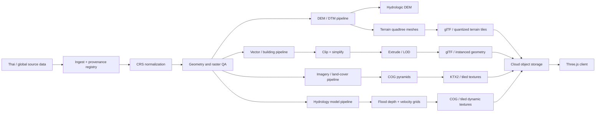
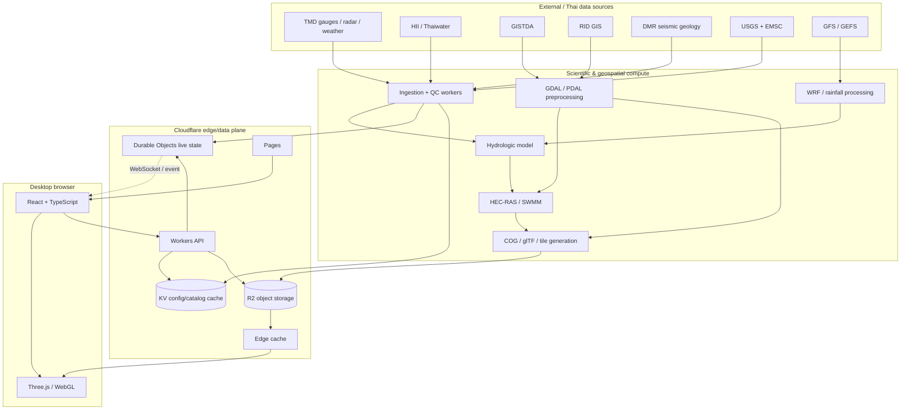
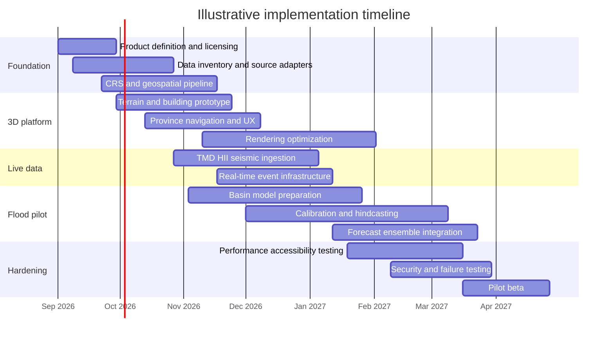

# Thailand 3D Hazard Intelligence Web Platform: Deep Research and Implementation Blueprint

> **This file is the original research blueprint** — data sources, methodology, feasibility and licensing research. It has **no phase structure** and is not a schedule: nothing here is numbered as "phase 1…9". The execution order — epics, ordered tasks with acceptance criteria, milestones and deferred work — lives in [`docs/roadmap.md`](roadmap.md); deploy steps live in [`docs/deploy.md`](deploy.md).

## Executive summary

A Thailand-focused desktop web application that renders provinces as interactive 3D environments and overlays flood and earthquake intelligence is technically feasible with Three.js/WebGL and a largely open-data foundation. The central design constraint is not 3D rendering itself; it is **data quality, elevation accuracy, model calibration, licensing, and communicating uncertainty honestly**.

For the visual layer, Thailand can be represented nationwide from open global DEM, land-cover and building data, then improved with Thai-government datasets from GISTDA, the Land Development Department, Department of Mineral Resources, Royal Irrigation Department, Thai Meteorological Department, Hydro-Informatics Institute and the national open-data catalog. Thailand's government catalog currently indexes more than 42,000 datasets across formats including CSV, ZIP, JSON and API resources, although openness and production suitability have to be checked dataset-by-dataset. citeturn23search0

For a visually convincing provincial overview, Copernicus GLO-30 elevation at approximately 30 m resolution, 10 m ESA WorldCover, GISTDA imagery, and OpenStreetMap/Overture buildings are sufficient. Copernicus GLO-30 is globally available and distributed as GeoTIFF; ESA WorldCover supplies 10 m land cover under CC BY 4.0; Geofabrik provides frequently refreshed Thailand OpenStreetMap extracts. citeturn3search0turn3search16turn3search2turn13search0 However, **30 m elevation must not be treated as adequate input for defensible street-level flood depths**. An operational urban flood system should ultimately acquire a higher-resolution bare-earth DTM, drainage geometry, culverts, road levels and surveyed river cross-sections in priority cities.

The flood side is realistic as an operational forecasting product. Thailand already has rainfall, weather, radar and water-monitoring infrastructure through TMD and HII. HII reports integrating hundreds of datasets from dozens of agencies, including rainfall, forecasts, river levels, dam conditions and Chao Phraya drainage information; its research also describes radar rainfall estimation and approximately one-to-three-hour rainfall nowcasting. citeturn0search15turn0search23 The application can combine those observations with TMD/WRF forecasts, NOAA GFS/GEFS forcing and hydrologic/hydraulic models such as HEC-RAS and SWMM. GFS runs four times daily and reaches 384 hours, while GEFS generates multiple ensemble members specifically to represent forecast uncertainty. citeturn19search9turn19search17

The earthquake feature needs different language and product expectations. **Current science cannot predict the exact time, place and magnitude of a future earthquake.** USGS explicitly distinguishes earthquake prediction from early warning, probabilistic hazard and aftershock forecasts. citeturn19search0turn19search16 A scientifically defensible Thailand product should therefore provide:

**earthquake monitoring → rapid shaking assessment → possible early-notification integration → aftershock probabilities → long-term seismic hazard**, rather than a UI claiming “earthquake forecast in the next seven days.”

USGS describes earthquake early warning as rapid detection after rupture begins, potentially producing seconds to tens of seconds of warning before shaking reaches some locations; it is not pre-event prediction. citeturn19search24 Thailand has the Thai Seismic Monitoring Network operated by TMD and catalog/active-fault information from TMD and DMR that can anchor the Thai-specific layer. citeturn6search1turn2search0turn2search5

For the application architecture, I recommend **Three.js + React/TypeScript on Cloudflare Pages; Workers as the edge API; R2 for immutable terrain, vector, imagery and model artifacts; Durable Objects for live state/WebSocket fan-out; and KV only for read-heavy configuration or slowly changing lookup data**. Cloudflare documents KV as eventually consistent, with changes potentially taking 60 seconds or more to propagate, so it is not the correct source of truth for real-time warning state. citeturn17search0turn17search4 Durable Objects support WebSocket hibernation so idle connected clients can remain attached while the object is not actively consuming duration. citeturn16search5

Heavy simulations such as WRF, national HEC-RAS models or large ensemble jobs should **not** be executed in ordinary Workers. They belong on dedicated CPU/HPC/cloud compute, with Cloudflare orchestrating, publishing and serving the results. Workers and Durable Objects are ideal control-plane and distribution components, not substitutes for hydrologic HPC. Cloudflare's current Worker runtime limits reinforce that separation. citeturn16search6

A reasonable development path is approximately **six to eight months for a credible single-region beta**, assuming a six-to-eight-person multidisciplinary team, followed by another six to twelve months for broader provincial calibration and operationalization. The first pilot should not attempt all 77 provinces simultaneously. Bangkok/Chao Phraya, Chiang Mai, or another basin with sufficiently good observation and hydraulic data should be used to prove the complete chain from sensor → model → uncertainty → 3D visualization.

My preferred name after a preliminary exact-string web screen is **THAVOX — Thailand All-hazard Visualization & Operations eXchange**. Eight name candidates and the screening limitations are given at the end.

## Data foundation for Thailand

The word “open-source dataset” is slightly misleading: software can be open source, whereas these are mostly **open data**. Their licenses range from genuinely reusable CC BY/ODbL data to government public datasets with non-commercial restrictions or source-specific terms. A production product therefore needs a license registry alongside the data catalog.

The most important architectural rule is to separate three classes of data:

**Base geospatial data** changes relatively slowly: terrain, soil, buildings, roads, administrative boundaries and land cover.

**Observation data** is time-dependent: rainfall gauges, radar, river levels, tidal levels and earthquakes.

**Derived/model data** is generated by your system: rainfall forecasts, discharge, flood depths, probabilities, shaking estimates and uncertainty products.

### Recommended source inventory

| Required layer | Primary recommendation | Format / access | Freshness | License / reuse issue | Production role and download |
|---|---|---|---|---|---|
| **Land use** | Thailand Land Development Department, Present Land Use | SHP and catalog resources | Dataset/province dependent; catalog entries have continued to be maintained, with the land-use group showing updates into 2025 | Verify each record before redistribution; LDD products do not all share identical terms | Best Thai thematic land-use baseline. [LDD Land Use catalog](https://lddcatalog.ldd.go.th/group/landuse) citeturn15search2turn15search5 |
| **DEM / surface elevation** | Copernicus DEM GLO-30 | GeoTIFF tiles | 2021 release; essentially static rather than a live elevation product | Copernicus DEM terms permit broad use; confirm attribution requirements in deployment | National terrain baseline. [Copernicus DEM open-data registry](https://registry.opendata.aws/copernicus-dem/) citeturn3search0turn3search16 |
| **Alternative DEM** | NASA/USGS SRTM 1 arc-second | GeoTIFF/HGT-style elevation products via Earthdata | Observed in 2000; static terrain source | NASA/USGS data-use conditions | Fallback and cross-check, not preferred for street hydraulics. [NASA Earthdata SRTM](https://www.earthdata.nasa.gov/data/catalog/lpcloud-srtmgl1-003) citeturn3search5turn3search9 |
| **Building footprints** | OpenStreetMap Thailand / Geofabrik | `.osm.pbf`, SHP and related extracts | Thailand extracts are refreshed frequently; current listings show near-daily snapshots | ODbL; attribution and database share-alike obligations matter | Excellent nationwide starting point, but completeness varies geographically. [Thailand Geofabrik extract](https://download.geofabrik.de/asia/thailand.html) citeturn13search0turn13search4turn13search12 |
| **Normalized buildings alternative** | Overture Maps Buildings | GeoParquet; client can export GeoJSON by bounding box | Release based | Buildings incorporate OSM content and carry the applicable ODbL obligations | Easier schema for ETL and columnar cloud processing. [Overture data access](https://docs.overturemaps.org/getting-data/) citeturn13search3turn13search20turn13search14 |
| **Administrative boundaries** | Use OSM polygons operationally; validate identifiers/hierarchy against Department of Provincial Administration data | OSM PBF/GeoJSON plus DOPA tabular/GIS resources | OSM frequently updated; DOPA source-specific | ODbL for OSM; government terms for DOPA | Do not treat crowd-sourced boundaries as legally authoritative. DOPA exposes province/district/subdistrict/village hierarchy and location data. [DOPA catalog](https://catalog.dopa.go.th/dataset/) citeturn24search2turn24search4 |
| **River / canal / hydrology network** | Royal Irrigation Department GIS + HII; OSM as cartographic fallback | RID hosted GIS layers can support SHP, CSV, KML, FileGDB and GeoJSON exports depending on item | Layer-specific | Check each RID item | Use RID/HII as the operational water-network source and OSM for visual completeness. [RID GIS Portal](https://gisportal.rid.go.th/portal/) citeturn10search0turn10search2 |
| **Rainfall gauges / water telemetry** | TMD AWS and Hydro-Informatics Institute | API/web time series; HII catalog includes daily/hourly rainfall datasets | Operational; TMD surfaces current automatic-station rainfall values, while HII catalog data varies by series | TMD API terms apply; some HII datasets are CC BY-NC rather than unrestricted | Primary observation forcing and model validation. [TMD Open Data](https://data.tmd.go.th/) / [HII Data](https://data.hii.or.th/) citeturn0search8turn4search4turn4search2 |
| **Weather radar / QPE** | TMD Weather Radar | Radar imagery/composites and nationwide QPE products | Operational weather product | TMD terms | Essential for 0–3 h precipitation nowcasting. TMD lists multiple radar sites and nationwide QPE resources. citeturn0search22turn0search24 |
| **Tide / sea level** | IOC Sea Level Station Monitoring Facility; Thai Hydrographic Department as national authority | Operational station observations via IOC facility | Many stations provide minute-scale observations; facility generally refreshes displays within minutes | Public operational data with policy/disclaimer rather than a blanket OSI-style license | Important for Bangkok/coastal backwater and storm-tide boundary conditions. [IOC Sea Level Monitoring](https://www.ioc-sealevelmonitoring.org/) citeturn12search0turn12search8 |
| **Earthquake events — Thailand** | TMD / Thai Seismic Monitoring Network | TMD API, FDSN-compatible network services | Operational seismic monitoring | Government service terms | Thai-first earthquake event layer. [TMD seismic API](https://data.tmd.go.th/api/DailySeismicEvent/v1/) citeturn6search1turn8search0 |
| **Earthquake events — global cross-check** | USGS ComCat / real-time GeoJSON | GeoJSON, FDSN, CSV, QuakeML | USGS real-time GeoJSON feeds are updated every minute | USGS data policy | Highly practical application feed. [USGS GeoJSON feeds](https://earthquake.usgs.gov/earthquakes/feed/v1.0/geojson.php) citeturn28search2turn28search9 |
| **Earthquake cross-check — EMSC** | EMSC SeismicPortal | FDSN Event API: QuakeML, JSON, CSV; WebSocket event notification | Near real time | FDSN catalog service states CC BY 4.0 | Useful second independent seismic provider and live WebSocket source. [EMSC FDSN service](https://www.seismicportal.eu/fdsn-wsevent.html) citeturn28search0turn28search6turn28search10 |
| **Active faults / earthquake hazard** | Department of Mineral Resources | ArcGIS REST/API and related government geospatial resources | Updated as required | Active-fault record is published under Creative Commons Attribution | Critical static seismic-context layer. [DMR active faults](https://data.dmr.go.th/dataset/zone-acttivefault) citeturn2search0turn2search7 |
| **Soil groups / soil series** | Land Development Department | SHP, CSV/PDF or catalog resources depending dataset | Soil-group catalog updated into 2025; soil-series resources into 2026 | Relevant LDD soil records are labeled CC BY-NC-ND; restrictive for commercial derivative workflows | Infiltration, runoff parameterization and susceptibility analysis. [LDD catalog](https://lddcatalog.ldd.go.th/) citeturn14search1turn14search4 |
| **Land cover** | ESA WorldCover | 10 m raster/GeoTIFF-class downloadable products and web services | Reference epochs 2020 and 2021, not a live land-cover product | CC BY 4.0 | Nationwide impervious/vegetation/water baseline. [WorldCover data access](https://esa-worldcover.org/en/data-access) citeturn3search2turn3search10 |
| **Satellite basemap / recent imagery** | GISTDA Open Data | API | GISTDA's 2 m basemap record labels its update unit “real time,” but its metadata also shows a specific last-data date; therefore treat freshness as metadata-driven, not guaranteed instant imagery | Open Data Common on the cited dataset | Excellent Thai-government visual layer and event imagery source. [GISTDA 2 m basemap dataset](https://opendata.gistda.or.th/dataset/2-gistda) citeturn23search1 |
| **Dataset discovery** | DGA Open Government Data / GD Catalog | CSV, JSON, API, ZIP, SHP where provided | Agency-specific | Dataset-specific | Discovery/metadata catalog rather than one authoritative geospatial database. [data.go.th](https://data.go.th/dataset/) citeturn23search0 |

There is one important legal issue hidden in this table: **“publicly downloadable” does not mean “safe to incorporate into a commercial derived-data product.”** HII catalog records can carry CC BY-NC terms, and LDD soil records cited above use CC BY-NC-ND. citeturn4search2turn14search1 The production pipeline should therefore store `source`, `license`, `version_date`, `attribution_text`, `redistribution_allowed`, and `derivative_allowed` alongside every layer.

For a commercial application, a sensible policy is:

| Data class | Recommended licensing approach |
|---|---|
| Terrain, broad land cover | Prefer clearly reusable Copernicus/ESA products |
| Buildings/roads | OSM/Overture is viable, but design attribution and ODbL compliance from the start |
| Government observations | Consume through official APIs subject to their operational terms; do not blindly republish complete historical databases |
| Restrictive NC/ND layers | Keep isolated from redistributable derived products until legal review or written permission |
| Model outputs | Track which input licenses propagate obligations into outputs |

**Resolution is more important than source count.** A visually impressive national prototype can be made with 30 m elevation, but a hydraulic model predicting whether one side of a Bangkok road receives 0.3 m or 0.8 m of water is sensitive to road crowns, walls, drains, embankments and very small elevation differences. That means a later operational phase needs local engineering data that may not be openly available.

## Geospatial preprocessing and 3D rendering pipeline

A production Three.js map should **not load raw nationwide SHP, GeoTIFF or OSM PBF files directly into the browser**. The preprocessing system should generate progressive, immutable web artifacts designed for spatial streaming.

The recommended coordinate hierarchy is:

**Source CRS → canonical geographic archive → local metric computation → floating-origin rendering.**

Thailand government GIS products use both current WGS84 and legacy datums; Royal Thai Survey Department material documents historical use of Indian 1975 as well as WGS84. citeturn9search0 LDD material explicitly references WGS84 UTM zones 47 and 48 for Thai spatial work. citeturn27search1

Use these conventions:

| Purpose | CRS strategy |
|---|---|
| API interchange, source catalog, database geometry | **WGS84 / EPSG:4326** |
| Metric processing in most of western/central Thailand | **WGS84 / UTM 47N — EPSG:32647** |
| Metric processing in eastern Thailand | **WGS84 / UTM 48N — EPSG:32648** |
| Web raster/vector tile addressing where standard ecosystem compatibility matters | Web Mercator where appropriate, while retaining elevation/model data in metric CRS |
| Three.js world coordinates | Local meters relative to a scene/tile origin, not raw latitude/longitude |
| Legacy Indian 1975 | Explicitly transform during ingestion; preserve original CRS metadata |
| TM3 | Treat as a source-specific surveying CRS. Do not infer parameters merely from the label “TM3”; require the agency's projection parameters/`.prj`/PROJ definition before transformation |

Using local coordinates for Three.js also avoids floating-point precision problems created by putting millions-of-meters global coordinates directly into GPU vertex buffers.

The complete pipeline should look like this:



**Raster preprocessing.** GDAL should be the main geospatial ETL tool. GDAL's official tooling supports reprojection/warping, Cloud Optimized GeoTIFF generation, tiled pyramids and common raster/vector formats. citeturn18search17turn18search7turn18search5 A typical DEM preprocessing sequence is:

`source GeoTIFF → validate nodata → reproject → mosaic → clip → hydrologic conditioning copy → web visualization copy → overviews/tiles`.

Keep the **hydraulic DEM and visualization terrain separate**. The model version might need stream burning, levees or drainage corrections; the visual version might need smoothing. Mixing them will eventually create discrepancies that are difficult to audit.

Generate normal maps from the elevation data for terrain detail. A normal map will visually recover small-scale relief even when the underlying terrain mesh has been decimated. It should not be mistaken for improved physical elevation resolution.

**Point-cloud preprocessing.** When LiDAR or UAV point clouds become available, use PDAL for filtering, reprojection, outlier removal, classification-related pipelines and point decimation before DTM generation. PDAL documents filters for reprojection, decimation and outlier handling. citeturn18search4turn18search16

**Terrain tiling and LOD.** Represent terrain as a quadtree. Far tiles have coarse grids; near tiles load higher-resolution children. Add skirts around tile borders to hide LOD cracks. QGIS itself uses hierarchical terrain tiles, replaces them with higher-detail tiles as the camera approaches, and exposes tile-resolution and skirt-height controls; this provides a useful reference implementation for the same concepts. citeturn21search0

A good self-hosted artifact architecture is either:

`tileset hierarchy → GLB terrain tile`

or

`quantized terrain → Three.js decoder`

with an independent texture layer.

OGC 3D Tiles is particularly relevant for dense buildings or future photogrammetry because the standard was explicitly designed to stream massive 3D geospatial datasets including buildings, point clouds and photogrammetry. citeturn21search1 This gives you a standards-based **Cesium ion alternative**: generate/host compatible tiles yourself in object storage rather than requiring Cesium ion as the serving platform.

**Buildings.** Do not render every building as an independent Three.js object. At ingestion:

`OSM/Overture polygon → repair geometry → clip to tile → simplify by zoom → determine height → triangulate → extrude → batch by material → glTF`.

Where `height` exists, use it. Where only floor count exists, use a documented configurable floor-height heuristic and flag the value as inferred. Where neither exists, render a low-detail default-height massing rather than pretending the building is accurately modeled.

At distant LODs, thousands of buildings can be merged into tile meshes. At closer levels, repeated objects such as trees, lights or generic building archetypes should use `THREE.InstancedMesh`; Three.js explicitly notes that instancing reduces draw calls for large sets of identical geometry/material combinations. citeturn20search14

**Mesh optimization.** Blender is useful for manual hero assets and batch preprocessing of selected 3D content. Its Decimate modifier is designed to reduce face/vertex counts while limiting shape change, and Blender supports glTF 2.0 export. citeturn22search0turn22search1 For programmatic nationwide generation, however, use scripts/GDAL/mesh libraries rather than putting Blender in every ETL job.

**Textures.** Build texture atlases for repeated facade/roof classes and use KTX2/Basis-compressed textures for GPU-friendly transmission. Three.js's `KTX2Loader` transcodes KTX2/Basis assets into compressed formats supported by the client GPU. citeturn20search11 Geometry can be Draco-compressed inside glTF; Three.js provides `DRACOLoader` integration with `GLTFLoader`. citeturn20search2turn20search5

**Materials and lighting.** For the mockup-style “high-end digital twin” appearance, use `MeshStandardMaterial`/PBR rather than flat Lambert materials for important surfaces. Three.js's standard material implements metallic-roughness PBR and benefits from an environment map. citeturn20search23 A restrained scene normally looks better than indiscriminately adding effects:

- directional sun light with cascaded or tightly bounded shadows near the camera;
- image-based environmental lighting;
- ambient occlusion concentrated around buildings;
- atmospheric haze increasing with camera distance;
- slight terrain roughness variation;
- normal maps to recover visual terrain texture;
- physically restrained water reflection/refraction;
- screen-space outlines only for selected/highlighted administrative features.

For water, render the actual hydraulic result independently of the decorative surface. The “water shader” may use animated normals, Fresnel reflectance and depth-based opacity, while the flood depth feeding the shader comes from the model grid. That separation prevents aesthetics from altering scientific data.

**Flood rendering.** A strong approach is to keep flood depth as a GPU texture. Terrain vertices or fragments sample the corresponding flood tile. This avoids generating a new mesh every model timestep. Additional textures can encode velocity, probability and confidence.

Use GPU particle systems for velocity-field visualization: particles advect through the model's `(u,v)` vector field and die/reseed after a fixed lifetime. Render them only at useful zoom levels.

**Atmosphere.** Full physically based atmospheric scattering is optional for a provincial urban product. A cheaper depth/altitude-dependent haze often produces the visual effect needed. Save full scattering for globe/high-altitude views where the horizon is visible.

**Recommended initial desktop performance budget** — these are engineering starting targets to benchmark, not browser hard limits:

| Metric | Mainstream desktop target | High-spec optional mode |
|---|---:|---:|
| Frame rate | 60 FPS desired; 30 FPS minimum interaction floor | 60+ FPS |
| 60 FPS total frame time | ≤16.7 ms | ≤16.7 ms |
| Visible triangles | roughly 1.5–3 million | roughly 4–8 million |
| Draw calls | target <300; investigate >500–600 | can tolerate more after profiling |
| Resident scene textures | roughly 300–600 MB | up to ~1 GB where GPU permits |
| First meaningful 3D payload | ~8–15 MB compressed target | progressive thereafter |
| High-detail radius | camera-dependent, usually a few km around focus | configurable |
| Shadow-casting geometry | near-camera objects only | wider radius |

The most effective performance improvements usually come from **LOD, batching, instancing, texture compression and reducing overdraw**, rather than micro-optimizing individual JavaScript expressions.

QGIS should remain in the workflow as a QA and authoring tool. Its current 3D system supports DEM terrain, hierarchical tiles, mesh LOD, shadows, ambient occlusion and export to 3D scenes, making it useful for validating source layers before they enter automated production. citeturn21search0turn21search2turn21search6

A practical tool comparison is:

| Tool | Use it for | Do not make it responsible for |
|---|---|---|
| **GDAL** | CRS conversion, clipping, raster pyramids, COG, raster/vector ETL | interactive client rendering |
| **PDAL** | LiDAR/point-cloud cleaning and preprocessing | hydraulic simulation |
| **QGIS** | QA, styling experiments, CRS inspection, manual layer analysis, 3D verification | production nationwide runtime |
| **Blender** | bespoke assets, material work, mesh decimation, glTF authoring | routine GIS transformation |
| **Three.js** | final browser renderer and interaction framework | large offline GIS operations |
| **OGC 3D Tiles** | interoperable hierarchy for large 3D datasets | hydrologic data model |
| **Self-hosted GLB quadtree** | simplest Three.js-specific terrain/building architecture | third-party interoperability |
| **Cesium ion** | optional managed preprocessing/hosting | mandatory infrastructure dependency |

An example Three.js terrain-tile loader, assuming the preprocessing pipeline has already generated local-coordinate `.glb` terrain tiles, is:

```ts
import * as THREE from "three";
import { GLTFLoader } from "three/addons/loaders/GLTFLoader.js";
import { DRACOLoader } from "three/addons/loaders/DRACOLoader.js";
import { KTX2Loader } from "three/addons/loaders/KTX2Loader.js";

type TerrainTile = {
  url: string;

  // Projected coordinates of the tile origin, for example EPSG:32647.
  easting: number;
  northing: number;
};

export class TerrainLoader {
  private readonly loader: GLTFLoader;

  constructor(
    private readonly renderer: THREE.WebGLRenderer,
    private readonly sceneOriginEasting: number,
    private readonly sceneOriginNorthing: number,
  ) {
    const draco = new DRACOLoader();
    draco.setDecoderPath("/codecs/draco/");

    const ktx2 = new KTX2Loader();
    ktx2.setTranscoderPath("/codecs/basis/");
    ktx2.detectSupport(renderer);

    this.loader = new GLTFLoader()
      .setDRACOLoader(draco)
      .setKTX2Loader(ktx2);
  }

  async load(tile: TerrainTile): Promise<THREE.Object3D> {
    const gltf = await this.loader.loadAsync(tile.url);
    const root = gltf.scene;

    /*
     * Convention for the generated GLB:
     *   X = local easting
     *   Y = elevation
     *   Z = local northing
     *
     * Keep the Three.js scene close to (0,0,0) to improve numerical
     * precision instead of using full projected coordinates per vertex.
     */
    root.position.set(
      tile.easting - this.sceneOriginEasting,
      0,
      -(tile.northing - this.sceneOriginNorthing),
    );

    root.traverse((obj) => {
      if (!(obj instanceof THREE.Mesh)) return;

      obj.frustumCulled = true;
      obj.castShadow = false;   // Terrain usually receives shadows.
      obj.receiveShadow = true;

      // Preserve PBR materials embedded in the glTF.
      if (obj.material instanceof THREE.MeshStandardMaterial) {
        obj.material.envMapIntensity = 0.8;
      }
    });

    return root;
  }
}
```

This approach is preferable to sending full-resolution DEM rasters to every client and constructing huge terrain meshes in JavaScript. Three.js can decode compressed glTF/KTX2 content directly with its documented loaders. citeturn20search2turn20search11

## Real-time hazard intelligence and forecasting

Flood forecasting and earthquake intelligence should be designed as two distinct scientific systems that happen to share the same map, time controls and event infrastructure.

**Flood processing chain:**

```text
TMD/HII gauges + radar + tide
             │
             ▼
       QC / gap detection
             │
     ┌───────┴────────┐
     ▼                ▼
Radar nowcast    NWP forecast
0–3 hours       WRF / GFS / GEFS
     │                │
     └───────┬────────┘
             ▼
     rainfall ensemble
             │
             ▼
 hydrologic runoff model
             │
             ▼
 river / drainage inflow
             │
             ▼
HEC-RAS / SWMM / other hydraulics
             │
             ▼
depth + velocity + probability grids
             │
             ▼
      tile / publish to web
```

TMD publicly exposes automatic weather-station information and forecast products, including seven-day forecast material and weather-radar/QPE resources. citeturn0search8turn0search26turn0search22 HII operates national water/climate information infrastructure combining observations, water conditions and forecasts, and has documented radar-based rainfall nowcasting work for roughly one-to-three-hour lead times. citeturn0search15turn0search23

This suggests the following product horizons:

| Horizon | What the UI should call it | Main information source | Realistic interpretation |
|---|---|---|---|
| **0–1 h** | Current conditions / extrapolation | gauges, radar, water levels | Highest observational anchoring |
| **1–3 h** | Rainfall nowcast / flash-flood nowcast | radar motion + gauge correction + short hydraulic runs | Particularly useful for intense convective rainfall |
| **3–24 h** | Short-range flood forecast | TMD/WRF + hydrologic/hydraulic model | Operationally valuable if basin model is calibrated |
| **1–3 d** | Flood forecast | regional/global NWP ensembles | Increasing forcing uncertainty |
| **3–7 d** | Flood-risk outlook | NWP ensembles + basin scenarios | Prefer probability/risk zones over exact street depths |
| **7–16 d** | Extended hydrometeorological outlook | GFS/ensemble guidance | Useful for preparedness; not defensible as deterministic street-level inundation |
| **Weeks/months** | Seasonal susceptibility/outlook | climatology, soil moisture, seasonal forecast | Probability and preparedness, not event timing |

NOAA's operational GFS runs at 00, 06, 12 and 18 UTC and provides forecasts through hour 384, or 16 days. citeturn19search25turn19search9 That does **not** mean a flood application has accurate 16-day building-level water depths: uncertainty compounds through precipitation, runoff and hydraulics. Beyond a few days, the map should progressively shift from “depth forecast” toward “probability / scenario / preparedness.”

For uncertainty, NOAA's GEFS is useful conceptually because it creates multiple forecasts rather than pretending one atmospheric future is certain. citeturn19search17 A flood ensemble can vary:

`meteorological member × rainfall bias correction × soil initial state × hydrologic parameters × hydraulic boundary conditions`.

The web product then publishes statistics such as:

`P(flood depth > 0.20 m)`,  
`P(flood depth > 0.50 m)`,  
`P10 / median / P90 water depth`,  
`expected arrival-time distribution`.

This is much more defensible than a single animated blue surface labeled “the forecast.”

### Model choices

| Model/platform | Best role | Notes |
|---|---|---|
| **HEC-RAS** | rivers, floodplains, 1D/2D hydraulic routing | USACE documents 1D and 2D unsteady-flow modeling including shallow-water/diffusion-wave approaches. citeturn19search2turn19search10 |
| **EPA SWMM** | urban drainage, pipes, channels, retention/storage | EPA describes SWMM as open-source and freely available; it models runoff and drainage networks. citeturn19search3turn19search39 |
| **Delft-FEWS** | operational forecasting orchestration, time-series handling, model workflow | Deltares describes FEWS as an open/flexible forecasting platform that connects data with external numerical models; it should be viewed mainly as the forecasting framework rather than “the flood model.” citeturn20search0turn20search3turn20search24 |
| **WRF** | regional numerical weather prediction | The NCAR/WRF ecosystem provides the mesoscale atmospheric model used for regional forecasting workflows. citeturn20search1turn20search7 |
| **GFS** | global deterministic meteorological boundary/forcing | Four runs daily, through 384 h. citeturn19search9turn19search25 |
| **GEFS** | meteorological ensemble | NOAA describes 21 forecasts/ensemble members for representing atmospheric forecast uncertainty. citeturn19search17 |
| **TMD regional models** | Thailand-specific operational meteorological input | TMD exposes high-performance forecast products, WRF-related forecasts and other spatial forecast services. citeturn0search2turn0search11 |
| **HII WRF/ocean workflows** | Thai regional atmosphere/coastal forcing | HII has documented coupled WRF–ROMS work for Thailand. citeturn0search27 |

For Bangkok, the hydraulic problem is not merely “river flood.” It can contain pluvial rainfall, pipe/drainage capacity, canals, pumping, gates, Chao Phraya levels and coastal/tidal backwater. Therefore an eventual Bangkok-grade system may need SWMM or another drainage-network solver coupled to a 1D/2D surface/river model.

**Compute strategy matters.** Run high-fidelity physics models asynchronously on dedicated compute, then publish raster/vector outputs. For rapid nowcasts, consider a hierarchy:

`full physics model → calibrated reduced model → surrogate / precomputed response surfaces`.

A machine-learning surrogate can reduce latency after enough validated training runs exist, but it should not replace the reference model until its error envelope has been quantified.

### Earthquakes: monitoring, not deterministic prediction

This needs a hard product boundary. USGS states that successful earthquake prediction would require specifying time, location and magnitude, and that major earthquakes cannot currently be predicted in that manner. citeturn19search0turn19search16

Therefore the UI should not present:

> “Earthquake probability in Chiang Mai tomorrow: 72%”

unless that number comes from a scientifically validated probabilistic model with a properly defined time window, magnitude threshold and region.

A defensible earthquake stack is:

```text
TMD seismic network
USGS real-time GeoJSON
EMSC near-real-time events
DMR active faults
        │
        ▼
event normalization + deduplication
        │
        ├── current epicenters
        ├── event confidence/status
        ├── estimated affected region
        ├── ShakeMap / intensity data where available
        ├── travel-time animation
        └── aftershock probability products
```

USGS recommends its real-time GeoJSON feeds for automated earthquake-display applications and currently updates those summary feeds every minute. citeturn28search2turn28search9 EMSC provides both FDSN queries and near-real-time WebSocket notification of newly inserted or updated events; its FDSN event service can return QuakeML, JSON or CSV and states CC BY 4.0 for that service. citeturn28search6turn28search10

Thailand's own TMD network should remain the primary local context rather than allowing USGS or EMSC to become the sole authoritative Thai display. TMD is listed as the operator of the Thai Seismic Monitoring Network in the FDSN ecosystem. citeturn6search1 DMR should provide active-fault and static geological context rather than being treated as the live event stream. citeturn2search0turn2search5

After a significant earthquake, probabilistic aftershock forecasts are scientifically meaningful. USGS forecasts aftershock activity over horizons including a day, week, month and year, updating expectations as a sequence develops. citeturn19search8 That is very different from predicting the original mainshock.

For earthquake UX, separate three concepts visibly:

**Observed** — event has been detected.

**Estimated** — shaking or impact is derived from observations/models.

**Probabilistic** — future aftershock/hazard information is uncertain.

Do not use the same bright deterministic color treatment for all three.

### Real-time cadence

A reasonable operational target is:

| Stream | Ingestion target | Browser delivery |
|---|---:|---:|
| Earthquake event changes | seconds–1 min, upstream dependent | immediately through event push |
| Rain gauges | follow source cadence; commonly minute-to-hour class depending network/product | refresh when station timestamp changes |
| Weather radar/QPE | ingest every newly published scan/product | update map tile manifest |
| River/water levels | follow station publication cadence | station-state push plus historical fetch |
| Tide | minutes | latest-value push / short polling |
| NWP run | after each new source model cycle | publish only when complete/validated |
| Flood simulation | per rainfall/model cycle | new immutable forecast run |
| Static terrain/buildings | days/months | immutable CDN cache |

The IOC sea-level facility states that many real-time stations provide minute observations with facility updates on the order of minutes. citeturn12search0 USGS's standard GeoJSON earthquake feed updates every minute. citeturn28search2

A push message should generally contain **“new version available”**, not megabytes of flood raster data. For example:

```json
{
  "type": "forecast.updated",
  "province": "10",
  "runId": "2026-08-16T12:00:00Z",
  "validThrough": "2026-08-19T12:00:00Z",
  "manifest": "/hazards/10/20260816T1200/manifest.json"
}
```

The client then fetches only newly visible tiles from the CDN.

Uncertainty should be visualized explicitly using:

- probability opacity/contours;
- P10/P50/P90 depth selectors;
- confidence hatching for poorly constrained areas;
- “observation time / model run / valid time” displayed separately;
- ensemble spread;
- sensor freshness indicators;
- grey or desaturated regions where input data are stale;
- ability to compare forecast vs observed water extent after an event.

This will make the system more trustworthy than a highly polished 3D animation that hides its uncertainty.

## Cloudflare-compatible architecture and deployment

Cloudflare is well suited to the **browser delivery, low-latency API, caching and live-event distribution** parts of this system. It should not be forced to perform all scientific computation.

Recommended architecture:



**Pages** serves the React/Vite/TypeScript desktop application.

**Workers** provides authenticated API routing, source normalization endpoints, metadata APIs and R2 access.

**R2** stores the large immutable objects:

```text
terrain/{datasetVersion}/{z}/{x}/{y}.glb
buildings/{version}/{z}/{x}/{y}.glb
imagery/{version}/...
forecast/{province}/{runId}/depth/{t}/{z}/{x}/{y}.tif
forecast/{province}/{runId}/manifest.json
earthquake/{eventId}/impact.json
```

R2's current standard-storage price is $0.015/GB-month, with a free allowance that includes 10 GB-month plus operation allowances; Cloudflare also advertises no R2 egress charge. citeturn16search1turn16search7 At that rate, before request costs, roughly 1 TiB of standard-class stored data after the 10 GB allowance is about **$15.21/month**. The expensive part of this system is much more likely to be scientific compute, high-resolution data acquisition and engineering labor than object-storage capacity.

**Durable Objects** should hold strongly coordinated transient state:

```text
latest forecast run per province
current incident state
WebSocket subscriptions
sensor-alert aggregation state
model-run state transitions
```

Cloudflare's hibernating WebSocket model lets clients stay connected while inactive Durable Objects sleep, which fits event notifications well. citeturn16search5 Cloudflare documents a maximum of 32,768 WebSocket connections associated with an individual Durable Object, although real production capacity should be load-tested below theoretical limits. citeturn16search14 Partition connections by province or incident instead of placing the whole country in one object.

**KV** should store slowly changing, globally read-heavy state:

```text
province metadata
UI configuration
feature flags
source catalog summary
latest stable data-version pointers that tolerate propagation lag
```

It should **not** store an emergency alert requiring immediate globally consistent updates because KV is eventually consistent. citeturn17search0turn17search4

**WebSocket alternatives.** Not every feature requires a socket. The preferred hierarchy is:

`immutable CDN fetch → ETag/polling → Server-Sent/streaming HTTP where appropriate → Durable Object WebSocket for true live events`.

A map tile does not need a WebSocket. A newly detected earthquake might.

**Caching strategy:**

| Asset | Suggested policy |
|---|---|
| Hash/versioned GLB/KTX2/terrain | `public, max-age=31536000, immutable` |
| Versioned flood tile | long immutable cache |
| Forecast run manifest | tens of seconds to a few minutes depending operational requirement |
| Station current-state API | ~10–60 s or event-driven invalidation |
| Static province metadata | hours/days |
| Emergency state | `no-store` or extremely short TTL |
| Historical event data | long CDN cache |

Cloudflare Cache Rules can control eligibility and TTL behavior, and Cloudflare supports standard cache-control semantics such as stale revalidation behavior. citeturn17search14turn17search8

A small Worker API can expose the latest model manifest while keeping R2 private:

```ts
export interface Env {
  HAZARD_BUCKET: R2Bucket;
  LIVE_STATE: DurableObjectNamespace;
}

const PROVINCE_RE = /^[0-9]{2}$/;

export default {
  async fetch(
    request: Request,
    env: Env,
  ): Promise<Response> {
    const url = new URL(request.url);

    // GET /api/v1/provinces/10/hazards/latest
    const match = url.pathname.match(
      /^\/api\/v1\/provinces\/([0-9]{2})\/hazards\/latest$/,
    );

    if (!match) {
      return new Response("Not found", { status: 404 });
    }

    const province = match[1];

    if (!PROVINCE_RE.test(province)) {
      return Response.json(
        { error: "Invalid province code" },
        { status: 400 },
      );
    }

    /*
     * Use a Durable Object as the strongly coordinated pointer to the
     * current model run. KV is intentionally not used for emergency-
     * sensitive latest state because its replication is eventual.
     */
    const id = env.LIVE_STATE.idFromName(`province:${province}`);
    const stub = env.LIVE_STATE.get(id);

    const stateResponse = await stub.fetch(
      new Request("https://internal/latest"),
    );

    if (!stateResponse.ok) {
      return Response.json(
        { error: "Forecast state unavailable" },
        {
          status: 503,
          headers: { "Cache-Control": "no-store" },
        },
      );
    }

    const state = await stateResponse.json<{
      runId: string;
      manifestKey: string;
    }>();

    const object = await env.HAZARD_BUCKET.get(state.manifestKey);

    if (!object) {
      return Response.json(
        { error: "Forecast manifest not found" },
        { status: 404 },
      );
    }

    return new Response(object.body, {
      headers: {
        "Content-Type": "application/json",
        // Latest pointer can change; keep the edge TTL short.
        "Cache-Control":
          "public, max-age=5, s-maxage=15, stale-while-revalidate=30",
        "ETag": object.httpEtag,
        "X-Model-Run": state.runId,
      },
    });
  },
};
```

The versioned R2 artifacts referenced by that manifest can then remain immutable.

Current Cloudflare Workers paid plans start at a $5/month minimum, while R2 and Durable Objects add usage-dependent charges. citeturn16search0turn16search3 The architecture therefore scales cheaply at low traffic from the serving perspective, but that can be misleading when estimating the complete project: high-resolution DEM acquisition, WRF runs, hydraulic ensembles and domain-specialist staffing will dominate a serious operational budget.

**Security architecture** should include authentication for admin/operator workflows, rate limiting and WAF in front of public APIs, private R2 buckets for data not intended for direct redistribution, source credentials stored in Worker secrets rather than frontend code, strict CORS, schema validation on every upstream feed, and separate permissions for model publishing versus public reading.

For every forecast artifact, preserve provenance:

```json
{
  "runId": "2026-08-16T12:00:00Z",
  "model": "hec-ras-example",
  "modelVersion": "x.y",
  "forcing": [
    {
      "source": "TMD",
      "observationCutoff": "2026-08-16T11:45:00Z"
    },
    {
      "source": "GFS",
      "cycle": "2026-08-16T06:00:00Z"
    }
  ],
  "terrainVersion": "dtm-bkk-2026-05",
  "calibrationVersion": "bkk-cal-v7",
  "status": "operational",
  "generatedAt": "2026-08-16T12:18:27Z"
}
```

Without this lineage, operators will eventually be unable to explain why two model runs disagree.

## Implementation roadmap, capacity, testing, and operations

I would not begin by building “Thailand nationwide real-time flood forecasting.” Start with a **national visual shell plus one scientifically credible hazard pilot**.

An illustrative implementation beginning in September 2026 is:



That translates approximately into:

**Weeks 1–4 — scope and legal/data discovery.** Select pilot basin/province. Establish data licenses. Measure source API reliability. Define flood forecast KPIs and clearly redefine earthquake functionality as monitoring/probabilistic hazard.

**Weeks 3–10 — national geospatial baseline.** Automate DEM, province, land-cover, waterways, roads and building ingestion. Establish UTM 47/48 handling, asset versioning, COG/glTF generation and R2 structure.

**Weeks 5–14 — Three.js product prototype.** Province picker, camera navigation, terrain quadtree, building LOD, atmosphere, PBR, flood texture prototype, sensor markers and timeline.

**Weeks 9–18 — operational ingestion.** TMD/HII/USGS/EMSC adapters, source freshness monitoring, event deduplication, Durable Object notifications and incident timeline.

**Weeks 10–24 — flood model pilot.** Obtain local DTM/drainage/cross-sections, build model, calibrate on historical events, establish rainfall forcing and generate model-output tiles.

**Weeks 17–27 — ensembles and uncertainty.** Multiple meteorological scenarios, probabilistic depth outputs, forecast-vs-observed evaluation and UX for uncertainty.

**Weeks 22–32 — production hardening.** Device profiling, memory testing, upstream failure drills, model monitoring, security assessment and operator workflow.

A credible **pilot beta is therefore about 24–32 weeks**. Nationwide operational hydraulic modeling is a separate expansion likely requiring another six to twelve months or more because every basin has different drainage data, hydraulic structures, calibration history and telemetry quality. This timeline is a planning estimate, not a promise tied to a specific procurement or staffing level.

A practical core team is around six to eight people:

| Role | Approx. allocation | Responsibility |
|---|---:|---|
| Product / UX designer | 1 | operations UX, hazard/time interaction, uncertainty communication |
| 3D frontend engineer | 1–2 | Three.js/WebGL, LOD, shaders, performance |
| Geospatial/data engineer | 1 | GDAL/PDAL, CRS, tiles, source ingestion |
| Backend/platform engineer | 1 | Workers, R2, live APIs, observability |
| Hydrologist/hydraulic modeler | 1–2 | flood model construction/calibration |
| Meteorology/forecast specialist | ~0.5–1 | rainfall forcing, WRF/GFS/ensemble interpretation |
| QA/SRE/data-quality engineer | ~1 | testing, monitoring, reliability |
| Seismologist/geologist | advisor/part-time initially | event interpretation, active faults, earthquake UX |

A team composed only of frontend/backend developers could build a polished visualization, but it would not by itself establish a defensible flood-forecasting system.

**Storage planning** should initially assume substantial headroom rather than optimize prematurely:

| Storage class | Planning range |
|---|---:|
| Nationwide open raw/base data | ~0.5–2 TB |
| Processed terrain/building/imagery assets | ~0.5–3 TB |
| Sensor/time-series history | ~50–500 GB/year initially |
| Model inputs/checkpoints | ~0.5–5 TB |
| Flood forecast outputs | potentially several TB/year |
| Full ensemble archives at high spatial/temporal resolution | potentially tens of TB/year |

These are capacity-planning estimates. Actual volume is controlled by grid resolution, number of modeled provinces, timestep frequency, number of ensemble members and retention period.

Do not retain every intermediate raster indefinitely. A sensible policy is:

`operational high-resolution results: 30–90 days`  
`event archives: permanent`  
`selected hindcasts/calibration runs: permanent`  
`routine intermediate simulations: lifecycle-expire`  
`summary statistics and manifests: permanent or long retention`.

For compute, separate four classes:

**ETL compute** — GDAL, vector clipping, building generation. Mostly batch CPU.

**Rendering preparation** — terrain meshing, glTF compression, texture transcode. CPU-heavy but parallelizable.

**Meteorological simulation** — WRF-scale jobs can require substantial multicore/HPC resources.

**Hydraulic ensembles** — CPU requirements depend enormously on cell size, model size and timestep. Benchmark the selected basin before promising a forecast turnaround.

The Cloudflare system sits after these jobs; it should never block a user request while waiting for HEC-RAS or WRF to finish.

Testing should operate on four independent dimensions.

**Data-quality tests:** CRS validation, bounding-box checks, impossible elevations, gauge timestamp gaps, duplicated seismic events, outlier rainfall and source schema changes.

**Scientific validation:** rainfall skill, river-level/discharge error, inundation extent comparison, depth error at known gauges/markers, event arrival-time error and forecast reliability by probability bin.

**Rendering tests:** FPS, GPU frame time, draw calls, triangles, texture memory, WebGL context loss, resizing, multiple-screen resolutions, integrated GPUs and dedicated GPUs.

**System reliability tests:** upstream TMD/HII outage, partially downloaded NWP run, stale sensor state, R2 failure simulation, malformed feed, model timeout, Durable Object reconnect, browser sleep/wakeup and clock skew.

Monitoring should surface at least:

```text
source_latest_timestamp
source_ingest_lag_seconds
missing_station_ratio
model_run_duration
model_run_status
forecast_age
tile_generation_duration
worker_error_rate
api_p95 / api_p99
R2 request rate
edge cache hit ratio
active WebSocket clients
frontend FPS
frontend memory
WebGL context failures
forecast skill by basin
```

The operator interface should put **source freshness and model health next to the hazard map**, rather than hiding them in an engineering dashboard. A flood map generated from stale gauges must be visibly distinguishable from one using current observations.

The first release should therefore contain two levels:

**National mode:** attractive 3D terrain/buildings, weather/water observations, earthquakes, active faults, recent GISTDA imagery and broad hazard context.

**Operational pilot mode:** one or a small number of basins with validated high-resolution flood forecasting.

That avoids the common failure mode of shipping nationwide “forecast” polygons with no calibrated physical basis.

## System naming and preliminary uniqueness screening

I screened eight deliberately coined strings using exact-string public-web searches on **August 16, 2026**. No exact indexed match surfaced for these eight strings in that screening session. This is useful for initial naming, but it is **not a trademark clearance, company-registry search, domain-name clearance or exhaustive global database check**. “No search result” is not proof that a name has never been used privately or in an unindexed context.

| Candidate | Expansion | Character |
|---|---|---|
| **THAVOX** | **TH**ailand **A**ll-hazard **V**isualization & **O**perations e**X**change | Strong product/operations name |
| **SIAHRA** | **S**patial **I**ntelligence **A**tlas for **H**azard & **R**esilience **A**nalytics | More governmental/research-oriented |
| **THAERIX** | **TH**ailand **A**ll-hazard **E**arth & **R**iver **I**ntelligence e**X**change | Emphasizes flood + earthquake |
| **THARQX** | **TH**ailand **A**ll-hazard **R**isk **Q**uantification e**X**change | More analytical/technical |
| **SIAMHX** | **S**patial **I**ntelligence & **A**ll-hazard **M**apping **H**ub e**X**change | Explicit Thai cultural association without using “Thai” |
| **GEOXTH** | **GEO**spatial e**X**change for **TH**ailand Hazards | GIS/infrastructure-oriented |
| **RIVATHX** | **R**isk **I**ntelligence & **V**isualization **A**tlas for **TH**ailand e**X**change | Sounds like a national risk atlas |
| **THAZIX** | **TH**ailand **A**ll-hazard **Z**onal **I**ntelligence e**X**change | Compact and technical |

**Recommended: THAVOX.**

> **THAVOX — Thailand All-hazard Visualization & Operations eXchange**

It maps reasonably well to what the product actually does: Thailand-specific, multi-hazard, visualization-centric, operational and built around exchanging live geospatial information. It also avoids promising that the platform can literally “predict disasters.”

A suitable product description would be:

> **THAVOX is a 3D geospatial hazard-intelligence platform for Thailand that combines real-time observations, flood forecasts, earthquake monitoring and probabilistic risk information in an interactive provincial digital environment.**

For a more government/scientific identity, **SIAHRA** is the stronger alternative:

> **SIAHRA — Spatial Intelligence Atlas for Hazard & Resilience Analytics**

The underlying architecture should remain hazard-neutral regardless of the brand. A well-designed schema lets future modules—landslide, wildfire, drought, PM2.5, heat, tsunami or storm surge—reuse the same province selection, 3D terrain, real-time ingestion, forecast-run model, uncertainty visualization and Cloudflare distribution infrastructure rather than becoming independent applications.