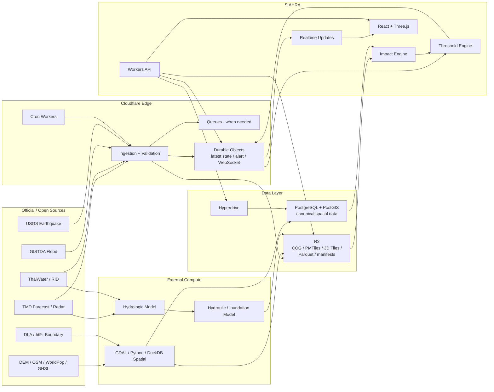
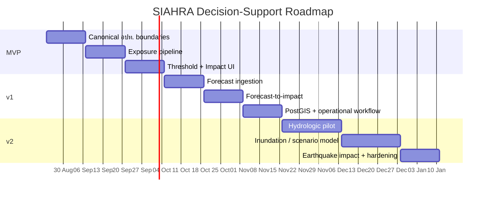

# SIAHRA: จากแพลตฟอร์มเฝ้าระวังภัยแบบสามมิติ สู่ระบบ Hazard Impact Decision Support สำหรับประเทศไทย

## บทสรุปผู้บริหาร

จากการตรวจ repository ปัจจุบันของ **SIAHRA — Spatial Intelligence Atlas for Hazard & Resilience Analytics** และเทียบกับ feedback จากผู้ใช้ ผมเห็นด้วยกับแก่นของ feedback ค่อนข้างชัดเจน: **ปัญหาหลักของ SIAHRA ตอนนี้ไม่ใช่ขาดข้อมูล hazard แต่ยังขาดชั้นข้อมูลและ logic ที่แปลง hazard ให้เป็น “ผลกระทบต่อพื้นที่รับผิดชอบ”**  

ตัวระบบปัจจุบันไปไกลกว่าต้นแบบแล้ว: repository มีโครงสร้าง monorepo แยก Web/API/ETL, รองรับ terrain สามมิติครบ 77 จังหวัด, flood extent จาก GISTDA, ThaiWater gauge/dam, TMD radar, earthquake feed, source freshness, mobile layout และ deploy จริงบน Cloudflare Workers + Durable Objects + R2 แล้ว citeturn19view0

แต่สิ่งเหล่านี้ยังตอบคำถามหลักได้ประมาณว่า:

> **“ตอนนี้เกิดอะไรขึ้นที่ไหน?”**

ในขณะที่เจ้าหน้าที่ ปภ. หรือ อปท. ต้องการคำตอบอีกชุดหนึ่ง:

> **“พื้นที่ที่ฉันรับผิดชอบจะโดนอะไร เมื่อไร รุนแรงแค่ไหน มีคน/บ้าน/ถนน/โรงพยาบาลอะไรอยู่ในพื้นที่กระทบบ้าง และฉันควรให้ความสำคัญกับพื้นที่ไหนก่อน?”**

นี่คือช่องว่างระหว่าง **Hazard Visualization** กับ **Decision Support** อย่างแท้จริง

ยิ่งไปกว่านั้น การแข่งขันด้วยการเพิ่ม layer monitoring หรือ forecast map อย่างเดียวไม่น่าจะสร้าง differentiation ได้มากนัก เพราะ ThaiWater มีมาตรฐาน/API ครอบคลุม rainfall, runoff, reservoirs และแนวคิดเกณฑ์เตือนภัยอยู่แล้ว ขณะที่ GISTDA Disaster Platform มีทั้ง flood layers ผ่าน Open API/WMS และหน้า flood ที่มีทั้งสถานการณ์ปัจจุบัน น้ำท่วมซ้ำซาก และพื้นที่คาดการณ์จากแบบจำลองแล้ว citeturn20search0turn24search0turn24search2

ดังนั้น **moat ของ SIAHRA ไม่ควรเป็น “แผนที่สวยกว่า” หรือ “ข้อมูลเยอะกว่า” แต่ควรเป็น “Impact Intelligence ที่ผูกกับเขตความรับผิดชอบของ อปท.”**

ข้อเสนอเชิงผลิตภัณฑ์คือเปลี่ยนแกนของระบบเป็น:

**Observe → Forecast → Estimate Impact → Prioritize → Act**

| ระดับ | SIAHRA ปัจจุบัน | เป้าหมายต่อไป |
|---|---|---|
| Observe | น้ำ ฝน เรดาร์ เขื่อน แผ่นดินไหว | รักษาไว้ |
| Forecast | ยังจำกัด | Rainfall / water-level / flood forecast |
| Exposure | มีแผน illustrative exposure ใน roadmap | คน อาคาร ถนน critical facilities ต่อ อปท. |
| Impact | ยังไม่มี model หลัก | “ใคร/อะไรจะได้รับผลกระทบเท่าไร” |
| Alert | source state / monitoring | threshold → อปท. ที่ได้รับผลกระทบ |
| Decision | ผู้ใช้ตีความ map เอง | จัดอันดับพื้นที่ + Impact Brief + timeline |
| Scenario | ยังไม่มี operational workflow | “ถ้าน้ำเพิ่มอีก 0.5/1.0 m จะกระทบอะไร” |
| Operations | monitoring dashboard | jurisdiction-centric incident dashboard |

Roadmap ปัจจุบันใน repository เริ่มมาถูกทางแล้ว โดยตั้งใจทำ “Tier A illustrative flood exposure” และแยกชัดว่าการทำ hydrological/hydraulic forecasting ต้องมีผู้เชี่ยวชาญและ compute ภายนอก อีกทั้งตั้งใจ defer PostGIS/Hyperdrive/Queues/Workflows เพื่อ harden Durable Object SQLite + R2 ก่อน citeturn19view1 แต่จาก feedback รอบใหม่นี้ ผมแนะนำให้ **ยกระดับ Exposure จาก feature ปลาย roadmap ให้กลายเป็นแกนหลักของ product roadmap** และเพิ่ม **อปท. boundary + threshold engine + forecast-to-impact** ขึ้นมาเป็น P0

เป้าหมายที่สมเหตุสมผลคือ:

**MVP Decision Support ภายในสัปดาห์ที่ 6 → v1 ภายในสัปดาห์ที่ 12 → v2 flood-impact forecasting pilot ภายในสัปดาห์ที่ 20**

โดยสมมติว่า **team size และ budget ยังไม่ระบุ**; timeline นี้เหมาะกับ software implementation โดยมี senior full-stack/geospatial engineer อย่างน้อยหนึ่งคน และตั้งแต่ช่วง forecast เป็นต้นไปควรมี hydrologist/domain expert ร่วม review หากเป็น solo developer จริงทั้งหมด ส่วน v2 ที่ต้องการความน่าเชื่อถือเชิงวิทยาศาสตร์อาจต้องยืดเกิน 20 สัปดาห์

ประเด็นสำคัญอีกข้อคือ **อย่าใช้คำว่า “พยากรณ์แผ่นดินไหว”** สำหรับเวลา/ตำแหน่ง/ขนาดของเหตุการณ์ล่วงหน้า เพราะ USGS ระบุชัดว่าปัจจุบันยังไม่มีวิธีทำนายแผ่นดินไหวใหญ่ในลักษณะนั้นได้ สิ่งที่ SIAHRA ควรทำแทนคือ **near-real-time earthquake impact estimation** หลัง rupture เริ่มแล้ว เช่น intensity/shaking → exposed population/buildings/critical facilities และใช้ ShakeMap/PAGER products เมื่อมีข้อมูล citeturn29search1turn29search2turn29search3

## สถานะปัจจุบันของ Repository และ Gap Analysis

ณ วันที่ 21 สิงหาคม 2026 repository สาธารณะมี 66 commits และ README ระบุว่า live system มี 3D terrain ครบ 77 จังหวัด, GISTDA flood extent, ThaiWater levels/dams, TMD radar, earthquake feed และ source-health/freshness indicator แล้ว citeturn19view0

โครงสร้าง repository มี separation ที่ดีสำหรับการขยายระบบ:

```text
SIAHRA/
├── apps/
│   ├── web/             React + Three.js client
│   ├── api/             Cloudflare Worker + Durable Objects
│   └── etl/             geospatial preprocessing
├── packages/
│   └── shared-types/
├── docs/
└── .github/
```

README ระบุ stack หลักเป็น Three.js, React 19, TypeScript, Vite, Tailwind CSS 4, Cloudflare Workers, Durable Objects, R2, GDAL และ Turf.js และแยก base geospatial data, observation data และ derived data ออกจากกัน ซึ่งเป็น foundation ที่เหมาะกับระบบ decision-support ต่อไป citeturn19view0

ไฟล์สำคัญที่ผมใช้ประกอบการ review:

[README.md](https://github.com/flukelaster/SIAHRA/blob/main/README.md)  
[docs/roadmap.md](https://github.com/flukelaster/SIAHRA/blob/main/docs/roadmap.md)  
[docs/SIAHRA-implement-plan.md](https://github.com/flukelaster/SIAHRA/blob/main/docs/SIAHRA-implement-plan.md)  
[apps/web/package.json](https://github.com/flukelaster/SIAHRA/blob/main/apps/web/package.json)  
[apps/api/package.json](https://github.com/flukelaster/SIAHRA/blob/main/apps/api/package.json)  
[apps/api/wrangler.toml](https://github.com/flukelaster/SIAHRA/blob/main/apps/api/wrangler.toml)  
[apps/web/wrangler.toml](https://github.com/flukelaster/SIAHRA/blob/main/apps/web/wrangler.toml)  
[.github/workflows/ci.yml](https://github.com/flukelaster/SIAHRA/blob/main/.github/workflows/ci.yml)

การประเมิน code quality ด้านล่างเป็น **static repository/configuration review** จาก source และเอกสารที่เผยแพร่ ไม่ใช่ dynamic security audit หรือการรัน test suite ภายนอก repository

| ด้าน | สิ่งที่มีแล้ว | Assessment | สิ่งที่ยังขาด |
|---|---|---|---|
| Frontend | React + Three.js + TS + Vite, responsive/mobile | แข็งแรงสำหรับ 3D operational UI | decision-centric UI, อปท. workflow |
| Terrain | quadtree terrain, buildings, roads, rivers, land cover | foundation ดีมาก | LOD polish, crack/transition handling, GPU budgets |
| Hazard | flood, gauges, rainfall/radar, dam, earthquake | monitoring coverage สูง | forecast-to-impact |
| Data freshness | แสดง source/age และไม่ตีความ unknown เป็น current | เป็นจุดแข็งของ product | ต้องต่อ provenance ไปถึง derived impact |
| API | versioned `/api/v1`, province hazard, flood, radar, station history | structure ดี | local-authority/exposure/impact/alert/scenario APIs |
| Realtime | Durable Objects / live earthquake / warm caches | Cloudflare-native ถูกทาง | generalized alert fan-out/watchlists |
| ETL | terrain/building/feature/land-cover scripts | แยก preprocessing ถูกต้อง | population/asset/boundary exposure pipeline |
| Storage | R2 + DO SQLite | เหมาะกับ immutable tiles + state | canonical spatial query engine เมื่อ complexity เพิ่ม |
| CI | lint, TS, build, workspace tests, Worker dry-run | baseline ดี | E2E operational tests, performance regression, data-contract tests |
| Deployment | Web Worker + API Worker, same-origin routing | เหมาะกับ Cloudflare | staging/canary/data rollback ที่เป็นระบบ |
| Decision Support | illustrative exposure อยู่ใน roadmap | concept เริ่มมี | exposure จริงตาม อปท., impact model, action prioritization |
| Forecasting | ถูก defer อย่างมีเหตุผล | scientific honesty ดี | dedicated forecast/model pipeline |

CI ของ repository ปัจจุบันมี lint, TypeScript validation, production build, Wrangler dry-run และ Vitest แยก workspace โดยมี aggregate `Test` gate แต่ README ระบุว่า aggregate test check ยังไม่ได้ถูก promote เป็น required status check บน `main` citeturn19view0 ตรงนี้ควรเป็นหนึ่งใน quick wins เพราะระบบเริ่มมี operational logic มากขึ้นแล้ว

**จุดสำคัญที่สุดของ audit คือ roadmap ปัจจุบันรับรู้ปัญหา exposure แล้ว แต่ scope ยังแคบกว่าที่ user feedback ต้องการ**

roadmap ระบุ M5 เป็น “Illustrative exposure & quake analytics” และตั้งใจไม่ใช้คำว่า probability/risk/forecast ใน layer ดังกล่าวจนกว่าจะมี model ที่รองรับจริง citeturn19view1 นี่เป็นการตัดสินใจด้าน data honesty ที่ถูกต้อง แต่สำหรับ use case เจ้าหน้าที่ อปท. exposure ที่ต้องการจริงไม่ควรหมายถึงเพียง station halo หรือ factor score; อย่างน้อยต้องแปลเป็น:

```text
Flood footprint / predicted inundation
              ×
Local authority boundary
              ×
Population
Buildings
Roads
Critical facilities
Land use
              ↓
Exposure by อปท.
```

ดังนั้นควรแยก terminology ใหม่เป็นสามระดับ:

| Layer | ความหมาย |
|---|---|
| **Hazard** | น้ำอยู่ตรงไหน / ฝนเท่าไร / ระดับน้ำเท่าไร |
| **Exposure** | คน บ้าน ถนน โรงพยาบาล โรงเรียน ฯลฯ อยู่ใน hazard footprint เท่าไร |
| **Impact/Risk** | เมื่อรวม hazard intensity + exposure + vulnerability แล้ว คาดว่าจะเสียหายหรือได้รับผลกระทบอย่างไร |

SIAHRA ควรทำ **Exposure ให้เชื่อถือได้ก่อน** แล้วจึงขยับไป Impact และ Risk

อีก finding ที่ควรแก้ใน documentation คือ README ปัจจุบันระบุว่า Durable-Object-backed endpoints ต้องใช้ Workers Paid plan citeturn19view0 แต่ Cloudflare ระบุในเอกสารเดือนกรกฎาคม 2026 ว่า **SQLite-backed Durable Objects ใช้บน Free plan ได้แล้วภายใต้ free-tier limits** ขณะที่ Workers Paid ยังมี minimum charge $5/เดือนและมี allowance ที่สูงกว่า citeturn30search0turn30search4 ดังนั้น `docs/deploy.md` ควร re-audit requirement นี้ แทนที่จะ assume ว่า DO = Paid เสมอ

ผมยัง **ไม่แนะนำให้ rewrite architecture ปัจจุบันไป PostGIS ทันที** เพราะ roadmap มีเหตุผลที่ดีในการ harden DO + R2 ก่อน แต่เมื่อ SIAHRA ต้องทำ dynamic joins ระหว่าง flood geometry × อปท. × population × buildings × facilities × scenario หลายชุด PostGIS จะเริ่มมี justification ชัดเจน เพราะ `ST_Intersects`, `ST_Within`, `ST_DWithin` และ spatial indexes ถูกออกแบบสำหรับ spatial joins ลักษณะนี้โดยตรง citeturn30search2turn30search5turn30search7

## สิ่งที่ Feedback กำลังบอกและ Product Direction ที่ควรเปลี่ยน

Feedback ที่ได้รับมี insight สำคัญกว่าการขอฟีเจอร์รายตัว เพราะมันกำลังบอกว่า **unit of decision ไม่ใช่ “จังหวัด” แต่คือ “jurisdiction + expected impact + time”**

SIAHRA ปัจจุบันใช้ **province-centric navigation** เป็นหลัก แต่เจ้าหน้าที่ระดับท้องถิ่นไม่ได้บริหาร “จังหวัดบนแผนที่” แบบ abstract; เขาต้องรู้สถานการณ์ภายในเขตที่ตนรับผิดชอบ

ดังนั้น information architecture ควรเปลี่ยนจาก:

```text
Province
 └─ Hazard layers
     ├─ Rain
     ├─ Flood
     ├─ Gauge
     └─ Earthquake
```

เป็น:

```text
พื้นที่รับผิดชอบ: เทศบาล / อบต.
 ├─ สถานะปัจจุบัน
 ├─ สิ่งที่กำลังเข้าใกล้
 ├─ คาดการณ์ 6 / 24 / 48 / 72 ชั่วโมง
 ├─ ประชากรที่อาจได้รับผลกระทบ
 ├─ อาคาร
 ├─ ถนน
 ├─ โรงพยาบาล / โรงเรียน / สถานีสำคัญ
 ├─ Threshold ที่ถูก trigger
 ├─ Confidence / Source / Freshness
 └─ Impact Brief / Export
```

นี่คือ differentiation ที่ ThaiWater/GISTDA ไม่ได้ถูกออกแบบมาโดยตรงเพื่อให้ SIAHRA ต้อง copy หน้าตาของระบบเดิม

ThaiWater Standard มี API/resource model สำหรับ rainfall, runoff, reservoirs, water quality และ station information รวมถึงมาตรฐานด้านเกณฑ์เตือนภัยและรหัส อปท. อยู่แล้ว citeturn20search0 ขณะที่ GISTDA Disaster Platform เปิด flood WMS และมีทั้ง current flood, recurrent flood และ modelled flood forecast citeturn24search0turn24search2 ดังนั้นการเพิ่ม “อีกหนึ่ง forecast layer” อย่างเดียวก็ยังไม่พอ

**SIAHRA ควรเป็น layer ที่เชื่อมข้อมูลเหล่านี้เป็นคำตอบ operational**

ตัวอย่าง output ที่ควรให้ได้:

> **เทศบาลนคร A — Warning candidate**  
> ระดับน้ำสถานี X สูงกว่า operational threshold 0.18 m และเพิ่มขึ้น 6 cm/h  
> ช่วงเวลาที่ต้องเฝ้าระวัง: 04:00–09:00  
> Scenario ปัจจุบันมีประชากรประมาณ 3,200 คน อาคาร 780 หลัง ถนน 12.4 km และโรงเรียน 3 แห่งอยู่ในพื้นที่ exposure  
> ความเชื่อมั่น: Medium  
> Flood extent: observed 22 นาทีที่แล้ว  
> Rainfall forcing: forecast run 18:00  
> Threshold rule version: TH-X-2026.4

ตัวเลขข้างต้นเป็นเพียงตัวอย่าง UX ไม่ใช่ข้อมูลจริง แต่แสดงว่า **เจ้าหน้าที่ไม่ควรต้องเปิด 5 layer แล้วตีความเองว่าต้องทำอะไร**

ลำดับ feature priority ที่ผมเสนอคือ:

| Priority | Feature | เหตุผล | Effort |
|---|---|---|---|
| **P0** | ขอบเขต อปท. + canonical IDs | เป็น unit ของ decision ทั้งระบบ | M |
| **P0** | Exposure population by อปท. | ตอบ “มีคนกี่คน” | M |
| **P0** | Exposure buildings/roads/facilities | ตอบ “อะไรจะกระทบ” | M |
| **P0** | Threshold Engine | เปลี่ยน gauge → operational signal | M |
| **P0** | Impact Summary Card | เปลี่ยน data → decision information | S–M |
| **P0** | TMD forecast ingestion | เพิ่ม time dimension | M |
| **P0** | Provenance/confidence/version | ป้องกัน false precision | M |
| **P1** | Local-authority watchlist | เหมาะกับ workflow เจ้าหน้าที่ | S |
| **P1** | Forecast Impact Timeline | 6/24/48/72h | L |
| **P1** | Alert + WebSocket push | ไม่ต้อง refresh dashboard | M |
| **P1** | Export A4/PDF/CSV/PNG | ใช้ประชุม/รายงาน/ส่งต่อ | M |
| **P1** | RBAC / user roles | จังหวัด/ปภ./อปท./analyst | M |
| **P1** | Mobile field mode | ใช้ขณะลงพื้นที่ | M |
| **P2** | Gauge-stage scenario library | เร็วกว่ารัน hydraulic model real-time | L |
| **P2** | Hydrologic model | forecast discharge/stage | XL |
| **P2** | Hydraulic inundation forecast | depth + time-to-peak | XL |
| **P2** | Vulnerability / damage curves | จาก exposure → impact/loss | XL |
| **P2** | Multi-hazard prioritization | flood + earthquake + others | XL |

สำหรับ Exposure ผมเสนอให้ทำเป็น maturity tiers แทนที่จะพยายามทำ “AI risk prediction” ตั้งแต่แรก:

**Tier A — Observed Exposure**

```text
Observed GISTDA flood extent
           ↓
Intersect
           ↓
Population + Buildings + Roads + Facilities
           ↓
Exposure by อปท.
```

นี่ควรเป็น MVP เพราะสามารถ validate ได้ตรงไปตรงมา และไม่อ้างว่าเป็น forecast

**Tier B — Stage/Threshold Scenario Exposure**

สร้าง precomputed inundation scenarios เช่น:

```text
Gauge X
+0.25 m
+0.50 m
+0.75 m
+1.00 m
```

แล้วแต่ละ scenario มี inundation footprint/depth grid ที่เตรียมไว้ล่วงหน้า เมื่อ gauge/forecast stage เข้าใกล้ระดับดังกล่าว ระบบเลือก scenario และคำนวณ exposure ได้เร็วมาก โดยไม่ต้องรัน hydraulic simulation ใน Cloudflare ทุกครั้ง

นี่น่าจะเป็น **sweet spot ระหว่าง usefulness กับ complexity** สำหรับ SIAHRA

**Tier C — Forecast Impact**

```text
Rainfall forecast
      ↓
Hydrologic model
      ↓
Discharge / river-stage forecast
      ↓
Hydraulic / inundation model
      ↓
Depth × Time
      ↓
Exposure
      ↓
Expected Impact
```

roadmap ปัจจุบันเองก็ตั้งใจ defer hydrological/hydraulic forecast เพราะต้องการ hydrologist และ external compute ซึ่งเป็นข้อจำกัดที่สมเหตุสมผล citeturn19view1

สำหรับแผ่นดินไหว product direction ควรเป็น:

```text
USGS / TMD earthquake event
          ↓
Rapid characterization
          ↓
ShakeMap / shaking intensity
          ↓
Intersect อปท.
          ↓
Population / Buildings / Critical Facilities
          ↓
Rapid Impact Estimate
```

USGS GeoJSON feeds อัปเดตทุกหนึ่งนาที และ ShakeMap ถูกออกแบบให้แสดง distribution ของ ground motion หลังเหตุการณ์แบบ near-real-time ขณะที่ PAGER ประเมิน casualties/losses อย่างรวดเร็วหลังเหตุการณ์ citeturn29search0turn29search2turn29search3

ดังนั้น label ที่ถูกต้องคือ **Earthquake Impact Intelligence** ไม่ใช่ **Earthquake Prediction**

## แหล่งข้อมูล Open / Official ที่ควรนำมาใช้

ข้อสังเกตสำคัญก่อน: **“เข้าถึงได้สาธารณะ” ไม่เท่ากับ “มี open license สำหรับนำไป redistribute”**

นี่สำคัญมากกับข้อมูลราชการไทย บางระบบเผย API/documentation ต่อสาธารณะ แต่เงื่อนไขการนำข้อมูลไป cache, modify หรือ redistribute ใน application อื่นอาจไม่ได้อยู่ภายใต้ CC/ODbL อย่างชัดเจน จึงควรมี `data-license-registry` ใน SIAHRA และไม่ควร hard-code ว่า “official API = open source”

| Source | Data | License / สิทธิ์ | Update | Access | Resolution | Reliability / RT suitability |
|---|---|---|---|---|---|---|
| **TMD Open Data** citeturn23view2 | forecast, observation, weather state, warnings, earthquake | เผยภายใต้นโยบาย Open Government Data; ตรวจ terms ของ dataset/API เพิ่ม | ตาม model/data cycle | API JSON/XML, shapefile, CSV | Forecast 18 km / 6 km / 2 km | **สูง**, official; เหมาะ forecast/NRT |
| **TMD HPC NWP** citeturn23view0turn23view2 | numerical weather forecast, basin/district risk | official TMD terms | ตาม model run | Web/API/download CSV/NetCDF ตาม service | 18 km 10d, 6 km 72h, 2 km 48h | **สูง** สำหรับ weather forcing |
| **TMD Radar** citeturn22view0 | radar rainfall/composite | official terms | ตาม radar product | TMD radar services | product-specific | **สูง/NRT**, แต่ต้องตรวจ metadata/cadence |
| **ThaiWater / HII Standard** citeturn20search0 | rainfall, runoff/water level, reservoir, station info, warning criteria | หน้า standard ระบุ copyright; ไม่ควร assume open redistribution | station dependent | REST API, CSV, FTP specification | point stations | **สูง** ในฐานะ official integration; NRT ตามสถานี |
| **Royal Irrigation Department** citeturn31search2 | hourly runoff, telemetry, reservoirs, runoff forecast, flood-warning telemetry | official portal; ไม่พบ open redistribution license ชัดจากหน้าที่ตรวจ | hourly/operational ตามระบบ | web/data services; API ต้องตรวจเป็นรายระบบ | station/basin | **สูง**, ควร integrate หาก access terms อนุญาต |
| **GISTDA Disaster Platform** citeturn24search0turn24search2 | current flood, flood frequency, recent flood, model forecast | มี Open API; repo ปัจจุบันระบุ Open Data Commons แต่ควร verify official terms ก่อน redistribution citeturn19view0 | satellite/model dependent | WMS/Open API | product-dependent | **สูง** สำหรับ observed flood, NRT ไม่ใช่ continuous realtime |
| **DLA Open Data** citeturn20search1turn20search3 | ชื่อ/รหัส/ที่ตั้ง/พิกัด อปท. | Open Data portal / dataset metadata; ตรวจ resource license ก่อน release | “จนกว่าจะมีการเปลี่ยนแปลง”; รายชื่อ 2569 อัปเดต 10 มิ.ย. 2026 | JSON, CSV, XLS | point/master records | **สูงสำหรับ master ID**, ไม่ใช่ polygon boundary |
| **GISTDA Administrative GIS** citeturn27search2 | province/district/subdistrict boundary, LAO locations | export ได้; license ต้องตรวจเป็น item/version | irregular | Shapefile, CSV, KML/ArcGIS | vector polygons | **สูง–กลาง**, ต้อง version/validate ก่อนใช้ operational |
| **DLA GIS** citeturn27search7 | ขอบเขต อปท. และ infrastructure layers | official DLA; access/export terms ต้องตรวจ | operational/irregular | GIS web service | vector | **มีศักยภาพสูงสุดสำหรับ อปท. polygon**, เป็น dependency ที่ควรเจรจา |
| **Copernicus DEM GLO-30** citeturn28search0turn28search4 | terrain DSM | free licence + required attribution notice | static releases | Browser, API, S3, OData | 30 m | **สูงสำหรับ national terrain**, ไม่ใช่ realtime |
| **ESA WorldCover** citeturn28search1turn28search5turn19view0 | land cover | CC BY 4.0 | 2020/2021 baseline | COG, WMS/WMTS, AWS | 10 m | **สูงเป็น static exposure proxy** |
| **OpenStreetMap / Geofabrik Thailand** citeturn31search0turn19view0 | buildings, roads, amenities, waterways | ODbL | extracts/diffs update frequently; Thailand extract ณ การตรวจมีข้อมูลถึง 20 ส.ค. 2026 | PBF, Shapefile, GeoPackage, diffs | feature-level | **กลาง–สูง**, completeness ต่างกันตามพื้นที่ |
| **WorldPop** citeturn28search3turn28search9 | population grids | open-access; ตรวจ license ของ selected vintage โดยตรง | periodic/model releases | GeoTIFF/download | ~100 m | **สูงสำหรับ estimated exposure**, ไม่ใช่ realtime census |
| **GHSL / GHS-POP** citeturn31search1turn31search4 | population/built-up/settlement | EU reuse allowed with acknowledgment | epochs 5 ปีถึง 2030 | raster downloads | 100 m / 1 km variants | **สูงสำหรับ cross-check/baseline** |
| **USGS Earthquake** citeturn29search0turn29search3 | events, ShakeMap, seismic products | USGS public-data policy;ตรวจ third-party components ใน product | feed every minute | GeoJSON/FDSN/web services | event points + shaking grids | **สูง/near-real-time** |
| **Open-Meteo** citeturn21search6 | normalized global weather/model forecasts | data CC BY 4.0; server open-source | model-dependent ~1–6h | JSON/CSV APIs | ~1–11 km model-dependent | **เหมาะ fallback/prototype**, แต่ควรให้ TMD เป็น authoritative source สำหรับไทย |

จุดที่ต้องให้ความสำคัญสูงสุดคือ **อปท. polygons**

DLA Open Data มี master records ที่ดีมาก เพราะมีชื่อ รหัส ที่ตั้ง และพิกัด อปท. และชุดข้อมูลปี 2569 ระบุข้อมูล ณ 10 มิถุนายน 2569 citeturn20search1turn20search3 แต่ข้อมูลนี้ยังไม่พอสำหรับ spatial impact เพราะต้องมี polygon

ในขณะเดียวกัน GISTDA Portal มี administrative datasets ที่ export เป็น Shapefile/CSV/KML และ DLA GIS เองแสดง layer “ขอบเขต อปท.” อยู่แล้ว citeturn27search2turn27search7

ผมจึงเสนอ canonicalization pipeline:

```text
DLA master list
name + code + type + official status
            │
            ├──────────────┐
            ▼              ▼
   DLA GIS polygon    GISTDA polygon
            │              │
            └──────┬───────┘
                   ▼
              QA / topology
                   ▼
       canonical_local_authority
                   │
       boundary_version = 2026.xx
                   ▼
             PMTiles + PostGIS
```

**อย่าใช้ “ขอบเขตตำบล = ขอบเขต อปท.” แบบอัตโนมัติ** ให้สร้าง canonical jurisdiction layer แยกต่างหากและผูกกับ DLA ID เพราะ product จะใช้ขอบเขตนี้ทั้ง exposure, alert, reporting และ access control หากฐาน polygon ผิด ผลลัพธ์ทุกอย่าง downstream จะผิดตาม

สำหรับ Exposure MVP ผมเสนอข้อมูลขั้นต่ำ:

| Exposure | Primary | Fallback / Validation | Metric |
|---|---|---|---|
| Population | WorldPop 100 m | GHSL 100 m | people exposed |
| Buildings | OSM footprint | GHSL built-up | count, footprint area |
| Roads | OSM | official roads ภายหลัง | affected km |
| Hospitals | OSM + official registry ภายหลัง | manual QA pilot | count/list |
| Schools | OSM + official registry ภายหลัง | manual QA | count/list |
| Emergency facilities | official/OSM | manual QA | count/list |
| Agricultural land | WorldCover 10 m | official land-use when license allows | affected ha |
| Local jurisdiction | DLA master + validated polygon | GISTDA/DLA GIS | อปท. impact |

WorldPop ไม่ควรแสดงเป็น “ประชากรจริง ณ วันนี้”; เป็น spatial population estimate ส่วน OSM building counts ก็ไม่ควรตีความว่า complete 100% ทุก อปท. วิธีที่เหมาะคือแสดง metadata เช่น:

```text
Estimated population exposed: ~3,240
Source: WorldPop R2024B
Resolution: ~100 m
Population vintage: 2025 estimate
Confidence: Medium
```

นี่สอดคล้องกับ philosophy เรื่อง data honesty ที่ repository เริ่มวางไว้อยู่แล้ว citeturn19view0turn19view1

## สถาปัตยกรรมเป้าหมายและรายละเอียดการ Implement

ผมไม่แนะนำให้ทิ้ง architecture Cloudflare ปัจจุบัน ในทางกลับกัน architecture ใหม่ควร **ต่อยอดของเดิม** โดยแยก “edge delivery” ออกจาก “scientific/spatial compute”

Cloudflare Durable Objects เหมาะกับ coordination/state/realtime เพราะมี strongly consistent storage และ WebSocket Hibernation สำหรับ connection ระยะยาว ส่วน Workers ยังมี memory envelope ที่จำกัดเมื่อเทียบกับ scientific computing จึงไม่ควรเอา hydrodynamic simulation หรือ raster processing ขนาดใหญ่ไปใส่ใน request path citeturn30search4turn30search6turn30search8



**PostGIS ไม่จำเป็นต้องเข้า MVP วันแรก**

roadmap เดิมเลือก defer PostGIS/Hyperdrive เพื่อให้ solo development manageable citeturn19view1 ผมยังเห็นด้วยสำหรับ MVP โดยทำ spatial joins แบบ batch ก่อน:

```text
GISTDA flood GeoJSON/raster
        ↓
GDAL / Turf / DuckDB Spatial
        ↓
intersect WorldPop / OSM / อปท.
        ↓
impact-summary.json
        ↓
R2
```

แต่เมื่อเข้าสู่ v1 และมี use case เช่น:

```text
เลือก scenario
เลือก อปท.
เลือกเวลาพยากรณ์
filter facility
compare scenarios
custom AOI
```

PostGIS จะมีประโยชน์ชัด เพราะ spatial predicates สามารถใช้ spatial indexes ได้โดยตรง citeturn30search5turn30search7

schema หลักที่แนะนำ:

```text
local_authority
- id
- dla_code
- name_th
- name_en
- type
- province_code
- geom
- boundary_version
- source_id
- valid_from
- valid_to

population_cell
- dataset_version
- population
- geom

asset
- id
- type
- name
- source
- source_version
- geom

gauge
- id
- source
- basin
- river
- bank_level
- geom

threshold_rule
- id
- gauge_id
- local_authority_id
- severity
- condition
- source_id
- effective_from
- effective_to
- version

hazard_run
- run_id
- hazard_type
- observed_at
- issued_at
- valid_time
- model
- confidence
- artifact_uri

impact_local_authority
- run_id
- local_authority_id
- population_exposed
- buildings_exposed
- road_km_exposed
- critical_facilities_exposed
- max_depth
- confidence

alert_event
- id
- rule_id
- local_authority_id
- triggered_at
- cleared_at
- reason
- input_snapshot
```

**Data formats ควรเลิกใช้ GeoJSON เป็น default สำหรับข้อมูลใหญ่**

| Data | Format ที่แนะนำ |
|---|---|
| Small/API geometry | GeoJSON |
| อปท./road/vector map | PMTiles / MVT |
| National vector archive | GeoParquet |
| Population / DEM / depth raster | COG GeoTIFF |
| Scientific forecast cube | NetCDF/Zarr ใน compute layer |
| Web flood raster | COG หรือ raster tiles |
| High-density 3D buildings | 3D Tiles / tiled geometry |
| Terrain | quantized/tiled terrain |
| Historical observations | Parquet |
| Metadata/latest pointer | JSON manifests |
| User/session state | DO/Postgres |
| Spatial canonical data | PostGIS |

R2 เหมาะกับ immutable geospatial artifacts และ Cloudflare ระบุว่า R2 ไม่มี egress fee แบบ object-storage egress ทั่วไป citeturn30search1

API ใหม่ที่ควรเพิ่มโดยไม่ทำลาย API เดิม:

```text
GET /api/v1/local-authorities
GET /api/v1/local-authorities/:id

GET /api/v1/local-authorities/:id/exposure/latest
GET /api/v1/local-authorities/:id/impact/latest

GET /api/v1/local-authorities/:id/forecast
GET /api/v1/local-authorities/:id/forecast/:runId

GET /api/v1/local-authorities/:id/thresholds
GET /api/v1/alerts
GET /api/v1/alerts/live

GET /api/v1/scenarios/:id
POST /api/v1/scenarios/compare

GET /api/v1/incidents/:id/brief
```

ทุก derived response ควรมี contract ประมาณนี้:

```json
{
  "runId": "flood-impact-20260821T180000Z",
  "hazardType": "flood",
  "classification": "forecast",
  "issuedAt": "2026-08-21T18:00:00+07:00",
  "validAt": "2026-08-22T06:00:00+07:00",
  "localAuthorityId": "TH-LAO-...",
  "confidence": "medium",
  "methodologyVersion": "flood-impact-v0.3",
  "boundaryVersion": "dla-2026-06",
  "sources": ["tmd-hpc", "thaiwater", "worldpop"],
  "exposure": {
    "population": 3240,
    "buildings": 782,
    "roadKm": 12.4
  }
}
```

### Forecast ที่ทำได้จริงควรมองเป็นหลาย horizon

TMD Open Data ระบุ forecast จาก HPC สามระดับโดยตรง: **2 km รายชั่วโมงล่วงหน้า 48 ชั่วโมง, 6 km รายชั่วโมงล่วงหน้า 72 ชั่วโมง และ 18 km ราย 3 ชั่วโมงล่วงหน้า 10 วัน** citeturn23view2

นี่ทำให้ SIAHRA มี weather forcing ที่ดีโดยไม่ต้องสร้าง NWP เอง แต่ต้องระวังว่า **rainfall forecast horizon ไม่เท่ากับ flood-depth forecast skill**

| Horizon | Source/Model | Product ที่ควรแสดง | Interpretation |
|---|---|---|---|
| **0–6 h** | radar + gauges + short-term forecast | nowcast / stage trajectory | operational มากที่สุดเมื่อ calibrate แล้ว |
| **6–24 h** | TMD 2 km + hydrologic model | likely affected อปท. | actionable planning |
| **24–48 h** | TMD 2 km | forecast exposure | planning + uncertainty |
| **48–72 h** | TMD 6 km | regional impact outlook | ไม่ควรให้ false street-level precision |
| **3–10 d** | TMD 18 km | preparedness outlook | ไม่ควร render เป็น exact flood depth โดยไม่มี validated model |
| Earthquake future | — | ไม่ทำ deterministic prediction | ใช้ rapid post-event impact แทน |

คอลัมน์ “interpretation” ด้านบนเป็น **product policy ที่เสนอ** ไม่ใช่การรับรอง forecast skill; skill จริงต้องได้จาก backtesting ของแต่ละ basin และ lead time

Threshold Engine ควรเป็น deterministic และ auditable มากกว่าปล่อย AI ตัดสินเอง:

```text
Observed Level
Forecast Level
Rate of Rise
1h / 3h / 24h Rainfall
Official Threshold
        │
        ▼
Threshold Rules
        │
        ├── Why triggered?
        ├── Which station?
        ├── Which rule version?
        └── Which อปท. affected?
        │
        ▼
Impact lookup
        │
        ▼
Alert Candidate
```

ThaiWater Standard มีแนวคิดระดับ/เกณฑ์การแจ้งเตือนและเกณฑ์สถานีอยู่แล้ว จึงควร map SIAHRA rules เข้ากับ official criteria ที่หาได้ก่อนสร้าง threshold ของตนเอง citeturn20search0

ข้อควรระวังคือ **ห้าม map “สถานีที่ใกล้ที่สุด → อปท. ที่ได้รับผลกระทบ” อย่างเดียว** ใน production เพราะ hydrological connectivity สำคัญกว่า Euclidean distance

MVP ทำได้ด้วย curated mapping:

```text
station
 → river reach
 → influence area / sub-basin
 → affected local authorities
```

แล้วค่อยย้ายไป modelled inundation footprint เมื่อมีข้อมูล

### การทำสามมิติให้สวยขึ้นโดยไม่ฆ่า performance

SIAHRA มี quadtree terrain อยู่แล้ว citeturn19view0 จึงไม่แนะนำ rewrite renderer หรือ migrate ทั้งหมดไป React Three Fiber เพียงเพื่อ architecture aesthetics

ผมแนะนำให้ Three.js เดิมเป็น rendering core และใช้ React/R3F เฉพาะ orchestration หากจำเป็น

สิ่งที่ควรทำต่อ:

| Area | Implementation |
|---|---|
| Terrain LOD | screen-space-error based quadtree |
| Terrain transition | geomorph/skirt ลด crack และ popping |
| Terrain geometry | pre-tessellate/offline ไม่สร้าง mesh หนักบน main thread |
| Buildings | batch per tile / instancing / merged geometry |
| POIs | `InstancedMesh` |
| Flood | terrain-draped shader/depth texture แทน transparent duplicate meshes จำนวนมาก |
| 3D Tiles | ใช้เมื่อ building/city model density สูง |
| Textures | KTX2/Basis compression |
| GLTF | Meshopt/Draco where appropriate |
| Compute | Web Worker สำหรับ decode/spatial overlay |
| Lighting | directional sun + ambient/hemisphere; จำกัด dynamic shadows |
| Materials | ลด material count, ใช้ vertex color/texture atlas |
| Mobile | adaptive pixel ratio + aggressive LOD |
| Animation | render-on-demand เมื่อ scene static |
| Picking | spatial index / tile-local lookup แทน raycast ทุก object |

roadmap ปัจจุบันเองมีงานลด legacy building payload, แก้ LOD และย้าย overlay computation ไป Web Worker อยู่แล้ว จึงควรรักษา direction นี้และผูกกับ performance budgets แทนการ optimize แบบ ad hoc citeturn19view1

**Performance budget ที่เสนอสำหรับ SIAHRA** — เป็น engineering target ภายใน ไม่ใช่ข้อจำกัดของ Cloudflare:

| Metric | Desktop target | Mobile target |
|---|---:|---:|
| First-load compressed app | ≤ 1.2 MB | ≤ 900 KB |
| Data before usable province view | ≤ 6 MB | ≤ 3 MB |
| Hazard incremental update | ≤ 250 KB | ≤ 150 KB |
| Target frame rate | 60 fps | ≥30 fps |
| p95 frame time | ≤20 ms | ≤33 ms |
| Active triangles | ≤1.5 M | ≤500 K |
| Draw calls | ≤300 | ≤150 |
| GPU/web memory working set | ≤500 MB | ≤250 MB |
| Individual streaming tile | preferably <2 MB | preferably <1 MB |

ควร baseline application ปัจจุบันก่อน แล้วให้ CI fail เมื่อ regression เกิน budget แบบมีเหตุผล

Caching strategy:

```text
/versioned/base/{hash}/...
Cache-Control: 1 year + immutable

/forecast/{runId}/...
immutable

/radar/{timestamp}/...
immutable

/latest-manifest.json
TTL: 15–60 sec

/observations/latest
TTL: source cadence, typically short

/alerts
minimal cache / no-store when necessary

WebSocket
push only:
  "impact.updated"
  "forecast.updated"
  "alert.triggered"

Client then fetches immutable artifact
```

การส่งเพียง event pointer ผ่าน WebSocket แล้วให้ browser fetch artifact จาก R2/CDN เหมาะกว่าการ push GeoJSON/raster ขนาดใหญ่ผ่าน socket

Durable Objects เหมาะสำหรับ WebSocket fan-out และ state coordination โดย Cloudflare แนะนำ Hibernation API สำหรับ long-lived WebSockets เพื่อให้ object ไม่จำเป็นต้อง active ใน memory ตลอดเวลา citeturn30search8

## Roadmap และ Sprint Backlog

Roadmap นี้ **ไม่ทิ้งงาน hardening ใน `docs/roadmap.md` เดิม** แต่เปลี่ยนลำดับให้ feedback จาก operational user เข้ามาเป็น product spine

สมมติเริ่มรอบใหม่วันจันทร์ที่ **24 สิงหาคม 2026** และใช้ milestone ดังนี้:

- **MVP — สิ้นสัปดาห์ที่ 6:** อปท. + observed exposure + threshold-based decision card
- **v1 — สิ้นสัปดาห์ที่ 12:** forecast-to-impact + alerting + PostGIS dynamic query + operational workflow
- **v2 Pilot — สิ้นสัปดาห์ที่ 20:** scientifically calibrated flood-impact pilot + earthquake rapid impact



Sprint backlog แบบ week-by-week:

| Week | Priority | งานหลัก | Deliverable / Exit criteria |
|---|---|---|---|
| **W1** | P0 | ออกแบบ canonical อปท. schema; ingest DLA master; source/version metadata | `local-authority-v1` + QA report |
| **W2** | P0 | ingest/clean polygons, topology QA, PMTiles generation, boundary layer UX | เปิด/ปิดเขต อปท., click/search ได้ |
| **W3** | P0 | WorldPop/GHSL raster → polygon aggregation; OSM building/road ETL | baseline exposure database |
| **W4** | P0 | GISTDA flood × exposure spatial join | จำนวนคน/อาคาร/ถนนต่อ อปท. จาก observed flood |
| **W5** | P0 | threshold schema + station→jurisdiction mapping + rule engine | deterministic rule evaluator + tests |
| **W6** | P0 | Impact Summary UI, rank affected อปท., WebSocket update, provenance | **Decision-Support MVP** |
| **W7** | P0 | ingest TMD 2/6/18-km forecasts; model-run manifest | forecast catalog/API |
| **W8** | P0 | forecast timeline UI + observed/forecast visual language | 0–72 h timeline พร้อม uncertainty labels |
| **W9** | P0 | forecast rainfall/level → preliminary impact scenarios | forecast exposure per อปท. |
| **W10** | P1 | managed PostgreSQL/PostGIS + Hyperdrive; migrate canonical spatial tables | dynamic spatial joins operational |
| **W11** | P1 | watchlists, roles, alert subscriptions, acknowledgement | local officer workflow |
| **W12** | P1 | PDF/print/CSV/PNG Impact Brief + mobile field mode | **v1 Operational Pilot** |
| **W13** | P2 | เลือก flood pilot basin; historical inputs; calibration dataset | scientific pilot specification |
| **W14** | P2 | rainfall-runoff/hydrologic model calibration | discharge/stage hindcast metrics |
| **W15** | P2 | gauge-stage → inundation footprint/depth scenario library | stage maps |
| **W16** | P2 | connect forecast stage → inundation → exposure | end-to-end forecast impact run |
| **W17** | P2 | uncertainty/scenario runs; P10/P50/P90 หรือ equivalent เมื่อ model รองรับ | probabilistic/ensemble UX |
| **W18** | P1/P2 | USGS ShakeMap → อปท. exposure + buildings/facilities | earthquake rapid impact module |
| **W19** | P0 | load test, failure drill, source outage simulation, data rollback, alert audit | operational readiness report |
| **W20** | P0 | field test กับเจ้าหน้าที่; measure decision usefulness; threshold/model revisions | **v2 pilot release** |

**MVP ที่ W6 ไม่ควรอ้างว่าเป็น Flood Forecasting System**

ควรเรียกว่า:

> **Observed & Threshold-based Impact Intelligence**

เพราะเป็นระบบที่ใช้ hazard ที่ตรวจวัด/สังเกตแล้วและ operational thresholds

ส่วน v1 สามารถใช้คำว่า:

> **Forecast-assisted Impact Intelligence**

เมื่อมี forecast forcing แต่ impact model ยังอยู่ระหว่าง validation

v2 จึงค่อยพิจารณา:

> **Flood Impact Forecast**

เฉพาะ basin ที่ผ่าน calibration/backtesting แล้ว

สำหรับ pilot basin ผมเห็นว่า **Hat Yai/Songkhla เป็น candidate ที่มีคุณค่าทาง product สูงมาก** เพราะตรงกับ feedback ที่ได้รับโดยตรง แต่ไม่ควร lock ตั้งแต่ตอนนี้ หากข้อมูล historical gauge, flood extent, cross-sections หรือ calibration data หาได้ยาก ควรเลือก basin ที่ data readiness สูงกว่าเป็น scientific pilot ก่อน

### CI/CD ที่ควรเพิ่มตาม roadmap ใหม่

pipeline ปัจจุบันมี baseline ที่ดีอยู่แล้ว โดย repository ใช้ lint, typecheck, build, workspace Vitest และ Worker dry-runs citeturn19view0

ควรขยายเป็น:

```text
Pull Request
   │
   ├─ Lint
   ├─ Typecheck
   ├─ Unit Tests
   ├─ Workerd API Tests
   ├─ Spatial Fixture Tests
   ├─ Data Contract Tests
   ├─ Build
   ├─ Bundle Budget
   ├─ Playwright Smoke
   ├─ WebGL Screenshot Regression
   └─ Wrangler Dry Run
          │
          ▼
      Preview/Staging
          │
          ├─ API smoke
          ├─ R2 manifest validation
          ├─ source freshness checks
          └─ critical journey E2E
                 │
                 ▼
              Production
                 │
                 ├─ version tag
                 ├─ manifest
                 └─ rollback pointer
```

สิ่งที่ต้อง test เพิ่มเป็นพิเศษไม่ใช่แค่ UI แต่คือ **data semantics**

ตัวอย่าง fixture:

```text
Given:
  flood polygon A
  LAO A/B/C
  population cells
  buildings
  threshold station X

Expected:
  LAO A = 1,240 exposed people
  LAO B = 310
  LAO C = 0

and:
  threshold input 4.52 m
  rule version v3
  => affected LAO A,B
```

ถ้า logic ตัวนี้เปลี่ยนเพราะ dependency update CI ต้องจับได้ทันที

### Library / tool shortlist

| Area | Recommendation | ใช้ตรงไหน |
|---|---|---|
| Existing 3D | Three.js | รักษา rendering core |
| React 3D abstraction | React Three Fiber เฉพาะส่วนที่มีประโยชน์ | ไม่ควร rewrite scene ทั้งหมด |
| Spatial JS | Turf.js | lightweight client/API geometry |
| Heavy ETL | GDAL / ogr2ogr | offline pipeline |
| Batch spatial | DuckDB Spatial | MVP exposure joins |
| Dynamic spatial | PostgreSQL + PostGIS | v1+ |
| DB edge access | Cloudflare Hyperdrive | Workers → Postgres |
| Vector tiles | PMTiles + MVT tooling | อปท./roads/assets |
| 3D city tiles | 3d-tiles-renderer / 3D Tiles | dense buildings |
| Geometry compression | Meshopt / glTF Transform | 3D assets |
| Textures | KTX2/Basis | terrain/building texture |
| Python raster | Rasterio / Rioxarray / Xarray | forecast/scientific pipeline |
| Python vector | GeoPandas / Pyogrio | ETL/QA |
| Data tables | Parquet / GeoParquet | history/analytics |
| Runtime validation | Zod | upstream/API contracts |
| Unit/integration | Vitest | existing ecosystem |
| Browser E2E | Playwright | operational journey |
| Worker compute | Web Workers / Comlink-style abstraction | decode/overlay main-thread offload |
| Scientific model | evaluate SFINCS/ANUGA/other validated options | external compute, not Worker |

ตัว model hydrology/hydraulics ควรเลือกจาก **data availability, calibration skill, domain expertise และ licensing** ไม่ใช่เลือกเพราะ library ดู modern ที่สุด

## ความเสี่ยง ต้นทุน การปฏิบัติการ และชื่อระบบ

ความเสี่ยงอันดับหนึ่งของ roadmap นี้ไม่ใช่ WebGL หรือ Cloudflare แต่คือ **ความน่าเชื่อถือของ decision-support output**

| Risk | Severity | สิ่งที่ควรทำ |
|---|---|---|
| อปท. boundary ผิด/เก่า | Critical | version + authoritative ID + topology QA + valid dates |
| Population estimate ถูกตีความเป็น census | High | label estimate/resolution/vintage |
| OSM building incompleteness | High | completeness indicator + GHSL cross-check |
| Threshold ไม่มี official basis | Critical | rule provenance + domain approval |
| Flood forecast uncalibrated | Critical | ห้ามใช้ operational wording จน backtest ผ่าน |
| Upstream API เปลี่ยน | High | adapters + fixtures + health status |
| GISTDA satellite gap | High | observed/acquired timestamps, no false realtime |
| Data licensing | High | data license registry + export policy |
| Source outage | High | stale-but-labelled state, no silent fallback |
| Alert fatigue | High | jurisdiction filter + hysteresis + dedupe |
| False precision | Critical | uncertainty/confidence/method version |
| Scientific compute cost | Medium–High | pilot basin first, precompute scenarios |
| Cloud dependency | Medium | immutable artifacts/portable formats |
| Operational liability | High | system remains decision-support until formally certified |

**Alert hysteresis** สำคัญมาก เช่น ไม่ควรให้ level oscillate รอบ threshold แล้วส่ง Warning/Clear/Warning ทุก 2 นาที ควรมี:

```text
Trigger threshold
Clear threshold
Minimum duration
Cooldown
Deduplication key
Rule version
```

และต้องเก็บ audit trail ว่า:

```text
ทำไม alert นี้ถึงเกิด
ข้อมูลอะไรเป็น input
ข้อมูลนั้น timestamp ไหน
threshold จากใคร
model version ไหน
ใคร acknowledge
alert ถูก clear เพราะอะไร
```

ด้านค่าใช้จ่าย Cloudflare ยังเข้ากับ architecture นี้ดี Workers Paid มี minimum charge **$5/เดือน** ณเอกสาร Cloudflare ที่อัปเดตกรกฎาคม 2026 และไม่มีค่า data-transfer แยกสำหรับ Workers plan ตาม pricing page; R2 ก็ออกแบบโดยไม่มี egress fee แบบ object storage ทั่วไป citeturn30search0turn30search1

อย่างไรก็ดี เนื่องจาก Durable Objects SQLite มี Free plan แล้วในปี 2026 จึงควร benchmark usage จริงก่อนสรุปว่าระบบต้อง Paid ตั้งแต่ต้น citeturn30search4

ใน production ค่าใช้จ่ายที่น่าจะกลายเป็นตัวหลักไม่ใช่ React/Three.js hosting แต่เป็น:

```text
Managed PostgreSQL/PostGIS
+
historical geospatial storage
+
raster/model processing
+
hydrologic/hydraulic compute
+
domain validation
+
operational monitoring
```

โดยเฉพาะ forecast model ควรอยู่นอก Workers แล้ว publish ผลกลับเข้ามาเป็น immutable artifacts:

```text
External Compute
    ↓
forecast run
    ↓
COG / PMTiles / JSON manifest
    ↓
R2
    ↓
latest pointer → Durable Object
    ↓
WebSocket event
    ↓
SIAHRA client
```

นี่ทำให้ Cloudflare ทำสิ่งที่ถนัดคือ **distribution, API, caching, state coordination และ realtime delivery** ส่วน numerical simulation อยู่ใน compute environment ที่เหมาะกว่า

### KPI ควรเปลี่ยนจาก “มี layer กี่ชั้น” เป็น “ช่วยตัดสินใจได้หรือไม่”

ผมเสนอ operational KPIs:

| KPI | เป้าหมายเบื้องต้น |
|---|---|
| Hazard data → browser latency | < 2 นาทีหลัง upstream มีข้อมูล สำหรับ NRT source |
| Own threshold evaluation | < 30 วินาทีหลัง ingest |
| Exposure aggregation error | deterministic/reproducible จาก dataset version เดียวกัน |
| อปท. coverage | 100% ของ pilot area ก่อน national rollout |
| Source provenance | 100% ของ derived outputs |
| Alert explanation | 100% มี rule/source/version |
| Forecast hindcast | ต้องมี skill report แยก lead time |
| Impact Brief generation | < 5 วินาที |
| Incident page usability | ผู้ใช้ต้องตอบ “พื้นที่ไหนกระทบที่สุด” ได้โดยไม่เปิดหลาย dashboard |
| False/stale data | ห้ามแสดง stale เป็น live |

SIAHRA จะมี value เพิ่มขึ้นอย่างมีนัยสำคัญเมื่อหน้าแรกของเจ้าหน้าที่ไม่จำเป็นต้องเริ่มที่ “เลือก Layer” แต่เริ่มจาก:

```text
พื้นที่ที่ต้องให้ความสนใจตอนนี้

1. เทศบาล A    Severe
   3,240 คน exposed
   Peak window 04:00–09:00

2. อบต. B      Elevated
   1,180 คน exposed
   River rising 7 cm/h

3. เทศบาล C    Watch
   Forecast rainfall threshold in 6h
```

จากนั้นจึง drill down เข้า 3D map

**ตรงนี้คือความแตกต่างระหว่าง “GIS Viewer” กับ “Decision-Support System”**

### Naming recommendation

หลังดู direction ใหม่ ผมยัง **ไม่แนะนำให้เปลี่ยนชื่อ SIAHRA ในตอนนี้**

เหตุผลไม่ใช่เพราะชื่อเดิมเพียงอย่างเดียว แต่เพราะ repository, deployment, documentation และ product identity เริ่มผูกกับ SIAHRA แล้ว และชื่อเต็ม **Spatial Intelligence Atlas for Hazard & Resilience Analytics** ยังครอบคลุม direction ใหม่ได้ดี citeturn19view0

สิ่งที่เหมาะกว่าคือแบ่ง product modules:

```text
SIAHRA
│
├── SIAHRA WATCH
│   Live hazard monitoring
│
├── SIAHRA IMPACT
│   Exposure & impact intelligence
│
├── SIAHRA FORECAST
│   Forecast & scenario intelligence
│
└── SIAHRA RESPONSE
    Operational decision support
```

ชื่อไทยของ umbrella system อาจใช้:

> **SIAHRA — ระบบภูมิสารสนเทศอัจฉริยะเพื่อวิเคราะห์ภัย ผลกระทบ และความพร้อมรับมือ**

ซึ่งสะท้อน product ใหม่ได้ดีกว่าคำว่า “แผนที่เฝ้าระวังภัย”

ถ้าต้องการชื่อใหม่จริง มีสอง candidate ที่ผมมองว่าน่าสนใจ:

| Name | Expansion | คำอ่าน | ภาษาไทย |
|---|---|---|---|
| **SAVIRA** | **Spatial Analytics for Vulnerability, Impact & Resilience Assessment** | ซา-วี-รา | ระบบวิเคราะห์เชิงพื้นที่เพื่อประเมินความเปราะบาง ผลกระทบ และความพร้อมรับมือ |
| **RIVARA** | **Risk Intelligence & Vulnerability Atlas for Resilience Action** | ริ-วา-รา | แผนที่อัจฉริยะด้านความเสี่ยงและความเปราะบางเพื่อการรับมือ |

จาก preliminary web search วันที่ 21 สิงหาคม 2026 ผมไม่พบ collision ที่ชัดเจนว่า **SAVIRA** หรือ **RIVARA** ถูกใช้เป็นชื่อ disaster-GIS platform โดยตรง; ผลลัพธ์ที่พบส่วนใหญ่เป็นชื่อบุคคล/นามสกุลหรือบริบทอื่น จึงเป็นเพียง **name-screening เบื้องต้น ไม่ใช่ trademark clearance หรือการรับรองว่าไม่เคยมีใครใช้ชื่อทั่วโลก** citeturn32search0turn32search1

ในทางกลับกัน IRASA มีการใช้เป็นชื่อองค์กร/งานประชุมอยู่แล้ว จึงไม่ควรเลือก citeturn32search2

**ข้อสรุปเชิงกลยุทธ์จึงเป็นให้เก็บชื่อ SIAHRA และเปลี่ยนสิ่งที่ระบบ “ตอบได้” มากกว่าสิ่งที่ระบบ “เรียกว่าอะไร”**

สถานะปลายทางที่ควรตั้งเป็น North Star ไม่ใช่:

> “SIAHRA แสดงข้อมูลภัยพิบัติแบบ 3D ได้ครบที่สุด”

แต่เป็น:

> **“เมื่อมีความเสี่ยงกำลังเข้ามา SIAHRA บอกได้ว่า อปท. ไหนน่าจะได้รับผลกระทบเมื่อไร มีคนและทรัพย์สินอะไรอยู่ในพื้นที่กระทบมากน้อยเพียงใด หลักฐานมาจากไหน และความมั่นใจของคำตอบมีเท่าไร”**

เมื่อระบบตอบชุดคำถามนี้ได้อย่าง reproducible และมี provenance ครบ SIAHRA จะเปลี่ยนจาก **3D hazard visualization platform** ไปเป็น **operational impact-intelligence platform** ซึ่งตรงกับ pain point จาก feedback มากกว่าการเพิ่ม layer monitoring หรือปรับภาพสามมิติให้สวยขึ้นเพียงอย่างเดียว.